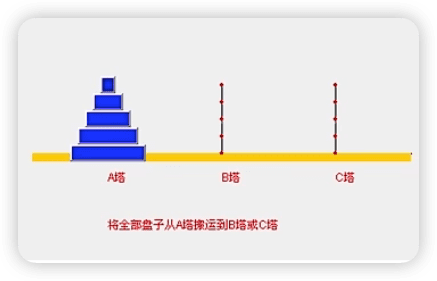
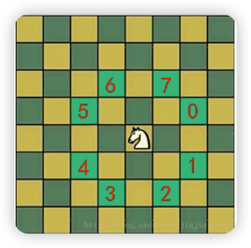

【尚硅谷】Java数据结构与算法
-------
[【尚硅谷】Java数据结构与算法](https://www.bilibili.com/video/BV1E4411H73v)

## 1 内容介绍和授课方式

### 1.1 数据解构和算法内容介绍

#### 几个经典的算法面试题

> 字符串匹配问题：
>
> 1) 有一个字符串 str1 = "硅硅谷 尚硅谷你尚硅 尚硅谷你尚硅谷你尚硅你好"，和一个子串str2 = "尚硅谷你尚硅你"
>
> 2. 现在要**判断str1是否含有str2**，如果存在，就返回第一次出现的位置，如果没有，则返回-1
>
> 3. 要求用最快的遠度来完成匹配
>
> 4. 你的思路是什么？
>
> 暴力匹配（简单、效率低）
>
> KMP算法 《部分匹配表》

> 汉诺塔游戏，请完成汉诺塔游戏的代码：要求：1)将A塔的所有國盘移动到c塔。并且规定，在2)小圆盘上不能放大圆盘，3)在三根柱子之间一次只能移动一个圆盘。
>
> 
>
> 分治算法

> 八皇后问题：
>
> 八皇后问题，是一个古老而著名的问题，回溯算法的典型案例。该问题是国际西洋棋棋手马克斯•贝瑟尔于1848年提出：
>
> 在8×8格的国际象棋上摆放八个皇后，使其不能互相攻击，即：任意两个皇后都不能处于同一行、同一列或同一斜线上，问有多少种摆法。
>
> 使用到回溯算法
>
> 【92】

> 马踏棋盘算法也被称为骑士周游问题：
>
> 将马随机放在国际象棋的8×8棋盘`Board[0~7][0~7]`的某个方格中，马按走棋规则(马走日字进行移动。要求每个方格只进入一次，走遍棋盘上全部64个方格。
>
> 
>
> 会使用到图的深度优化遍历算法(DFS)+贪心算法优化

#### 数据结构和算法的重要性

1. 算法是程序的灵魂，优秀的程序可以在海量数据计算时，依然保持高速计算。

2. 一般来讲程序会使用了内存计算框架(比如Spark）和缓存技术(比如Redis等)来优化程序，再深入的思考一下，这些计算框架和缓存技术。它的核心功能是哪个部分呢？

3. 拿实际工作经历来说，在Unix下开发服务器程序，功能是要支持上千万人同时在线，在上线前，做内测，一切OK,可上线后，服务器就支撑不住了，公司的CTO对代码进行优化，再次上线，坚如磐石。你就能感受到程序是有灵魂的，就是算法。

4. 目前程序员面试的门槛越来越高，很多一线T公司，都会有数据结构和算法面试题(负责的告诉你，肯定有的）。

5. 如果你不想永远都是代码工人,那就花时间来研究下数据结构和算法。

### 数据结构和算法的介绍

## 2 数据结构和算法概述

### 2.1 数据结构与算法的关系

1. 数据结构是一门研究组织数据方式的学科，有了编程语言就有了数据结构，学号数据结构可以编写出更加漂亮、更加有效率的代码。
2. 要学号数据结构就要多多考虑如何将生活中遇到的问题，用程序去实现解决。
3. 程序 = 数据结构 + 算法
4. 书籍结构是算法的基础。

## 稀疏数组和队列

## 链表

## 栈

## 递归

## 排序算法

## 查找算法

## 哈希表

## 树结构基础

## 树结构实际应用

## 多路查找树

## 图

## 程序员常用10大算法

