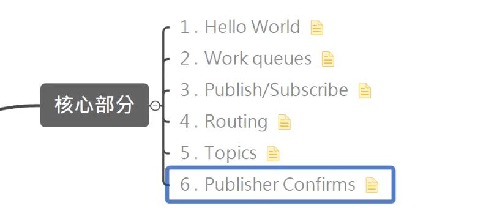
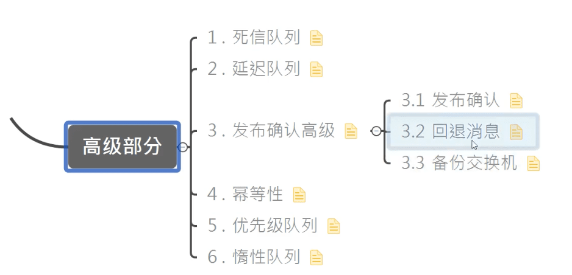

RabbitMQ
----------------

https://www.bilibili.com/video/BV1cb4y1o7zz








Rabbitmq-server-3.8.8


## 1 消息队列

### 1.1 MQ相关概念

MQ（message queue），队列，FIFO，存放message；是一种跨进程的通讯机制，用于上下游传递消息。

在互联网架构中，MQ是一种非常常见的上下游“逻辑解耦+物理解耦”的消息通信服务。使用了MQ之后，消息发送上游只需要依赖MQ，不用依赖其他服务。

#### 为什么要使用MQ

1. 流量消峰

2. 应用解耦

   以电商应用为例，应用中有订单系统、库存系统、物流系统、支付系统。用户创建订单后，如果耦合调用库存系统、物流系统、支付系统，任何一个子系统出了故障，都会造成下单操作异常。当转变成基于消息队列的方式后，系统间调用的问题会减少很多，比如物流系统因为发生故障，需要几分钟来修复。在这几分钟的时间里，物流系统要处理的内存被缓存在消息队列中，用户的下单操作可以正常完成。当物流系统恢复后，继续处理订单信息即可，下单用户感受不到物流系统的故障，提升系统的可用性。

   


3. 异步处理

   有些服务间调用是异步的，例如A调用B，B需要花费很长时间执行，但是A需要知道B什么时候可以执行完，以前一般有两种方式，A过一段时间去调用B的查询api查询。或者A提供一个callback api，B执行完之后调用api通知A服务。这两种方式都不是很优雅，使用消息总线，可以很方便解决这个问题，A调用B服务后，只需要监听B处理完成的消息，当B处理完成后，会发送一条消息给MQ，MQ会将此消息转发给A服务。这样A服务既不用循环调用B的查询api，也不用提供callback api。同样B服务也不用做这些操作。A服务还能及时的得到异步处理成功的消息。

   


#### MQ的分类

1. ActiveMQ

古老，单机吞吐量万级，时效性ms级，基于主从架构实现高可用性，消息丢失概率很低；

缺点：维护少，高吞吐场均较少使用


2. Kafka

为大数据而生，百万级，分布式


3. RocketMQ

阿里巴巴，Java，十万级，消息可以做到0丢失，支持10亿级别的消息堆积

缺点：支持的客户端语言不多，Java，C++还不成熟


4. RabbitMQ

2007年发布，是一个在AMQP（高级消息队列协议）基础上完成的，可复用的企业消息系统，是当前最主流的消息中间件之一。
优点：由于erlang语言的高并发特性，性能较好；吞吐量到万级，MQ功能比较完备，健壮、稳定、易用、跨平台、支持多种语言如：Python、Ruby、.NET、Java、JMS、C、PHP、ActionScript、XMPP、STOMP等，支持AJAX文档齐全；开源提供的管理界面非常棒，用起来很好用，社区活跃度高；更新频率相当高

https://www.rabbitmq.com/news.html

缺点：商业版需要收费，学习成本较高


大型公司选择Kafka

金融领域选择RocketMQ

中小型选择RabbitMQ


### 1.2 RabbitMQ

接受、存储和转发消息数据


#### 四大核心概念


1. 生产者
2. 交换机
3. 队列
4. 消费者


#### RabbitMQ核心部分

6中模式


#### 名词介绍


**Broker**：RabbitMQ的实体，接受和分发消息的应用，也叫RabbitMQ Server或Message Broker。

Producer：生产者

Consumer：消费者

Connection：publisher/consumer和broker之间的TCP链接

Channel：信道。channel是connection内部建立的逻辑连接，如果应用程序支持多线程，通常每个thread创建单独的channel进行通讯，AMQP method包含了channel id帮助客户端和message brokeer识别channel，所以channel之间是完全隔离的。

Exchange指交换机。根据分发规则，匹配查询表中的routing key，分发消息到queue中去。常用类型有：direct，topic，fanout。

Queue：消息最终被送到这里等待consumer取走。

Binding：exchange和queue之间的虚拟链接。

Virtual hosts：相当于库，每一个Virtual hosts中的exchange和queue都是不同的。

#### 安装

https://www.rabbitmq.com/download.html

先要安装 Erlang 语言

##### linux

先下载erlang和Rabbit包

```shell
rpm -ivh erlang-xxx.rpm
yum install socat -y   // rabbitmq的依赖
rpm -ivh rabbitmq-server-xxx.rpm
```

常用命令

```
添加开启启动RabbitMQ服务：
chkconfig rabbit-server on

启动服务：
/sbin/service rabbit-server start

查看服务状态：
/sbin/service rabbit-server status

停止服务：
/sbin/service rabbit-server stop
```

##### macOS

```shell
brew install erlang
brew install rabbitmq

// 安装RabiitMQ的可视化监控插件
//
sudo sbin/rabbitmq-plugins enable rabbitmq_management

// 配置环境变量
sudo vi /etc/profile
//加入以下两行
export RABBIT_HOME=/usr/local/Cellar/rabbitmq/3.8.0
export PATH=$PATH:$RABBIT_HOME/sbin
// 立即生效
source /etc/profile


// 后台启动 detatched表示以守护线程方式启动
sudo rabbitmq-server -detached  
// 查看状态
sudo rabbitmqctl status 
sudo rabbitmqctl stop 
```

http://localhost:15672

brew安装erlang老是失败，改用包安装(https://www.erlang.org/downloads)

```shell
tar -zxvf otp_src_24.0.tar.gz
cd otp_src_24.0
./configure   
make
sudo make install
```


##### 安装后台web管理界面

端口号：15672

先关闭rabbitMQ

```
/sbin/service rabbit-server stop
```

```shell
rabbitmap-plugins enable rabbitmq-management
```

访问之前要关掉防火墙：

```
systemctl stop firewalld
```

```
systemctl status firewalld
# enable 表示让防火墙下次电脑启动将不再开启
systemctl enable firewalld
```

##### 添加新用户

```
rabbitmqctl add_user admin 123456
```

###### 设置用户角色

```
rabbitmqctl set_user_tags admin administrator
```

###### 设置用户权限

```
set_permissions [-p <vhostpath>] <user> <conf> <write> <read>
```

```shell
rabbitmqctl set_permissions -p "/" admin ".*" ".*" ".*"
```

用户user_admin具有/vhost1这个virtualhost中所有资源的配置、写、读权限

###### 当前用户和角色

```
rabbitmqctl list_users
```


## 2.Hello World


p16

