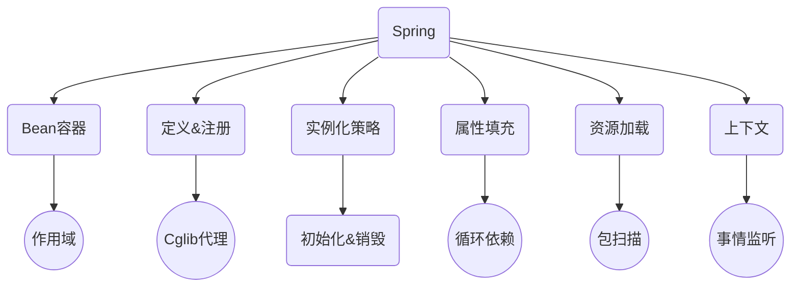

[Spring收撸专栏](https://mp.weixin.qq.com/mp/appmsgalbum?__biz=MzIxMDAwMDAxMw==&action=getalbum&album_id=1871634116341743621&scene=173&from_msgid=2650730810&from_itemidx=1&count=3&nolastread=1#wechat_redirect)

https://github.com/fuzhengwei/small-spring

### 实现一个简单的Bean容器

Spring Bean 容器是什么？

Spring 容器，用于定义、存放和获取 Bean 对象。

### 实现 Bean 的定义、注册、获取

其实编码方式主要依托于：接口定义、类实现接口、抽象类实现接口、继承类、继承抽象类，而这些操作方式可以很好的隔离开每个类的基础功能、通用功能和业务功能，当类的职责清晰后，你的整个设计也会变得容易扩展和迭代。

