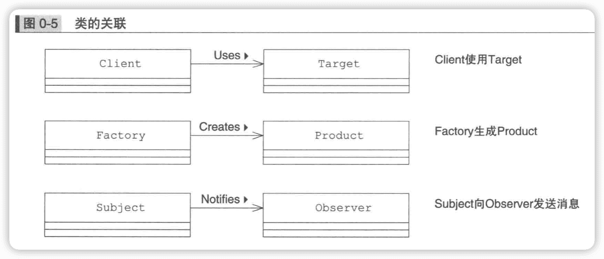

图解设计模式
--------------

术语

“某个类的接口”，多是指该类所持有的方法的集合。

## UML

Java 	UML

字段（field）	属性（attribute）

方法（method）	操作（operation）

### 类图

UML中的类图用于表示类、接口、实例等之间相互的**静态**关系。

#### 类与层次结构

长方形三个区域分别表示：类名、字段名、方法名。

abstract类和方法（抽象类和方法）    斜体

static字段和方法（静态字段和方法）	下划线

#### 接口与实现

#### 聚合（aggregation）

**聚合**（aggregation）关系：只要在一个类汇总持有另外一个类的实例，无论是一个还是多个，无论是使用数组、java.util.Vector或是其它实现方式。空心菱形表示聚合关系。

#### 可见性

| `+`  | public  |
| ---- | ------- |
| `-`  | private |
| `#`  | protect |
| `~`  | 同一包  |

#### 类的关联

### 时序图

UML的时序图（sequence diagram）用来表示程序在工作时其内部方法的调用顺序，以及事件的发生顺序。

类图中表示的是”**不因事件流逝而发生变化的关系（静态关系）**“，时序图则与之相反，表示的是“**随时间发生变化的东西（动态行为）**”。

<u>:Client</u>等表示类的实例，还可以在冒号前加上实例名，如<u>server:Server</u>。

实例向下延伸的虚线，叫作**生命线**，可以理解为实例的生命周期。

生命线上细长的长方形，表示实例处于某种活动中。

横向的黑色实线箭头表示**方法调用**。

上图open实线箭头，表示client 调用 server 的 open 方法。当server 的 open 方法被调用后，server 实例处于活动中，因此在open 箭头处画出了一个细长的长方形而在 open 箭头画出的长方形下方，还有一条指向 client 实例的虚线箭头，它表示返回 open 方法。有些时序图也会省略返回箭头。

由于程序控制已经返回至 client，所以表示 server 实例处于活动状态的长方形就此结束了。

接着，client 实例会调用 server 实例的print 方法。不过这次不同的是在print方法中，server 会调用 device 实例的write 方法。

**时序图的阅读顺序是沿着生命线从上至下阅读**。然后当遇到箭头时，可以顺着箭头所指的方向查看对象间的协作。

## 适应设计模式

### 1 Iterator（迭代器）模式——一个一个遍历

Iterator（迭代器）模式用户在数据集合中按照顺序遍历集合。

### 2 Adapter（适配器）模式——加个“适配器”以便于复用

## 交个子类

### 3 Template Method（模板）模式——将具体处理交给子类

### 4 Factory Method（工厂方法）模式——将实例的生成交给子类

## 生成实例

### 5 Singleton（单例）模式——只有一个实例

### 6 Prototype（原型）模式——通过复制生成实例

### 7 Builder（建造者）模式——组装复杂的实例

### 8 Abstract Factory（抽象工厂）模式——将关联零件组装成产品

## 分开考虑

### 9 Bridge（桥接）模式——将类的功能层次结构与实现层次结构分离

### 10 Strategy（策略）模式——整体地替换算法

## 一致性

### 11 Composite（组合）模式——容器和内容的一致性

### 12 Decorator（装饰者）模式——装饰边框与被装饰物的一致性

## 访问数据结构

### 13 Visitor（访问者）模式——访问数据结构并处理数据

### 14 Chain of Responsibility（责任链）模式——推卸责任

## 简单化

### 15 Facade（门面/外观）模式——简单窗口

### 16 Mediator（中介）模式——只有一个仲裁者

## 管理状态

### 17 Observer（观察者）模式——发送状态变化通知

### 18 Memento（备忘录）模式——保存对象状态

### 19 State（状态）模式——用类表示状态

## 避免浪费

### 20 Flyweight模式——共享对象，避免浪费

### 21 Proxy（代理）模式——只在必要时生成实例

## 用类来表现

### 22 Command（命令）模式——命令也是类

### 23 Interpreter（迭代器）模式——语法规则也是类