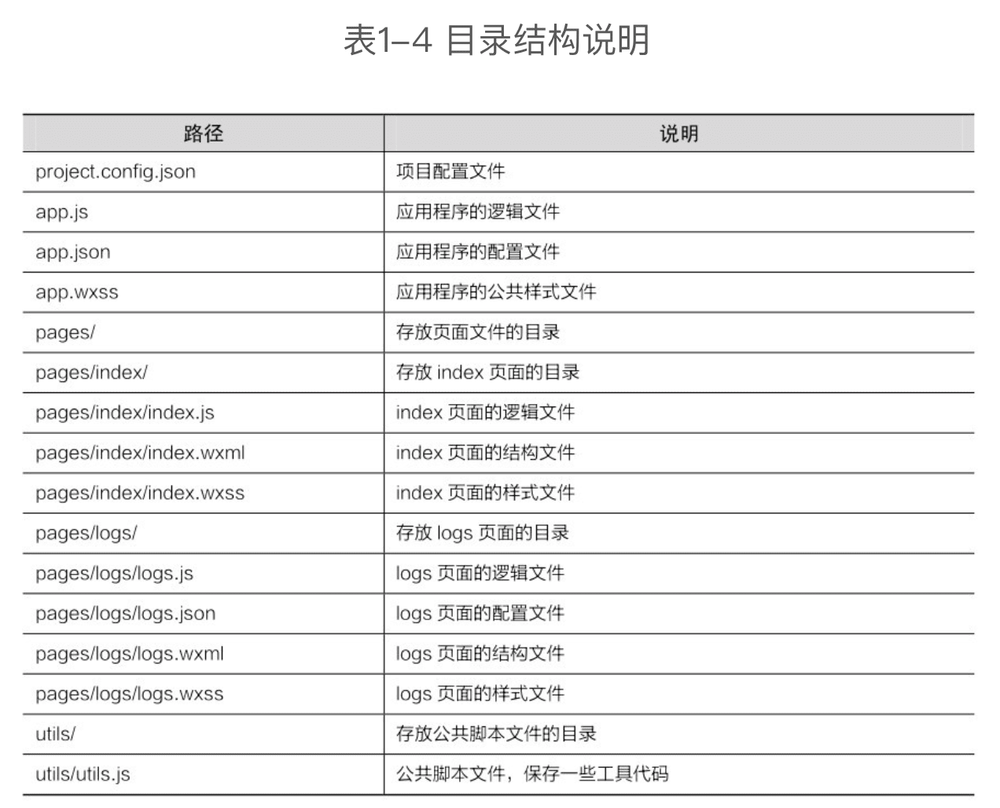

微信小程序开发实战
------------

### 1 微信小程序入门

微信小程序于2017年1月9日正式上线

#### 1.1 初识微信小程序

微信小程序是一种不需要安装即可使用的应用，用户只要“扫一扫”或“搜一搜”即可打开应用，无须安装或卸载。微信小程序运行于微信之上，它的交互类似于手机原生应用，但是每个应用的体积非常小（目前上限是2048KB），具有无须安装、触手可及、用完即走、无须卸载的特点。

由于微信的产品定位，使它不仅仅是一个即时通信的工具，而是发展成了一个**服务的平台**，用户在微信中就能完成订票、打车、订餐等服务。在小程序出现之前，这些服务是通过公众平台中的服务号来完成的，但是由于服务号的功能薄弱，不能满足需求，所以小程序就诞生了。相比原生APP，微信小程序有着天然的优势，即微信的用户量非常大，是互联网的流量入口之一，微信小程序可以更快速地获取用户，并且能被附近用户搜索到，能结合公众平台来推广等。

##### 微信小程序的账号

[微信公众平台](https://mp.weixin.qq.com)（mp是Media Platform（媒体平台）的缩写）有四种账号：

1. 小程序是指在微信公众平台中发布小程序所使用的账号；
2. 订阅号主要用于为用户传达资讯，类似报纸、杂志；
3. 服务号主要用于服务交互，类似银行、114，提供查询服务；
4. 企业微信主要用于公司内部通信使用，在关注企业号前要先验证身份。

微信小程序的开发方式与Web APP相似，即<u>通过WXML（类似HTML）、WXSS（类似CSS）和JavaScript进行开发</u>，可以使Web开发人员快速上手，并且提供了丰富的组件和接口，从而具有更接近原生 APP 的使用体验。

微信小程序相比Web APP也存在一些缺点，它<u>不支持HTML标签和DOM（文档对象模型）操作，对于 CSS 的支持也是受限的，一些成熟的前端库和框架（如jQuery、Vue.js）也无法使用</u>。

> 微信小程序适合开发一些业务逻辑简单、低频次使用、对性能要求不高的应用。

#### 1.2 开发环境搭建

##### 注册微信公众号

##### 安装微信开发者工具

#### 1.3 小程序的开发体验

#### 1.4 团队开发与项目上线

### 2 微信小程序开发基础

项目的基本架构、常用组件的使用、页面样式的编写、事件处理函数、数据绑定，以及条件渲染和列表渲染的语法。