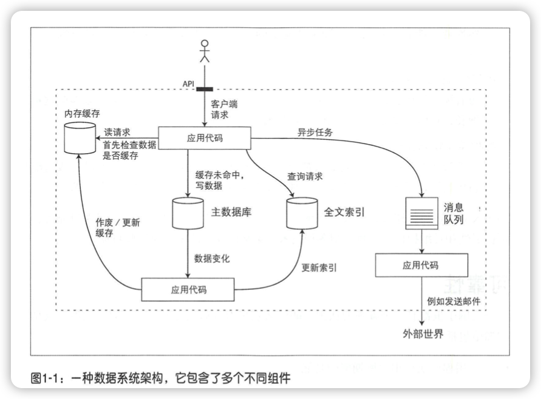

数据密集型应用系统设计
----

**Designning Data-Intensive Applications**，英文原版出版时间2017

# 前言

进年出现商业名词如：NoSQL、Big Data、Web-scale、Sharding、Eventual consistency、ACID、CAP理论、云服务、MapReduce和Real-time等，所有这些都是围绕如何构建高效存储与数据处理这一核心主题。

硬件方面，**CPU主频增长日趋缓慢，而多核系统成为新常态**，网络速度则依旧保持快速发展，这就意味着**并行分布式系统**将会成为业界主流。

对于一个应用系统，如果”数据“是其成败决定性因素，包括数据的规模、数据的复杂度或数据产生与变化的速率等	，我们就可以叫它为”数据密集型应用系统“；与之对应的是计算密集型，CPU主频往往时期最大的瓶颈。

# 一、数据系统基础

## 1 可靠、可扩展与可维护的应用系统

数据密集型应用通常也是基于标准模块构建而成，每个模块负责单一的常用功能。例如，

- 数据库：用以存储数据，这样之后应用可以再次访问。
- 高速缓存：缓存那些复杂或操作代价吊贵的结果，以加快下一次访问。
- 索引：用户可以按关键字搜索数据并支持各种过滤。
- 流式处理：持续发送消息至另一个进程，处理采用异步方式。
- 批处理：定期处理大量的累积数据。

### 认识数据系统

### 可靠性（Reliability）

对于软件，可靠性体现在：

- 应用程序执行用户所期望的功能呢。
- 可以容忍用户出现错误或者不正确的软件使用方法。
- 性能可以应对典型场景、合理负载压力和数据量。
- 系统可防止任何未经授权的访问和滥用。

简单来说，就是即使发生了某些错误，系统仍可以继续正常工作。

可能出错的事情成为**错误（faults）或故障**，系统可应对错误则称为**容错（faulttolerant）或者弹性（resilient）**。

容错总是指特定类型的故障，这样的系统才更有实际意义。

故障与失效（failure）不完全一致。故障通常被定义为组件偏离其正常规格，而失效意味着系统作为一个整体停止，无法向用户提供所需要的服务。

#### 硬件故障

平均故障时间（MTTF）

#### 软件错误

导致软件故障的bug通常会长时间处于引而不发的状态，直到碰到特定的触发条件。

#### 人为失误

### 可扩展性（Scalability）

可扩展性是用来描述系统应对负载增加能力的术语。

#### 描述负载

#### 描述性能

吞吐量（throughput）：每秒可处理的记录条数。

响应时间（response time）：客户端从发送请求到接收响应之间的间隔。

> 延迟（latency） vs 响应时间

#### 应对负载增加的方法

### 可维护性（Maintainability）

软件的大部分成本并不在最初的开发阶段，而是在**整个生命周期内持续的投入，这包括维护与缺陷修复，监控系统来保持正常运行、故障排查、适配新平台、他陪新场景、技术缺陷的完善以及增加新功能等**。

为了减少维护期的麻烦，在软件设计时关注三个设计原则：

#### 可运维性

#### 简单性：简化复杂度

复杂性的表现方式：**状态空间的膨胀，模块紧耦合，令人纠结的相互依赖关系，不一致的命名和术语，为了性能而采取的特殊处理，为解决某特定问题而引入的特殊框架**等。

#### 可演化性：易于改变

