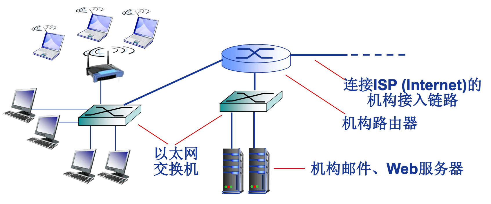

计算机网络 
----------
[中国大学MOOC-哈尔滨工业大学-计算机网络](http://www.icourse163.org/learn/HIT-154005?tid=1002210011)

## 1 概述
### 1.1 基本概念

#### 什么是计算机网络

- 计算机网络=通信技术+计算机技术

- 通信系统模型:

- 计算机网络就是一种通信网络

- 定义：计算机网络就是**互连**的、**自治**的计算机集合。

  - 自治-无主从关系 
  - 互连-互联互通

- 距离远、数量大如何保证互连?

  通过**交换网络**互连主机

#### 什么是Internet?- 组成细节角度

- 全球最大的互联网络

  ISP(Internet Service Provider)网络互连的“网络之网络”

- 数以百万计的互连的计算设备集合:

  - 主机(hosts)=端系统 (end systems)
  - 运行各种网络应用

- 通信链路：光纤, 铜缆, 无线电, 卫星......

- 分组交换: 转发分组 (数据包)

  路由器(routers) 和 交换机(switches)

#### 什么是Internet?- 服务角度

- 为网络应用提供通信服务的通信基础设施:

  Web, VoIP, email, 网络游戏, 电子商务, 社交网络, ...

- 为网络应用提供应用编程 接口(API):

  + 支持应用程序“连接” Internet，发送/接收数据

  + 提供类似于邮政系统的数据 传输服务

#### 网络协议

协议是计算机网络有序运行的重要保证。

任何通信或信息交换过程都需要规则

网络通信:

- 通信主体是“机器”而不是人

- 交换“电子化”或 “数字化”消息

- 计算机网络的所有通信过程都必须遵守某种/些规则——协议

网络协议(network protocol)，简称为协议 ，是为进行网络中的数据交换而建立的规则、标准或约定。

协议规定了通信实体之间所交换的消息的格式、意义、顺序**以及针对收到信息或发生的事件所采取的**“动作”(actions)**。

##### 协议的三要素

1. 语法(Syntax)
   数据与控制信息的结构或格式 

   信号电平

2. 语义(Semantics)
   需要发出何种控制信息
   完成何种动作以及做出何种响应 

   差错控制

3. 时序(Timing) 

   事件顺序
   速度匹配

##### 协议是计算机网络的重要内容

- 协议规范了网络中所有信息发送和接收过程

  e.g., TCP, IP, HTTP, Skype, 802.11

- 学习网络的重要内容之一

- 网络创新的表现形式之一

- Internet协议标准

  RFC: Request for Comments

  IETF:互联网工程任务组( Internet Engineering Task Force)

### 1.2 计算机网络结构

- 网络边缘： 主机 网络应用

- 接入网络，物理介质：有线或无线通信链路

- 网络核心（核心网络）： 

  互联的路由器(或分组 转发设备)

  网络之网络

#### 网络边缘

- 主机(端系统):

  位于“网络边缘”

  运行网络应用程序，如:Web,email

- 客户/服务器(client/server)应用模型:

  客户发送请求，接收服务器响应
  如:Web应用，文件传输FTP应用

- 对等(peer-peer, P2P)应用模型: 

  无(或不仅依赖)专用服务器
  通信在对等实体之间直接进行
  如:Gnutella, BT, Skype, QQ

#### 接入网络

如何将网络边缘接入核心网(边缘路由器)? 接入网络

住宅(家庭)接入网络
机构接入网络 (学校,企业等) 
移动接入网络

用户关心是: 带宽(bandwidth) (bps)，共享/独占?

##### 接入网络：数字用户线路（DSL）

- 利用已有的电话线连接中心局的DSLAM

  数据通信通过DSL电话线接入Internet
  语音(电话)通过DSL电话线接入电话网

- < 2.5 Mbps上行传输速率 (典型速率 < 1 Mbps) 

- < 24 Mbps下行传输速率 (典型速率 < 10)

- FDM: >50 kHz - 1 MHz用于下行

  4 kHz - 50 kHz用于上行
  0 kHz - 4 kHz用于传统电话

##### 接入网络: 电缆网络

频分多路复用: 在不同频带(载波)上传输不同频道

- HFC:混合光纤同轴电缆( hybrid fiber coax)
  非对称: 下行高达30Mbps传输速率，上行为2 Mbps传输速率

- 各家庭(设备)通过电缆网络→光纤接入ISP路由器 各家

  庭共享家庭至电缆头端的接入网络
  不同于DSL的独占至中心局的接入

##### 典型家庭网络的接入

##### 机构(企业)接入网络 (Ethernet)

- 主要用于公司、高校、企业等组织机构 
- 典型传输速率:10 Mbps, 100Mbps, 1Gbps, 10Gbps 
- 目前，端系统通常直接连接以太网交换机(switch)

目前最流行的有线接入网络就是以太网。

##### 无线接入网络

通过共享的无线接入网络连接端系统与路由器。通过**基站**(base station)或称为“**接入点**”(access point)。

- 无线局域网(LANs):

  同一建筑物内 (30m)

  802.11b/g (WiFi): 11Mbps、 54Mbps传输速率

- 广域无线接入:

  通过电信运营商 (蜂窝网) ，接入 范围在几十公里~

  带宽:1 Mbps、10 Mbps、 100Mbps

  3G、 4G: LTE  移动互联网

#### 网络核心

网络核心的关键功能：路由+转发

网络核心解决的基本问题: 

Q:如何实现数据从源主机通过网络核心送达 目的主机?

A:**数据交换**

### 1.3 网络核心
#### 为什么需要数据交换？

- N2链路问题 
- 连通性 
- 网络规模

N(N-1)/2

#### 数据交换的类型

电路交换     事先需要建立电路，不能共享（独占）
报文交换
分组交换

#### 电路交换的特点

- 最典型电路交换网络:电话网络

- 电路交换的三个阶段:

  建立连接(呼叫/电路建立) 

  通信
  释放连接(拆除电路)

- 独占资源

电路交换网络如何共享中继线? **多路复用**(Multiplexing)

##### 多路复用（multiplexing）

- 多路复用(Multiplexing): 链路/网络资源(如带 宽)划分为“资源片”

  将资源片分配给各路“呼叫”(calls)

  每路呼叫独占分配到的资 源片进行通信

  资源片可能“**闲置**”(idle) (无共享)

- 典型多路复用方法: 

  频分多路复用( frequency division multiplexing-FDM ) 

  时分多路复用( time division multiplexing-TDM )
  波分多路复用(Wavelength division multiplexing-WDM)

  码分多路复用( Code division multiplexing-CDM )

- FDM   (如有线电视)

- TDM

- WDM

波分复用就是光的频分复用

- CDM

CDMA

#### 报文交换（message Switching）

 

#### 分组交换（package switching）

#### 分组交换 vs 报文交换

分组交换是目前计算机网络主要采用的技术 

T = L/R  * n + L/R * M/L = nL/R + M/R

R = 100Mbps

L = 1000B = 0.001MB = 0.008Mb

n = 2

M = 980000/(1000-20)  *  1000  = 1MB = 8Mb

T = 2*0.008/1000 + 8/100 = 80.16ms

#### 分组交换 vs 电路交换

分组交换适合于：

### 1.4 计算机网络性能

#### 速率

#### 带宽

#### 延迟/时延 (delay/latency)

在铜缆中光信号的传输速度是0.7倍的光束（~2*10的8次方）

#### 时延带宽积

#### 分组丢失（丢包）

#### 吞吐量/率(Throughput)

瓶颈链路

### 1.5 计算机网路体系结构

#### 为什么需要计算机网络体系结构？

#### 为什么采用分层结构

#### 分层网络体系结构基本概念

#### OSI参考模型

数据链路层加头加尾构成**帧**

##### 物理层

 

半双工 - 就是双方不能同时通信。 列如 对讲机

##### 数据链路层   

物理寻址

##### 网络层   

逻辑寻址  全局唯一   可跨越多个网络

##### 传输层

这边的连接是指逻辑连接

##### 会话层

不进行分割，插入一些同步控制点

实际情况，会话层不单独存在

##### 表示层

##### 应用层  

最丰富的一层

#### TCP/IP参考模型   

先实践后总结而得到

以IP 为基础，只需要通过iP 能够从一个点传另一个点就行了。

#### 5层参考模型

### 1.6 计算机网络与Internet发展历史

#### 1961-1972: 早期分组交换原理的提出与应用

- 1961: Kleinrock – **排队论**证实**分组交换**的有效性
- 1964: Baran – 分组交换 应用于军事网络

- 1967: ARPA(Advanced Research Projects Agency)提出ARPAnet构想

- 1969: 第一个ARPAnet结点运行

- 1972:
  - ARPAnet公开演示
  - 第一个主机-主机协议NCP (Network Control Protocol)
  - 第一个e-mail程序
  - ARPAnet拥有15个结点

#### 1972-1980: 网络互连，大量新型、私有网络的涌现

## 2 网络应用层

### 2.1 网络应用的体系结构

#### 客户机/服务器结构

#### 纯P2P结构

#### 混合结构

- 网络应用的进程间通信

socket把几个网络协议层抽象化

使用公开协议，就允许相互操作

- 网络应用的需求与传输层服务

UDP给我们提供了自由

### 2.2 Web应用

#### Web与HTTP

#### HTTP概述

#### HTTP连接的两种类型

TCP链接是双工的

#### HTTP消息格式

#### Cookie技术

#### Web缓存/代理服务器技术

### 2.3 Email应用

#### Email应用的构成

#### SMTP协议：RFC 2821

命令/响应模式(类似 http的请求/响应模式)

使用telnet发送邮件

#### Email消息格式和POP3协议

- 邮件访问协议

IMAP协议就是有状态的

### 2.4 DNS应用

#### DNS概述

##### 分布式层次式数据库

 

#### DNS记录和消息格式

CNAME  规范名字 **criterion**

DNS同时占用UDP和TCP端口53是公认的，这种单个应用协议同时使用两种传输协议的情况在TCP/IP栈也算是个另类。

### 2.5 P2P应用

#### 原理与文件分发

#### P2P应用：索引技术

分布式索引

全局查询：

这种设计思路在互联网中很常见

查阅Skype相关资料，架构、协议、算法等

### 2.6 Socket编程

#### 应用编程接口（API）

#### Socket API概述

在网络中Socket识别管理时是通过 iP地址和端口号。而在操作系统内部是通过套接字描述符来识别和管理。

#### Socket API 函数

WinSock

#### 客户端软件设计

#### 服务器软件设计

## 3 传输层

### 3.1 传输层服务概述

### 3.2 多路复用和多路分用

### 3.3 UDP

### 3.4 可靠数据传输原理

#### Rdt2.0

### 3.5 滑动窗口协议

### 3.6 面向连接传输协议-TCP

### 3.7 拥塞控制原理

### 3.8 TCP拥塞控制

### 3.9 传输层总结

## 4 网络层

### 4.1网络层服务

### 4.2 虚电路网络与数据报网络

### 4.3 IPv4协议

### 4.4 CIDR与路由聚集

### 4.5 DHCP协议

### 4.6 NAT

### 4.7 ICMP协议

### 4.8 IPv6简介

### 4.9 路由算法

### 4.10 Internet路由

## 5 数据链路层

### 5.1 数据链路层服务（15m08s）

### 5.2 差错编码

### 5.3 多路访问协议（1h13m07s）

局域网

### 5.4 ARP协议

### 5.5 以太网

### 5.6 PPP协议

### 5.7 802.11无线局域网

## 6 物理层

### 6.1 数据通信基础

### 6.2 物理介质

### 6.3 信道与信道容量

### 6.4 基带传输基础

### 6.5 频带传输基础

### 6.6 物理层接口规程（8m33s）

## 7 网路安全基础

### 7.1 网络安全基础

### 7.2 网络安全威胁

### 7.3 密码学基础

### 7.4 身份认证

### 7.5 消息完整性与数字签名

### 7.6 密钥分发与公钥证书

## 8 网络安全协议与技术

### 8.1 安全电子邮件

### 8.2 安全套接字层（SSL）

### 8.3 IP安全（IPsec）

### 8.4 无线局域网安全

### 8.5 防火墙

##

