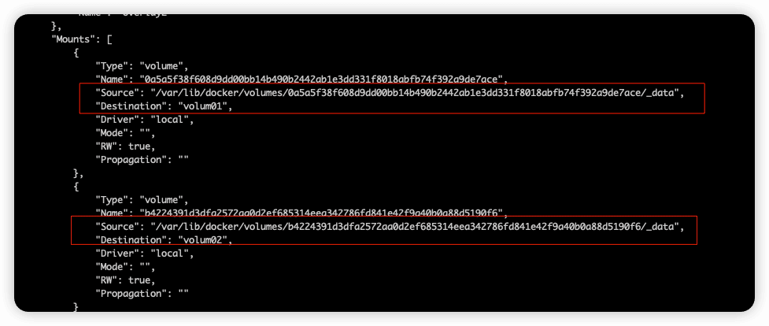
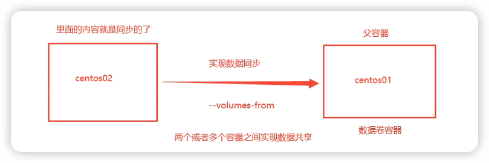
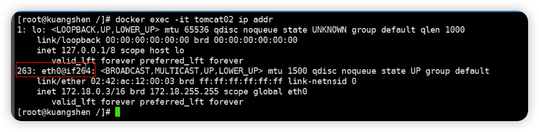
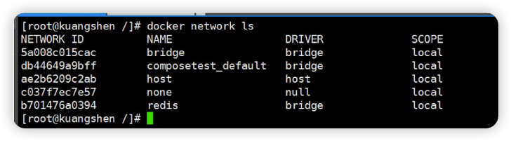
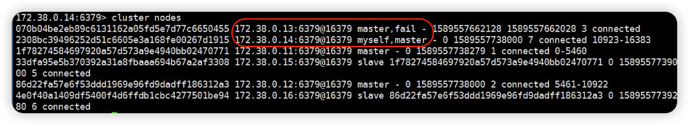

Docker-ks

[狂神说Docker](https://www.bilibili.com/video/BV1og4y1q7M4)


DevOps


Docker概述

Docker安装

Docker命令：

​	镜像命令

​	容器命令

​	操作命令

​	...

Docker镜像

容器数据卷

Dockerfile

Docker网络原理

IDEA整合Docker

Docker Compose

Docker Swarm

CI\CD   Jenkins


即使再小的帆也能远航。

## Docker概述

### Docker为什么出现？

一款产品：开发--上线 两套环境！应用环境，应用配置！

开发  --- 运维。 问题： 我在我的电脑上可以运行！版本更新，导致服务不可用！对于运维来说，考验就十分大？

环境配置是什么的麻烦，每一个机器都要部署环境（集群Redis、ES、Hadoop...）！费时费力。

发布一个项目（jar + （Redis MySQL jdk ES）），项目能不能带上环境一起打包发布？Docker就是干这事的。

之前的服务器配置一个应用的环境Redis MySQL jdk ES Hadoop等，配置超级麻烦，还不能跨平台（windows开发，发布到Linux）。

传统：开发jar，运维做其它！

现在：开发打包部署上线，一套流程做完！

Docker给以上的问题，提出了解决方案！

和安装开发流程做个对比：

Java -- apk -- 发布（应用商店）  -- 张三使用apk -- 安装即可用！

Java -- jar（环境） -- 打包项目带上环境（Docker镜像） -- （Docker仓库：相当于应用商店） -- 下载我们发布的镜像 -- 直接运行即可！

 

Docker的思想就来自于集装箱！

Docker通过**隔离**机制，可以将服务器利用到极致！


本质：所有的技术都是因为出现了一些问题，我们需要器解决、才去学习！

### Docker的历史

2010，几个搞IT的年轻人，美国，公司dotCloud，Pass云计算服务。LXC（Linux Container）相关的容器技术！

他们将自己的容器化技术命名为Docker！ 

2013年，Docker开源，引起关注。。。

2014-4-9，Docker1.0发布！

Docker为什么这么火？

在容器技术出来之前，都是使用虚拟机技术！

虚拟机：在windows中装一个VMware等，通过这个软件我们可以虚拟出来一台或者多台电脑！笨重！

虚拟机也是属于虚拟化技术，Docker容器技术，也是一种虚拟化技术！

```
VM： Linux CentOS原生镜像（一个完整的操作系统），隔离，需要开启多个虚拟机！ 几个几十个G  几分钟
docker：隔离，镜像（不是完整系统，知识最核心的环境，最小大概4m），十分的小巧。 几个M、KB  秒级启动！
```

到现在，所有开发人员都必须要会Docker！


Docker基于Go语言开发的！

[Docker官网](https://www.docker.com/)

[Docker文档](https://docs.docker.com/) 超级详细

仓库地址：https://hub.docker.com/

### Docker能干嘛

虚拟机技术缺点：

1. 资源占用十分多
2. 冗余步骤多
3. 启动很慢

==容器化技术不是模拟的一个完整的操作系统==。

Docker与虚拟机技术的不同：

- 传统虚拟机，虚拟出整个硬件，运行一个完整的操作系统，然后再这个系统上的安装和运行软件
- 容器内的应用直接运行在宿主机的内核，容器是没有自己的内核的，也没有虚拟硬件，所以就轻便了
- 每个容器间是互相隔离，每个容器内都有一个属于自己的文件系统，互不影响。

> DevOps(开发、运维)
>
> - **应用更快速的交付和部署**。docker：打包镜像发布测试，一键运行。
> - **更便捷的升级和扩缩容**。使用docker之后，部署应用就和搭积木一样！
> - **更简单的系统运维**。容器化后，开发、测试环境是高度一致的。
> - **更高效的计算资源利用**。

## Docker安装

### Docker基本组成


#### 镜像（image）：

docker镜像就好比一个模板，可以通过这个模板来创建容器服务，tomcat镜像 -> run -> tomcat01容器（提供服务器），通过这个镜像可以创建多个容器（最终服务运行或者项目运行就是在容器中的）。

#### 容器（container）：

Docker利用容器技术，独立运行一个或一组应用，通过镜像来创建的。

启动、停止、删除，基本命令！

目前就可以把这个容器理解为一个简易的Linux系统

#### 仓库（repository）：

仓库就是存放镜像的地方！

公有仓库和私有仓库。

Docker Hub

阿里云等都有容器服务器

### 安装Docker

1. 环境准备

> Linux基础
>
> 远程Linux环境
>
> 远程链接客服端（Terminus）

2. 环境查看

```shell
# 系统内核是3.10以上的
[root@VM-16-12-centos ~]# uname -r
3.10.0-1160.11.1.el7.x86_64
# 系统版本
[root@VM-16-12-centos ~]# cat /etc/os-release 
NAME="CentOS Linux"
VERSION="7 (Core)"
ID="centos"
ID_LIKE="rhel fedora"
VERSION_ID="7"
PRETTY_NAME="CentOS Linux 7 (Core)"
ANSI_COLOR="0;31"
CPE_NAME="cpe:/o:centos:centos:7"
HOME_URL="https://www.centos.org/"
BUG_REPORT_URL="https://bugs.centos.org/"

CENTOS_MANTISBT_PROJECT="CentOS-7"
CENTOS_MANTISBT_PROJECT_VERSION="7"
REDHAT_SUPPORT_PRODUCT="centos"
REDHAT_SUPPORT_PRODUCT_VERSION="7"
```

3. 安装

https://docs.docker.com/engine/install/centos/

```shell
# 1、卸载旧的版本
sudo yum remove docker \
                  docker-client \
                  docker-client-latest \
                  docker-common \
                  docker-latest \
                  docker-latest-logrotate \
                  docker-logrotate \
                  docker-engine
                  
# 2、需要的安装包
sudo yum install -y yum-utils

# 3、设置镜像的仓库
sudo yum-config-manager \
    --add-repo \
    https://download.docker.com/linux/centos/docker-ce.repo
    
sudo yum-config-manager \
    --add-repo \
    http://mirrors.aliyun.com/docker-ce/linux/centos/docker-ce.repo  # 阿里云docker镜像

# 更新yum软件包索引
sudo yum makecache fast

# 4、安装docker  docker-ce 社区版  ee 企业版
sudo yum install docker-ce docker-ce-cli containerd.io

# 5、开启docker
sudo systemctl start docker

# 6、查看docker
$ docker version
Client: Docker Engine - Community
 Version:           20.10.11
 API version:       1.41
 Go version:        go1.16.9
 Git commit:        dea9396
 Built:             Thu Nov 18 00:38:53 2021
 OS/Arch:           linux/amd64
 Context:           default
 Experimental:      true

Server: Docker Engine - Community
 Engine:
  Version:          20.10.11
  API version:      1.41 (minimum version 1.12)
  Go version:       go1.16.9
  Git commit:       847da18
  Built:            Thu Nov 18 00:37:17 2021
  OS/Arch:          linux/amd64
  Experimental:     false
 containerd:
  Version:          1.4.12
  GitCommit:        7b11cfaabd73bb80907dd23182b9347b4245eb5d
 runc:
  Version:          1.0.2
  GitCommit:        v1.0.2-0-g52b36a2
 docker-init:
  Version:          0.19.0
  GitCommit:        de40ad0
  
# 7、hello-world
sudo docker run hello-world
```


```shell
# 8、查看hello-world镜像
docker images
```

卸载docker

```shell
# 1、卸载依赖
sudo yum remove docker-ce docker-ce-cli containerd.io

# 2、删除资源
sudo rm -rf /var/lib/docker
sudo rm -rf /var/lib/containerd
```


### 阿里云镜像加速

https://cr.console.aliyun.com/cn-hangzhou/instances/mirrors


配置

```shell
sudo mkdir -p /etc/docker

sudo tee /etc/docker/daemon.json <<-'EOF'
{
  "registry-mirrors": ["https://o5co6vo1.mirror.aliyuncs.com"]
}
EOF

sudo systemctl daemon-reload

sudo systemctl restart docker
```


查看信息

```shell
$ docker info
```


### Run的流程

`docker run`的流程：


### Docker底层原理

#### **Docker是怎么工作的？**

Docker是一个Client-Server结构的系统，Docker的守护进程运行在主机上。通过Socket从客服端访问！

DockerServer接收到DockerClient的指令，就执行这个命令。


#### Docker为什么比VM快？

1. Docker有着比虚拟机更少的抽象层。
2. docker利用的是宿主机的内核，vm需要是Guset OS


## docker常用命令

### 帮助命令

```shell
docker version
docker info  		# docker系统信息，包括镜像和容器的数量 
docker 命令 --help
```

更详细的帮助：https://docs.docker.com/reference/

### 镜像命令

1. `docker images`

```shell
# 查看所有本地主机上的镜像
$ docker images
REPOSITORY    TAG       IMAGE ID       CREATED        SIZE
hello-world   latest    feb5d9fea6a5   2 months ago   13.3kB
# 解释
REPOSITORY  镜像名称
TAG		镜像版本
IMAGE ID  镜像id
CREATED  镜像创建时间

$ docker images -q   # 只显示镜像id
feb5d9fea6a5


```

2. `docker search` 镜像搜索

```shell
# 镜像搜索
$ docker search mysql
NAME                              DESCRIPTION                                     STARS     OFFICIAL   AUTOMATED
mysql                             MySQL is a widely used, open-source relation…   11784     [OK]       
mariadb                           MariaDB Server is a high performing open sou…   4487      [OK]       
mysql/mysql-server                Optimized MySQL Server Docker images. Create…   882                  [OK]
percona                           Percona Server is a fork of the MySQL relati…   565       [OK]       
...
$ docker search mysql --filter=STARS=3000  # 搜索star大于3000的
```

3. `docker pull` 下载镜像

```shell
# 下载镜像
$ docker pull mysql
Using default tag: latest					# 不写tag，默认latest
latest: Pulling from library/mysql
ffbb094f4f9e: Pull complete 			# 分层下载，docker image的核心，联合文件系统
df186527fc46: Pull complete 
fa362a6aa7bd: Pull complete 
5af7cb1a200e: Pull complete 
949da226cc6d: Pull complete 
bce007079ee9: Pull complete 
eab9f076e5a3: Pull complete 
8a57a7529e8d: Pull complete 
b1ccc6ed6fc7: Pull complete 
b4af75e64169: Pull complete 
3aed6a9cd681: Pull complete 
23390142f76f: Pull complete 
Digest: sha256:ff9a288d1ecf4397967989b5d1ec269f7d9042a46fc8bc2c3ae35458c1a26727
Status: Downloaded newer image for mysql:latest
docker.io/library/mysql:latest  # 真实地址
# docker pull mysql 等价于 docker pull docker.io/library/mysql:latest

# 指定版本下载，版本数一定要在官方有的
$ docker pull mysql:5.7  
5.7: Pulling from library/mysql
ffbb094f4f9e: Already exists 
df186527fc46: Already exists 
fa362a6aa7bd: Already exists 
5af7cb1a200e: Already exists 
949da226cc6d: Already exists 
bce007079ee9: Already exists 
eab9f076e5a3: Already exists 
c7b24c3f27af: Pull complete 
6fc26ff6705a: Pull complete 
bec5cdb5e7f7: Pull complete 
6c1cb25f7525: Pull complete 
Digest: sha256:d1cc87a3bd5dc07defc837bc9084f748a130606ff41923f46dec1986e0dc828d
Status: Downloaded newer image for mysql:5.7
docker.io/library/mysql:5.7

$ docker images
REPOSITORY    TAG       IMAGE ID       CREATED        SIZE
mysql         5.7       738e7101490b   2 days ago     448MB
mysql         latest    bbf6571db497   2 days ago     516MB
hello-world   latest    feb5d9fea6a5   2 months ago   13.3kB
```

4. `docker rmi` 删除镜像（可以是镜像名称和镜像id）

```shell
$ docker rmi -f 738e7101490b  # 删除指定的容器
Untagged: mysql:5.7
Untagged: mysql@sha256:d1cc87a3bd5dc07defc837bc9084f748a130606ff41923f46dec1986e0dc828d
Deleted: sha256:738e7101490b45decf606211a5437ed87aa6a82f1ff03c354564bf9375ce20f9
Deleted: sha256:addad8cfeac97b96eb6652a576269346ac96def9a6709ed2388e24fff4345837
Deleted: sha256:e288c3439a7e2f423f50bf22979a759371c51a70bbbaa450993c336978460b1a
Deleted: sha256:33ece15accaa3bb20e3dee84e2e4501469b917c3abba3d5475cd1fec8bb3e82c
Deleted: sha256:6b15390bceeca8424d82e75f5c9aca5eb4693f96849d6382168a99747877693d

$ docker rmi -f  镜像1id 镜像2id # 删除多个镜像

$ docker rmi -f $(docker images -aq) # 删除全部的镜像
```

### 容器命令

有了镜像才可以创建容器，下载一个centos镜像测试学习

```shell
$ docker pull centos
```

**新建容器并启动**：

```shell
$ docker run [可选参数] image

# 参数说明
--name="Name"  		容器名字，用来区分容器
-d								后台方式运行
-it 							使用交互方式运行，进入容器查看内容
-p 								指定容器的端口 -p 8080:8080
		-p 主机端口:容器端口（常用）
		-p ip:主机端口:容器端口
		-p 容器端口
		容器端口
-P 								随机指定端口

# 测试并进入容器
[root@VM-16-12-centos ~]# docker run -it centos /bin/bash
[root@f400e2b1698e /]# ls   # 已进入容器内的centos
bin  dev  etc  home  lib  lib64  lost+found  media  mnt  opt  proc  root  run  sbin  srv  sys  tmp  usr  var

# 退出容器回到主机
[root@f400e2b1698e /]# exit  
exit
[root@VM-16-12-centos /]# ls
bin   data  etc   lib    lost+found  mnt  proc  run   srv  tmp  var
boot  dev   home  lib64  media       opt  root  sbin  sys  usr
```

**列出所有运行的容器**：

```shell
# docker ps
			# 正在运行的容器
-a  	# 正在运行的容器+历史运行过的容器
-n=? 	# 显示最近创建的容器（？表示数目）
-q		# 只显示容器的编号

[root@VM-16-12-centos /]# docker ps
CONTAINER ID   IMAGE     COMMAND   CREATED   STATUS    PORTS     NAMES
[root@VM-16-12-centos /]# docker ps -a
CONTAINER ID   IMAGE          COMMAND       CREATED         STATUS                     PORTS     NAMES
f400e2b1698e   centos         "/bin/bash"   7 minutes ago   Exited (0) 2 minutes ago             ecstatic_euclid
b80fba45b53a   feb5d9fea6a5   "/hello"      2 hours ago     Exited (0) 2 hours ago               awesome_shtern
[root@VM-16-12-centos /]# docker ps -a -n=1
CONTAINER ID   IMAGE     COMMAND       CREATED          STATUS                     PORTS     NAMES
f400e2b1698e   centos    "/bin/bash"   11 minutes ago   Exited (0) 6 minutes ago             ecstatic_euclid
[root@VM-16-12-centos /]# docker ps -aq
f400e2b1698e
b80fba45b53a
```

**退出容器**：

```shell
exit   		# 容器停止并退出
Ctrl+P+Q	# 容器不停止退出

[root@VM-16-12-centos /]# docker run -it centos /bin/bash
[root@169891c6c9c9 /]# [root@VM-16-12-centos /]# docker ps
CONTAINER ID   IMAGE     COMMAND       CREATED          STATUS          PORTS     NAMES
169891c6c9c9   centos    "/bin/bash"   24 seconds ago   Up 23 seconds             busy_chaum
```

**删除容器**：

```shell
docker rm  容器id								# 删除指定的容器，不能删除正在运行的容器
docker rm -f $(docker ps -aq)		# 删除所有容器
docker ps -aq | xargs docker rm # 删除所有容器
```

**启动和停止容器的操作**

```shell
docker start 容器id		# 启动容器
docker restart 容器id	# 重启容器
docker stop 容器id 		# 停止当前正在运行的容器
docker kill 容器id		# 强制停止当前正在运行容器
```


### 常用其它命令

#### 后台启动容器

```shell
# 命令 docker run -d 镜像名
[root@VM-16-12-centos /]# docker run -d centos
bce3c807f51eca99db8334ac27d1a56ebcc26a9ebd2bd2b88134b8181e6f99d4

# 问题：使用`docker ps`，发现此时新启动的容器是停止状态的。
# 常见的坑：docker容器使用后台启动运行时，就必须要有一个前台进程
```

#### 查看日志

```shell
docker logs

# 编写一段shell脚本，用来观察日志
[root@VM-16-12-centos ~]# docker run -d centos /bin/sh -c "while true;do echo andyron;sleep 1;done"
dd29ed47280f9160ba01c950147b847cff6f3f2b8c519822e9ce09f19aed7e1c
[root@VM-16-12-centos ~]# docker ps
CONTAINER ID   IMAGE     COMMAND                  CREATED         STATUS         PORTS     NAMES
dd29ed47280f   centos    "/bin/sh -c 'while t…"   8 seconds ago   Up 7 seconds             interesting_williams

# 显示日志
	-tf     # 显示日志
	-tail n # 显示的日志数目
[root@VM-16-12-centos ~]# docker logs -f -t --tail 10 dd29ed47280f
2021-12-06T02:28:08.890154038Z andyron
2021-12-06T02:28:09.892341992Z andyron
2021-12-06T02:28:10.894507336Z andyron
2021-12-06T02:28:11.896642083Z andyron
2021-12-06T02:28:12.898744678Z andyron
2021-12-06T02:28:13.901033523Z andyron
2021-12-06T02:28:14.902965615Z andyron
2021-12-06T02:28:15.905427504Z andyron
2021-12-06T02:28:16.907658384Z andyron
2021-12-06T02:28:17.909515804Z andyron
2021-12-06T02:28:18.911442711Z andyron
2021-12-06T02:28:19.913670985Z andyron
```

#### 查看容器内进程信息

```shell
[root@VM-16-12-centos ~]# docker top dd29ed47280f
UID                 PID                 PPID                C                   STIME               TTY                 TIME                CMD
root                678                 660                 0                   10:27               ?                   00:00:00            /bin/sh -c while true;do echo andyron;sleep 1;done
root                2177                678                 0                   10:33               ?                   00:00:00            /usr/bin/coreutils --coreutils-prog-shebang=sleep /usr/bin/sleep 1
```

#### 查看docker对象（镜像或容器等）的元数据

```shell
docker inspect 镜像id/容器id
```


#### 进入当前正在运行的容器

```shell
# 通常容器都是使用后台方式运行的，有时需要进入容器，修改一些配置

# 命令
docker exec -it 容器id bashShell
# 测试
[root@VM-16-12-centos ~]# docker ps
CONTAINER ID   IMAGE     COMMAND                  CREATED          STATUS          PORTS     NAMES
dd29ed47280f   centos    "/bin/sh -c 'while t…"   16 minutes ago   Up 16 minutes             interestng_williams
[root@VM-16-12-centos ~]# docker exec -it dd29ed47280f /bin/bash
[root@dd29ed47280f /]# ps -ef
UID        PID  PPID  C STIME TTY          TIME CMD
root         1     0  0 02:27 ?        00:00:00 /bin/sh -c while true;do echo andyron;sleep 1;done
root      1040     0  0 02:44 pts/0    00:00:00 /bin/bash
root      1064     1  0 02:44 ?        00:00:00 /usr/bin/coreutils --coreutils-prog-shebang=sleep /usr/bin/sleep 1
root      1065  1040  0 02:44 pts/0    00:00:00 ps -ef

# 方式二
docker attach 容器id
# 测试

# 比较
# docker exec   # 进入容器后开启一个新的终端，可以在里面操作（常用）
# docker attach # 进入容器正在执行的终端，不会启动新的进程
```

#### 从容器中拷贝文件到主机

```shell
docker cp 容器id：容器内路径  目的主机路径

# 进入docker容器内部
[root@VM-16-12-centos home]# docker attach 6e6877efd23e

# 退出容器
[root@6e6877efd23e tmp]# exit
exit
[root@VM-16-12-centos home]# docker ps -a
CONTAINER ID   IMAGE     COMMAND       CREATED         STATUS                      PORTS     NAMES
6e6877efd23e   centos    "/bin/bash"   4 minutes ago   Exited (0) 24 seconds ago             nervous_brown
# 拷贝容器中文件到主机
[root@VM-16-12-centos home]# docker cp  6e6877efd23e:/home/tmp/test.java /home
[root@VM-16-12-centos home]# ls
lighthouse  test.java
```

cp拷贝是个手动过程，未来使用-v 卷的技术，可实现，自动同步

#### 小结


```shell
attach      Attach local standard input, output, and error streams to a running container		# 进入指定正在的运行容器中
build       Build an image from a Dockerfile  # 通过 Dockerfile 定制镜像
commit      Create a new image from a container's changes  # 提交当前容器为新的镜像
cp          Copy files/folders between a container and the local filesystem  # 从容器中拷贝指定文件或者目录到宿主机中
create      Create a new container  # 创建一个新的容器，同run，但不启动容器
diff        Inspect changes to files or directories on a container's filesystem  # 查看 docker 容器变化
events      Get real time events from the server  # 从：docker 服务获取容器实时事件
exec        Run a command in a running container  # 在运行的容器里执行命令
export      Export a container's filesystem as a tar archive  # 导出容器的内容流作为一个 tar 归档文件[对应import]
history     Show the history of an image  # 展示一个镜像的历史
images      List images
import      Import the contents from a tarball to create a filesystem image
info        Display system-wide information
inspect     Return low-level information on Docker objects
kill        Kill one or more running containers
load        Load an image from a tar archive or STDIN
login       Log in to a Docker registry   # 注册或者登陆一个 docker 源服务器
logout      Log out from a Docker registry
logs        Fetch the logs of a container
pause       Pause all processes within one or more containers
port        List port mappings or a specific mapping for the container  # 杳香映射端口对应的容器肉部源端口
ps          List containers
pull        Pull an image or a repository from a registry
push        Push an image or a repository to a registry
rename      Rename a container
restart     Restart one or more containers
rm          Remove one or more containers
rmi         Remove one or more images
run         Run a command in a new container
save        Save one or more images to a tar archive (streamed to STDOUT by default)
search      Search the Docker Hub for images
start       Start one or more stopped containers
stats       Display a live stream of container(s) resource usage statistics
stop        Stop one or more running containers
tag         Create a tag TARGET_IMAGE that refers to SOURCE_IMAGE
top         Display the running processes of a container
unpause     Unpause all processes within one or more containers  # 取消暂停容器
update      Update configuration of one or more containers
version     Show the Docker version information
wait        Block until one or more containers stop, then print their exit codes  # 截取容器停止时的退出状态值
```


### 练习

#### Nginx

```shell
docker search nginx
docker pull nginx
docker run -d --name nginx01 -p 3344:80 nginx   # 访问主机3344端口，就是访问docker中Nginx镜像的80端口
```


```shell
[root@VM-16-12-centos home]# docker run -d --name nginx01 -p 3344:80 nginx
287c984b04054ce05cd2ce280cba54882da4f152cc09ef0e85c916b67817ae20
[root@VM-16-12-centos home]# docker ps
CONTAINER ID   IMAGE     COMMAND                  CREATED         STATUS         PORTS                                   NAMES
287c984b0405   nginx     "/docker-entrypoint.…"   5 seconds ago   Up 4 seconds   0.0.0.0:3344->80/tcp, :::3344->80/tcp   nginx01
[root@VM-16-12-centos home]# curl localhost:3344
<!DOCTYPE html>
<html>
<head>
<title>Welcome to nginx!</title>
<style>
html { color-scheme: light dark; }
body { width: 35em; margin: 0 auto;
font-family: Tahoma, Verdana, Arial, sans-serif; }
</style>
</head>
<body>
<h1>Welcome to nginx!</h1>
<p>If you see this page, the nginx web server is successfully installed and
working. Further configuration is required.</p>

<p>For online documentation and support please refer to
<a href="http://nginx.org/">nginx.org</a>.<br/>
Commercial support is available at
<a href="http://nginx.com/">nginx.com</a>.</p>

<p><em>Thank you for using nginx.</em></p>
</body>
</html>

# 进入容器
[root@VM-16-12-centos home]# docker exec -it nginx01  /bin/bash
root@287c984b0405:/# whereis nginx
nginx: /usr/sbin/nginx /usr/lib/nginx /etc/nginx /usr/share/nginx
root@287c984b0405:/# ls /etc/nginx/
conf.d  fastcgi_params  mime.types  modules  nginx.conf  scgi_params  uwsgi_params
```

> 需要对应服务器（腾讯云or阿里云）等的防火墙中添加规则，开放3344端口

思考问题：每次改动Nginx配置文件，都需要进入容器内部？比较麻烦，可以在容器外部提供一个映射路径，容器外部修改文件，容器内部自动修改？ -v 数据卷

#### Tomcat

```shell
# 官方的使用
docker run -it --rm tomcat:9.0
# 我们之前的启动都是后台，停止了容器之后，还能查到，--rm表示用完就删掉，一般用于测试

# 下载使用
docker pull tomcat:9.0
# 启动使用
docker run -d -p 3355:8080 --name tomcat01 tomcat
# 测试公网ip:3355，可访问但404

# 进入容器，发现webapps目录为空
docker exec -it tomcat01 /bin/bash
root@4598e67e7b89:/usr/local/tomcat# ls
BUILDING.txt     LICENSE  README.md      RUNNING.txt  conf  logs            temp     webapps.dist
CONTRIBUTING.md  NOTICE   RELEASE-NOTES  bin          lib   native-jni-lib  webapps  work
root@4598e67e7b89:/usr/local/tomcat# ls -al webapps
total 12
drwxr-xr-x 2 root root 4096 Dec  3 14:17 .
drwxr-xr-x 1 root root 4096 Dec  3 14:18 ..
# 默认镜像是最小，不必要的都删除了。把webapps.dis目录内容复制到webapps即可
cp -r webapps.dist/* webapps/
```

#### 部署ES+Kibana🔖

```
es 
暴露的端口比较多
耗内存、数据一般需要放置到安全目录！挂载
--net somework  网络配置
```


```shell
 # 启动
 docker run -d --name elasticsearch -p 9200:9200 -p 9300:9300 -e "discovery.type=single-node" elasticsearch:7.14.2 
 
 #  查看cpu的状态
 docker stats
 
 # 访问测试
 [root@VM-16-12-centos home]# curl localhost:9200
{
  "name" : "97b4d07c9e4e",
  "cluster_name" : "docker-cluster",
  "cluster_uuid" : "Z3c9dV-nSeqWUFSe5b0XVg",
  "version" : {
    "number" : "7.14.2",
    "build_flavor" : "default",
    "build_type" : "docker",
    "build_hash" : "6bc13727ce758c0e943c3c21653b3da82f627f75",
    "build_date" : "2021-09-15T10:18:09.722761972Z",
    "build_snapshot" : false,
    "lucene_version" : "8.9.0",
    "minimum_wire_compatibility_version" : "6.8.0",
    "minimum_index_compatibility_version" : "6.0.0-beta1"
  },
  "tagline" : "You Know, for Search"
}

# 关闭es
docker stop 97b4d07c9e4e
# 添加内存限制，修改配置文件 -e 环境配置修改
docker run -d --name elasticsearch02 -p 9200:9200 -p 9300:9300 -e "discovery.type=single-node" -e ES_JAVA_OPTS="-Xms64m -Xmx512m" elasticsearch:7.14.2 
[root@VM-16-12-centos home]# docker stats
CONTAINER ID   NAME              CPU %     MEM USAGE / LIMIT     MEM %     NET I/O           BLOCK I/O       PIDS
3afca92fcff9   elasticsearch02   96.59%    393.1MiB / 1.795GiB   21.39%    656B / 0B         117MB / 381kB   34
287c984b0405   nginx01           0.00%     1.453MiB / 1.795GiB   0.08%     5.63kB / 4.76kB   0B / 4.1kB      2
```


kibana，思考之间网络是怎么链接的？


### 可视化面板

portainer：Docker的图形化界面管理工具(平时用的比较少)

Rancher：CI/CD再用


```shell
docker run -d -p 8088:9000 \
--restart=always -v /var/run/docker.sock:/var/run/docker.sock --privileged=true portainer/portainer
```

```
# 访问测试
公网ip::8088

admin
1**9
```

链接local


## Docker镜像详解


### 镜像是什么

镜像是一种轻量级、可执行的独立软件包，用来打包软件运行环境和基于运行环境开发的软件，它包含运行某个软件==所需的所有内容==，包括==代码、运行时、库、环境变量和配置文件==。
所有的应用，直接打包docker镜像，就可以直接跑起来！
如何得到镜像：

- 从远程仓库下载
- 朋友拷贝给你
- 自己制作一个镜像DockerFile

### Docker镜像加载原理

**UnionFS（联合文件系統）**
==**UnionFS（ 联合文件系统）==**：Union文件系统( UnionFS）是一种分层、轻量级并且高性能的文件系统，它支持对文件系统的修改作为一次提交来一层层的叠加（<u>之前docker pull下载时一层一层的下载就是这个，有点类似git的记录</u>），同时可以将不同目录挂载到同—个虛拟文件系统下(unite several directories into a single virtual filesystem)。 ==Union文件系统是 Docker 镜像的基础==。镜像可以通过分层来进行继承，基于基础镜像（没有父镜像），可以制作各种具体的应用镜像。

> 特性：一次同时加载多个文件系统，但从外面看起来，只能看到一个文件茶统，联合加载会把各层文件系统叠加起来，这样最终的文件系统会包含所有底层的文件和目录。

**Docker镜像加载原理**

docker的镜像实际上由一层一层的文件系统组成，这种层级的文件系统UnionFS。
**==bootfs(boot file system)==**（系统启动需要引导加载）主要包含==bootloader==和==kernel==，bootloader主要是引导加载kernel，Linux刚启动时会加载bootfs文件系统，在Docker镜像的最底层是bootfs。这一层与我们典型的Linux/Unix系統是一样的，包含boot加载器和内核。当boot加载完成之后整个内核就都在内存中了，此时内存的使用权已由bootfs转交给内核，此时系统也会卸载bootfs。

**==rootfs (root file system)==**，在bootfs之上。包含的就是典型 Linux 系统中的/dev,/proc, /bin,/etc 等标准目录和文件。rootfs就是各种不同的操作系统发行版，比如Ubuntu， Centos等等。


一般centos系统要几个G，为什么Docker中才200多M？

对于一个精简的OS，rootfs可以很小，只需要包含最基本的命令，工具和程序就可以了，因为底层直接用Host的kernel，自己只需要提供rootfs就可以了。由此可见对于**不同的Linux发行版，bootfs基本是一致的，rootfs会有差别**，因此不同的发行版可以公用bootfs。

### 分层理解

观察下载的日志输出，可以看到是一层一层的在下载：

```shell
[root@VM-16-12-centos ~]# docker pull redis
Using default tag: latest
latest: Pulling from library/redis
e5ae68f74026: Already exists 
37c4354629da: Pull complete 
b065b1b1fa0f: Pull complete 
6954d19bb2e5: Pull complete 
6333f8baaf7c: Pull complete 
f9772c8a44e7: Pull complete 
Digest: sha256:2f502d27c3e9b54295f1c591b3970340d02f8a5824402c8179dcd20d4076b796
Status: Downloaded newer image for redis:latest
docker.io/library/redis:latest
```

>  思考：为什么Docker镜像要采用这种分层的结构呢？

最大的好处，莫过于是==资源共享==了！比如有多个镜像都从相同的Base镜像构建而来，那么宿主机只需在磁盘上保留一份base镜像，同时内存中也只需要加载一份base镜像，这样就可以为所有的容器服务了，而旦镜像的每—层都可以被共享.

查看镜像分层的方式可以通过 `docker image inspect` 命令

```shell
[root@VM-16-12-centos ~]# docker image inspect redis:latest
[
    {
        // ...
        "RootFS": {
            "Type": "layers",
            "Layers": [
                "sha256:9321ff862abbe8e1532076e5fdc932371eff562334ac86984a836d77dfb717f5",
                "sha256:aa2858ea5edc9c0981901a1b63b49a8f4a6e7099b4304b49e680ffdcc6b71b3e",
                "sha256:93079bf13a6d5fe7c4bd9f00cb96183f9d1db9968c4bd15b395df2f3867bf8e5",
                "sha256:9ca504b88e256aa6f6c04ec65aeeed6b926661ea30a0b97f829fbe230155241a",
                "sha256:9468a3f0498bd5cc298ce25ea6ce9c6adf14aa2ce152856b5f389510a9bb9e01",
                "sha256:b7851a62867d82784052d7662862adc0b47b2bddcddc89ae78307f75ba1b29ae"
            ]
        },
        "Metadata": {
            "LastTagTime": "0001-01-01T00:00:00Z"
        }
    }
]
```

**理解：**

所有的 Docker 镜像都起始于一个**基础镜像层**，当进行修改或增加新的内容时 ，就会在当前镜像层之上，创建新的镜像层。

举一个简单的例子，假如基于 Ubuntu Linux 16.04 创建一个新的镜像，这就是新镜像的第一层；如果在该镜像中添加 Python包，就会在基础镜像层之上创建第二个镜像层；如果继续添加一个安全补丁，就会创建第三个镜像层。

该镜像当前已经包含 3个镜像层，如下图所示（这只是一个用于演示的很简单的例子）。


在添加额外的镜像层的同时，镜像始终保持是当前所有镜像的组合，理解这一点非常重要。下图中举了一个简单的例子，每个镜像层包含3个文件，而镜像包含了来自两个镜像层的6个文件。


上图中的镜像层跟之前图中略有区别，主要目的是便于展示文件。

下图中展示了一个稍微复杂的三层镜像，在外部看来整个镜像只有6个文件，这是因为最上层中的文件7是文件5的一个更新版本。


这种情况下，上层镜像层中的文件覆盖了底层镜像层中的文件。这样就使得文件的更新版本作为一个新镜像层添加到镜像当中。
<u>Docker 通过存储引擎（新版本采用快照机制）的方式来实现镜像层堆栈，井保证多镜像层对外展示为统一的文件系统。</u>
Linux 上可用的存储引擎有 AUFS、Overlay2、Device Mapper、Btrfs 以及ZFS。顾名思义，每种存储引擎都基于 Linux 中对应的文件系统或者块设备技术，并且每种存储引擎都有其独有的性能特点。
Docker 在Windows上仅支持windowsfilter 一种存储引擎，该引擎基于 NTFS 文件系统之上实现了分层和 CoW。
下图展示了与系统显示相同的三层镜像。所有镜像层堆叠并合并，对外提供統一的视图。

**特点：**

Docker镜像都是只读的，当容器启动时，一个新的可写层被加载到镜像的顶部！这一层就是通常说的**容器层**，容器之下的都叫**镜像层**。

镜像层就是pull过来的，不能改变；容器层是run启动的，我们的所有操作都是基于容器层。


### 如何提交一个自己的镜像（commit镜像）

```shell
docker commit 提交容器成为一个新的副本

# 和git类似
docker commit -m="提交的描述信息" -a="作者" 容器id  目标镜像名:[TAG]
```

实战测试

> 1 启动-哥默认的tomcat
>
> 2 发现默认tomcat的webapps目录中没有东西
>
> 3 拷贝一些内容（webapps.dist里内容）进去
>
> 4 将上面操作过的容器通过commit提交位一个镜像。以后就可以使用这个镜像

```shell
➜  docker docker ps
CONTAINER ID   IMAGE     COMMAND             CREATED       STATUS       PORTS                    NAMES
f2f2e9842ec6   tomcat    "catalina.sh run"   4 hours ago   Up 4 hours   0.0.0.0:3355->8080/tcp   tomcat01
➜  docker docker commit -a="andyron" -m="add webapps" f2f2e9842ec6 artomcat:1.0
sha256:e6e717e05aafe786ecb2514abe2de7567f588c417a00b853db8961838e955b34
➜  docker docker images
REPOSITORY    TAG       IMAGE ID       CREATED         SIZE
artomcat      1.0       e6e717e05aaf   9 seconds ago   474MB
tomcat        latest    e92276b1f8dc   32 hours ago    469MB
tomcat        9.0       54373f401809   4 days ago      471MB
nginx         latest    114aa6a9f203   7 days ago      135MB
mysql         latest    ad405c51acf6   12 days ago     544MB
hello-world   latest    46331d942d63   11 months ago   9.14kB
centos        latest    e6a0117ec169   17 months ago   272MB
```

> 如果你想要保存当前容器的状态，就可以通过commit来提交，获得一个镜像


学到此处才是Docker的入门，【容器数据卷，DockerFile，Docker网络】三部分是Docker的精髓。

> 容器数据卷
>
> DockerFile
>
> Docker网络
>
> 企业实战
>
> Docker Compose
>
> Docker Swarm（集群）
>
> CI/CD Jenkins

## 容器数据卷

### 概念

docker的理念回顾：将应用和环境打包成一个镜像！

数据？如果数据都在容器中，那么容器删除，数据就会丢失！需求：数据可以持久化。

如，MySQL，容器删了，删库跑路！需求：MySQL数据可以存储在本地！

容器之间可以有一个数据共享的技术！Docker容器中产生的数据，同步到本地！

这就是卷技术！目录的挂载，就是将我们容器的目录，挂载到本地Linux里面


==总结：容器的持久化和同步操作！容器间也是可以数据共享的！==

### 使用数据卷

#### 方式一：直接使用命令来挂载 -v

```shell
docker run -it -v 主机目录:容器内目录
```

```shell
docker run -it -v /Users/andyron/myfield/tmp/docker/ceshi:/home centos /bin/bash
```

就是把容器里`/home`目录挂载到本机的`/Users/andyron/myfield/tmp/docker/ceshi`上，（会创建`ceshi/`目录），这样后，这两个目录的内容会自动同步（可以理解位双向绑定）。

通过`docker inspect 容器id`查看容器信息，可观察到目录挂载信息：


退出容器后，然后在主机中修改`ceshi/`目录，依旧是可以同步的容器内的：

```shell
[root@7e36d47cd152 home]# exit
exit
➜  docker docker ps
CONTAINER ID   IMAGE     COMMAND   CREATED   STATUS    PORTS     NAMES
➜  docker docker start 7e36d47cd152
7e36d47cd152
➜  docker docker attach 7e36d47cd152
[root@7e36d47cd152 /]# cd /home/
[root@7e36d47cd152 home]# ls
test.java  test.js
[root@7e36d47cd152 home]# cat test.js
hello test.js docker!
```

> 容器卷的好处：只要在本地修改文件，容器内会自动同步。

#### 实战：mysql同步数据

```shell
# 获取镜像
docker pull mysql:5.7

# 运行容器，需要做数据挂载！
# 需要注意，安装启动MySQL需要配置密码
# 官方测试，可以到Docker Hub（https://hub.docker.com/）里查看具体配置
docker run --name some-mysql -e MYSQL_ROOT_PASSWORD=my-secret-pw -d mysql:tag

```

```shell
# 启动挂载
# -d 后台运行
# -p 端口映射
# -v 卷挂载（可挂载多个）
# -e 环境参数配置
# --name 容器名字
docker run -d -p 3310:3306 -v /Users/andyron/myfield/tmp/docker/mysql/conf:/etc/mysql/conf.d -v /Users/andyron/myfield/tmp/docker/mysql/data:/var/lib/mysql -e MYSQL_ROOT_PASSWORD=123456 --name mysql01 mysql
```

通过mysql客服端（navicat），连接测试，创建一个数据库测试。

容器删了，本地的数据不会删除：

```
docker rm -f mysql01
```


### 匿名挂载和具名挂载

```shell
# 匿名挂载
# -v 后只有容器里的目录
# -P 大P表示随机端口
docker run -d -P --name nginx01 -v /etc/nginx nginx

# 查看所有数据卷的情况
docker volume ls


# 具名挂载
docker run -d -P --name nginx02 -v juming-nginx:/etc/nginx nginx
```

```shell
➜ docker run -d -P --name nginx01 -v /etc/nginx nginx
e675c2d8b4ce3309b0bfb7e9aa24e6de53f4690a86771f0459bdef2e54b70bcc
➜ docker run -d -P --name nginx02 -v juming-nginx:/etc/nginx nginx
c32583998e4640eb51bd2dcbb35cd43aa91d6b7ca546a23bcede7b5e33aff544
➜ docker volume ls
DRIVER    VOLUME NAME
local     cdf88bca9a3d569b537d913102cc6d146fadf92cf0e9032d584722c7d68125e2
local     juming-nginx
```

查看挂载数据卷信息：

```shell
➜ docker volume inspect juming-nginx
[
    {
        "CreatedAt": "2023-03-08T09:39:05Z",
        "Driver": "local",
        "Labels": null,
        "Mountpoint": "/var/lib/docker/volumes/juming-nginx/_data",
        "Name": "juming-nginx",
        "Options": null,
        "Scope": "local"
    }
]
```

所有docker容器内的卷，没有指定目录的情况都是在`/var/lib/docker/volumes/xxxx/_data`（macos有点不同）。

通过具名挂载可以方便找到我们的卷，大多数情况下使用**具名挂载**。

如何区分具名挂载，匿名挂载，指定路径挂载：

```
-v 容器内路径							# 匿名挂载
-v 卷名:容器内路径					 # 具名挂载	
-v /宿主机路径:容器内路径		 # 指定路径挂载
```

拓展：

```shell
docker run -d -P --name nginx02 -v juming-nginx:/etc/nginx:ro nginx
docker run -d -P --name nginx02 -v juming-nginx:/etc/nginx:rw nginx
```

ro，readonly，只读，表示容器内无法修改，只能在宿主机主中操作；

rw， readwrite，可读可写。

## DockerFile

DockerFile就是用来**构建docker镜像的构建文件**。命令脚本。

通过这个脚本可以生成镜像，镜像是一层一层的，脚本中一个个的命令，每个命令都是一层。

DockerFile也是**第二种挂载方式**。

创建一个dockerfile文件，名字可以随机去。

文件中的内容，`指令（大写） 参数`（每一个行就是一层镜像）：

```tex
FROM centos

VOLUME ["volum01", "volum02"]   # 匿名挂载

CMD echo "-----end------"
CMD /bin/bash
```


```shell
➜  docker-test-volume cat dockerfile01
FROM centos

VOLUME ["volum01", "volum02"]

CMD echo "-----end------"
CMD /bin/bash
➜  docker-test-volume docker build -f /Users/andyron/myfield/tmp/docker/docker-test-volume/dockerfile01 -t andyron/centos:1.0 .
[+] Building 0.1s (5/5) FINISHED
 => [internal] load build definition from dockerfile01                                                                                                                        0.0s
 => => transferring dockerfile: 128B                                                                                                                                          0.0s
 => [internal] load .dockerignore                                                                                                                                             0.0s
 => => transferring context: 2B                                                                                                                                               0.0s
 => [internal] load metadata for docker.io/library/centos:latest                                                                                                              0.0s
 => [1/1] FROM docker.io/library/centos                                                                                                                                       0.0s
 => exporting to image                                                                                                                                                        0.0s
 => => exporting layers                                                                                                                                                       0.0s
 => => writing image sha256:15fc9d800daa0101c88fb03d87aec0cea22af62ab72f49bc035b5f3e24d6b9ac                                                                                  0.0s
 => => naming to docker.io/andyron/centos:1.0                                                                                                                                 0.0s
➜  docker-test-volume docker images
REPOSITORY       TAG       IMAGE ID       CREATED         SIZE
centos           latest    e6a0117ec169   17 months ago   272MB
andyron/centos   1.0       15fc9d800daa   17 months ago   272MB
```

启动

```shell
docker run -it 15fc9d800daa /bin/bash
```


```shell
➜ docker ps
CONTAINER ID   IMAGE          COMMAND       CREATED         STATUS         PORTS     NAMES
e306c2310101   15fc9d800daa   "/bin/bash"   7 minutes ago   Up 7 minutes             peaceful_yonath
➜ docker inspect e306c2310101
```




### 数据卷容器

容器与容器间数据同步



通过自己创建的镜像，启动三个容器：

```shell
docker run -it --name docker01 andyron/centos:1.0

# --volumes-from 类似继承
# 这时docker01就是数据卷容器
docker run -it --name docker02 --volumes-from docker01 andyron/centos:1.0


docker run -it --name docker03 --volumes-from docker01 andyron/centos:1.0
```

> 测试：在docker01的volume01目录中创建文件，在docker02中的volume01目录看是否有；
>
> 在docker03的volume01目录创建文件后，在docker01和docker02中也能看到；

通过`--volumes-from `就能实现容器间的数据共享。

测试：如果删除容器docker01，其它容器中数据不受影响


多个mysql实现数据共享


**结论：**

容器之间配置信息的传递，数据卷容器的生命周期一直持续到没有容器使用为止。

但是一旦持久化到了本地（宿主机），这个时候就算容器都删除了，数据也不会删除。


### DockerFile介绍

构建步骤：

1. 编写dockerfile文件
2. `docker build` 构建成为一个镜像
3. `docker run` 运行镜像
4. `docker push` 发布镜像（DockerHub，阿里云镜像仓库）

查看一下官方是怎么做的：


点击不同版本，跳转到GitHub中对应的DockerFile：


很多官方镜像都是基础包，很多功能都没有，我们通常会自己构建自己的镜像！


### DockerFile构建过程

基础知识：

1. 每个保留关键字（指令）都必须是大写字母
2. 执行从上到下顺序执行
3. `#`表示注释
4. 每个指令都会创建提交一个新的镜像层，并提交


dockerfile是面向开发的，我们以后要发布项目，做镜像，就需要编写dockerfile文件，这个文件十分简单。

步骤：开发、部署、运维。。。缺一不可

Docker镜像逐渐成为企业交付的标准，必须掌握！

DockerFile：构建文件，定义一切的步骤，源代码

DockerImages：通过DockerFile构建生成的镜像，最终发布和运行的产品。原来是jar，war

Docker容器：容器就是镜像运行起来提供服务器


### Dockerfile指令

```
FROM  				# 基础镜像，一切从这里开始构建
MAINTAINER 		# 镜像是谁写的，姓名+邮箱
RUN 					# 镜像构建的时候需要运行的命令
ADD						# 
WORKDIR				# 镜像的工作目录
VOLUME				# 挂载的目录
EXPOSE			  # 暴露端口配置
CMD						# 指定这个容器启动的时候要运行的命令。只有最有一个会生效，可被替代
ENTRYPOINT		# 指定这个容器启动的时候要运行的命令。可以追加命令
ONBUILD  			# 当构建一个被继承Dockerfile时候，就会运行ONBUILD指令。触发指令
COPY					# 类似ADD，拷贝本机文件到镜像内
ENV						# 构建的时候设置环境变量
```

[dockerfile官方文档](https://docs.docker.com/engine/reference/builder/)


### 实战测试

Docker Hub中99%镜像都是从这个基础镜像过来：`FROM scratch`，然后配置需要的软件和配置进行的构建。


```dockerfile
FROM centos
MAINTAINER andyron<randy.njfu@gmail.com>

ENV MYPATH /usr/local
WORKDIR $MYPATH

RUN yum -y install vim
RUN yum -y install net-tools

EXPOSE 80

CMD echo $MYPATH
CMD echo "------end------"
CMD /bin/bash
```


```
docker build -f mydockerfile-centos -t mycentos:0.1 .
```


> 🔖问题：p28
>
> 
>
> https://www.cnblogs.com/studyitskill/p/14081899.html


`docker history`可用来查看镜像构建过程：


平时拿到一个镜像，可以研究一下她是怎么做的？

### CMD与ENTRYPOINT的区别

```
CMD						# 指定这个容器启动的时候要运行的命令。只有最有一个会生效，可被替代
ENTRYPOINT		# 指定这个容器启动的时候要运行的命令。可以追加命令
```


```dockerfile
FROM centos
CMD ["ls", "-a"]
```

```shell
➜  dockerfile vim dockerfile-cmd-test
➜  dockerfile docker build -f dockerfile-cmd-test -t cmdtest .
[+] Building 0.1s (5/5) FINISHED
 => [internal] load build definition from dockerfile-cmd-test                                                                                                                 0.0s
 => => transferring dockerfile: 81B                                                                                                                                           0.0s
 => [internal] load .dockerignore                                                                                                                                             0.0s
 => => transferring context: 2B                                                                                                                                               0.0s
 => [internal] load metadata for docker.io/library/centos:latest                                                                                                              0.0s
 => CACHED [1/1] FROM docker.io/library/centos                                                                                                                                0.0s
 => exporting to image                                                                                                                                                        0.0s
 => => exporting layers                                                                                                                                                       0.0s
 => => writing image sha256:800ae6f76bf9bd620270ac45363d160888daaa2e8d4fd17c155f573761ddca66                                                                                  0.0s
 => => naming to docker.io/library/cmdtest                                                                                                                                    0.0s
➜  dockerfile docker images
REPOSITORY       TAG       IMAGE ID       CREATED         SIZE
cmdtest          latest    800ae6f76bf9   17 months ago   272MB
➜  dockerfile docker run 800ae6f76bf9   # 运行，ls -a命令生效
.
..
.dockerenv
bin
dev
etc
home
lib
lib64
lost+found
media
mnt
opt
proc
root
run
sbin
srv
sys
tmp
usr
var
# 想追加一个命令 -l，也就是ls -al
➜  dockerfile docker run 800ae6f76bf9 -l
docker: Error response from daemon: failed to create shim task: OCI runtime create failed: runc create failed: unable to start container process: exec: "-l": executable file not found in $PATH: unknown.
# 报错的原因是，-l替换了CMD的命令 ["ls", "-a"]
```


```shell
➜  dockerfile cat dockerfile-cmd-entrypoint
FROM centos
ENTRYPOINT ["ls", "-a"]
➜  dockerfile docker build -f dockerfile-cmd-entrypoint -t entrypointtest .

➜  dockerfile docker images
REPOSITORY       TAG       IMAGE ID       CREATED         SIZE
entrypointtest   latest    9f1a36acb553   17 months ago   272MB
cmdtest          latest    800ae6f76bf9   17 months ago   272MB
➜  dockerfile docker run 9f1a36acb553 -l
total 56
drwxr-xr-x   1 root root 4096 Mar  9 04:51 .
drwxr-xr-x   1 root root 4096 Mar  9 04:51 ..
-rwxr-xr-x   1 root root    0 Mar  9 04:51 .dockerenv
lrwxrwxrwx   1 root root    7 Nov  3  2020 bin -> usr/bin
drwxr-xr-x   5 root root  340 Mar  9 04:51 dev
drwxr-xr-x   1 root root 4096 Mar  9 04:51 etc
drwxr-xr-x   2 root root 4096 Nov  3  2020 home
lrwxrwxrwx   1 root root    7 Nov  3  2020 lib -> usr/lib
lrwxrwxrwx   1 root root    9 Nov  3  2020 lib64 -> usr/lib64
drwx------   2 root root 4096 Sep 15  2021 lost+found
drwxr-xr-x   2 root root 4096 Nov  3  2020 media
drwxr-xr-x   2 root root 4096 Nov  3  2020 mnt
drwxr-xr-x   2 root root 4096 Nov  3  2020 opt
dr-xr-xr-x 212 root root    0 Mar  9 04:51 proc
dr-xr-x---   2 root root 4096 Sep 15  2021 root
drwxr-xr-x  11 root root 4096 Sep 15  2021 run
lrwxrwxrwx   1 root root    8 Nov  3  2020 sbin -> usr/sbin
drwxr-xr-x   2 root root 4096 Nov  3  2020 srv
dr-xr-xr-x  13 root root    0 Mar  9 04:51 sys
drwxrwxrwt   7 root root 4096 Sep 15  2021 tmp
drwxr-xr-x  12 root root 4096 Sep 15  2021 usr
drwxr-xr-x  20 root root 4096 Sep 15  2021 var
```


### 实战：Tomcat镜像🔖p30

1. 准备镜像文件tomcat和jdk压缩包
2. 编写dockerfile文件，官方命名为`Dockfile`，build时会自动寻找这个文件，就不需要-f指定了


3. 构建镜像


4. 启动镜像


5. 访问测试


6. 发布项目（由于做了卷挂载，我们直接子啊本地编写项目就可以发布了！）


### 发布自己的镜像

DockerHub

1. 注册账号 https://hub.docker.com/
2. 确定自己的账号可以登录
3. 在本机上登录

```shell
docker login -u andyron
```

4. 提交镜像 `docker push`

```shell
```


> 发布镜像到阿里云容器服务


## 小结


## Docker网络

### 理解 Docker0

环境清理

```shell
docker rm -f $(docker ps -aq)

docker rmi -f $(docker images -aq)
```


三个网络

> 问题：docker是如何处理容器网络访问的？

```shell

docker run -d -P --name tomcat01 tomcat

# 查看容器的内部网络地址
docker exec -it tomcat01 ip addr

# 思考，Linux能不能ping通容器内部
```


> 原理

1. 我们启动一个docker容器，Docker就会给docker容器分配一个ip，我们只有安装了docker，就会有一个网卡docker0桥接模式，使用的技术是veth-pair技术！


启动一个容器查看：


2. 在启动一个容器

```shell
docker run -d -P --name tomcat02 tomcat
```





> 发现这个容器带来的网卡，都是一对一对的。
>
> veth-pair就是一对虚拟设备接口，它们是成对出现的，一段连着协议，一段彼此相连。
> 正因为有这个特性，evth-pair充当一个桥梁，连接各种虚拟网络设备的
>
> OpenStac，Docker容器之间的连接，OVS的连接，都是使用veth-pair技术


3. 测试tomcat01和tomcat02 之间是否可以ping通。

结论：容器和容器之间是可以互相ping通的。


tomcat01和tomcat02是公用的一个路由器 docker0。

所有的容器不指定网络的情况下，都是docker0路由的，docker会给容器分配一个默认的可用ip。

Docker使用的Linux的桥接，宿主机中是一个Docker容器的网桥docker0.


Docker中的所有网络接口都是虚拟的。虚拟的转发效率高！（内网传递文件）


### --link（容器互联）

> 思考一个场景：我们编写一个微服务，database url = `ip:port`，项目不重启，数据库ip换掉了，怎么？
>
> 可以通过名字来进行访问容器


通过`--link`,把两个容器相连，就可以直接通过容器的服务名ping通。(反向是不可以ping的)


```
docker network ls

docker network inspect 容器id
```


探究：inspect


其实这个tomcat03就是在本地配置了tomcat02的配置！


`--link`就是在hosts配置中添加了配置。

> `--link`目前已经不建议使用了。

### 自定义网络

> 查看所有的Docker网络



**网络模式：**

- bidge：桥接，docker默认使用（自定义网络也是用bridge模式）
- none：不配置网络
- host：和宿主机共享网络
- container：用的比较少


**测试**

```


```


自定义网络搭建成功


在自定义网络创建容器：

```shell
docker run -d -P --name tomcat-net-01 --net mynet tomcat

docker run -d -P --name tomcat-net-02 --net mynet tomcat
```

自定义的网络是可以直接用容器名ping的，不需要--link了


> 以后都使用自定义网络。
>
> 好处：
>
>  redis - 不同的集群使用不同的网络，保证集群是安全和健康的。
>
>  mysql - 不同的集群使用不同的网络，保证集群是安全和健康的。

### 网络连通


一个网络中的容器（如tomca-01）要连接另一个网络中的容器（如tomcat-net-01），要让容器和另外一个网络打通，需要使用`docker network connect`命令。


> 测试打通 tomcat01 - mynet

```shell
docker network connect mynet tomcat01

docker network inspect mynet
# 连通之后就是将tomcat01放到了mynet网络下
# 这种就是 一个容器两个ip地址！ 类似阿里云服务，公网ip，私网ip
```


### 实战：部署redis集群🔖


创建一个网络：

```shell
docker network create redis --subnet 172.38.0.0/16
```


`redis-cli -c`是连接集群




使用了docker之后，所有的技术都会慢慢的变得简单起来！

### SpringBoot微服务打包成Docker镜像🔖

1. 创建Springboot项目
2. 打包应用，jar
3. 编写dockerfile
4. 构建镜像
5. 发布运行

以后我们使用了Docker之后，给别人交互的就是一个镜像即可！


https://www.bilibili.com/video/BV1kv411q7Qc

## Docker Compose

如果有很多镜像

容器的编排 yaml

## Docker Swarm

集群部署

Swarm 相当于k8s的简版

## CI/CD之Jenkins

