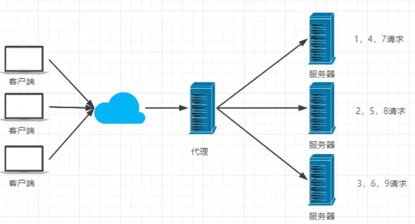
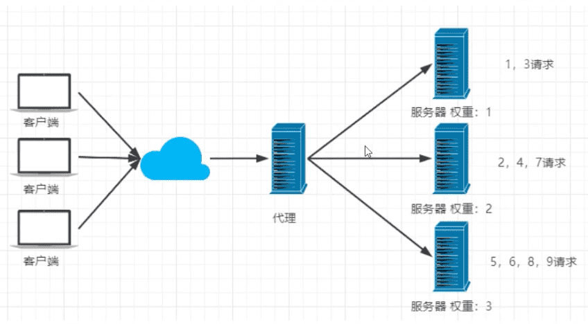
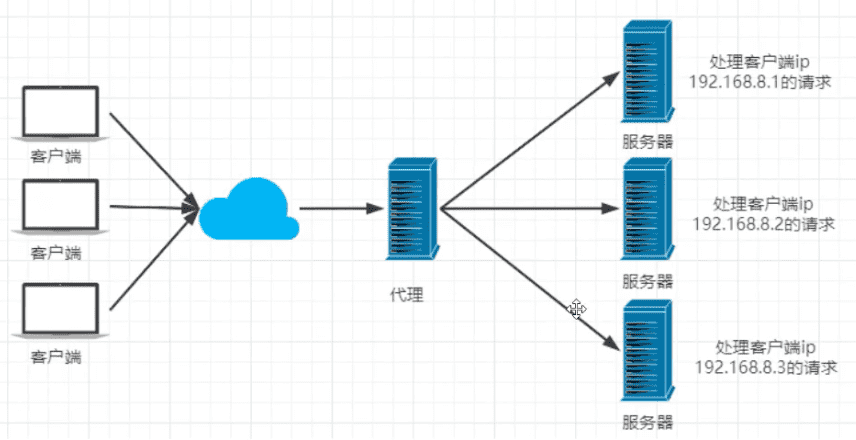
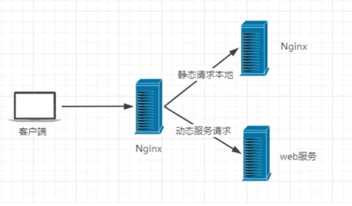

### 资源


[《Nginx 入门指南》](https://www.w3cschool.cn/nginx/)

https://www.bilibili.com/video/BV1F5411J7vK

https://mp.weixin.qq.com/s/iM6-_GpmbpA1Q8T5XoJweQ

https://mp.weixin.qq.com/s/2qjeShJcQs7bW3rIU_I_gg

## Nginx介绍

[主页](http://nginx.org/)，[官方文档](http://nginx.org/en/docs/)，[中文文档](https://www.nginx.cn/doc/)

Nginx 是一款轻量级的 Web 服务器/反向代理服务器及电子邮件（IMAP/POP3）代理服务器，其特点是占有内存少，并发能力强（50000个并发）。

事件驱动

架构：没有什么是加一层解决不了的问题


### nginx的主要功能

#### 反向代理（服务器端的代理）

正向代理（客服端的代理）

#### 负载均衡

负载均衡的两种策略：

1. 内存策略：

轮询：



加权轮询：



ip hash：对客户端的ip进行hash操作，然后根据hash结果将同一客户端iPhone的请求分发给同一台服务器进行处理，可以解决session不共享的问题。（一般不采用，多是采用redis解决session共享问题）



2. 扩展策略

   天马行空共


#### 动静分离

动静分离，在我们的软件开发中，有些请求是需要后台处理的，有些请求是不需要经过后台处理的（如：css、html、jpg、js等等文件），这些不需要经过后台处理的文件称为静态文件。让动态网站里的动态网页根据一定规则把不变的资源和经常变的资源区分开来，动静资源做好了拆分以后，我们就可以根据静态资源的特点将其做缓存操作。提高资源响应的速度。




### 安装

```
MacOS 安装
brew install nginx

配置文件
/usr/local/etc/nginx/nginx.conf
```

```bash
sudo nginx  启动
sudo nginx -s stop	停止（强制退出）
sudo nginx -s quit	安全退出(把所有进程都安全退出)
sudo nginx -s reload	重新加载配置文件
ps aux | grep nginx 
```
注意：连接不上，检查端口是否开放，防火墙，相关命令：

```
#开启
service firewalld start
#重启
service firewalld restart
#关闭
service firewalld stop
#查看防火墙规则
firewall-cmd --list-all
#查询端口是否开放
firewall-cmd --query-port=8080/tcp
#开放80端口
firewall-cmd --permanent --add-port=80/tcp #移除端口
firewall-cmd --permanent --remove-port=8080/tcp
#重启防火墙（修改配置后要重启防火墙） firewall-cmd --reload
#参数解释
1、 firwall-cmd：是Linux提供的操作firewall的一个工具； 
2、   permanent：表示设置为持久；
3    add-port：标识添加的端口；
```

<font color=#FF263D>注意：</font>

多路复用：Nginx开启可能有多个进程

Nginx开启后，关闭命令行不会关闭Nginx


### 实战

nginx配置文件nginx.conf文件结构：

```properties
// 全局配置

events {
	worker_connections 1024
}

http {
	// http配置
	
	upstream xx {
	// 负载均衡配置
	}
	
	server {
		listen		80;
		server_name localhost;
		
		location / {
		
		}
	}
	
	server {
		listen		443;
		server_name localhost;
		
	}
}
```


```properties
// ...

# 负载均衡 这边的名字kuangstudy随意，要与相面proxy_pass对应
upstream kuangstudy {
		# 服务器资源
		server 127.0.0.1:8080 weight=1;
		server 127.0.0.1:8081 weight=3;
}
server {
		listen		80;
		server_name localhost;
		
		location / {
			root html;
			index index.html index.htm;
			proxy_pass http://kuangstudy;
			# http请求下的kuangstudy都代理到上面配置的负载均衡
		}
	}

```

上面这个配置的结果就是：访问80端口后，nginx会按照1：3的比例分别调转到`127.0.0.1:8080`和`127.0.0.1:8081`。


### 初探Nginx架构

Nginx 在启动后，会有一个 master 进程和多个 worker 进程。

<font color=#FF8C00>**Master进程的作用是？**</font>

**读取并验证配置文件nginx.conf；管理worker进程；**(接收来自外界的信号，向各 worker 进程发送信号，监控 worker 进程的运行状态，当 worker 进程退出后(异常情况下)，会自动重新启动新的 worker 进程)。

<font color=#FF8C00>**Worker进程的作用是？**</font>

**每一个Worker进程都维护一个线程（避免线程切换），处理连接和请求；注意Worker进程的个数由配置文件决定，一般和CPU个数相关（有利于进程切换），配置几个就有几个Worker进程。**


