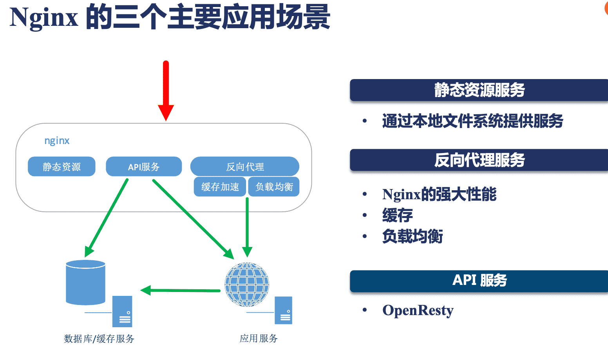
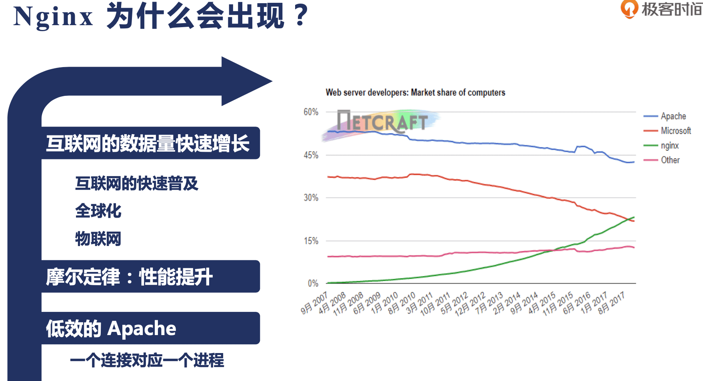
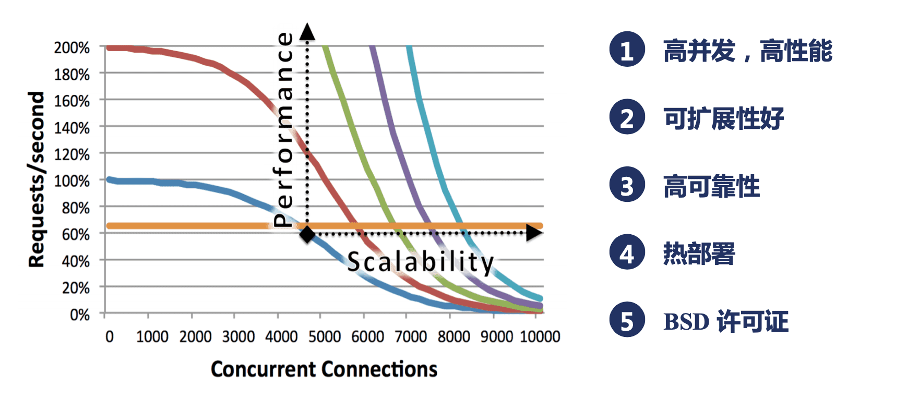
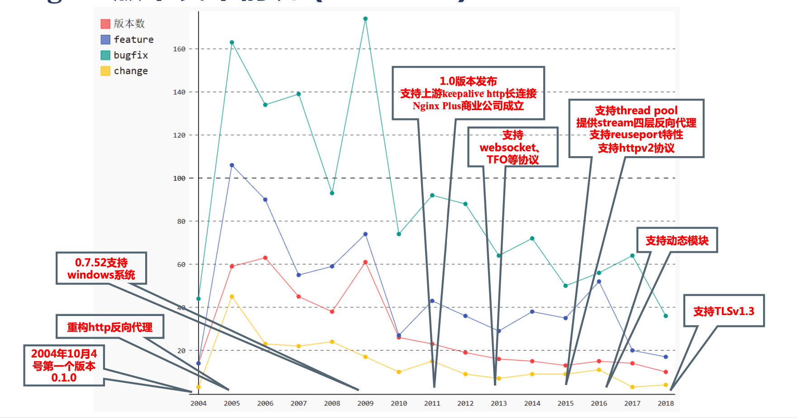
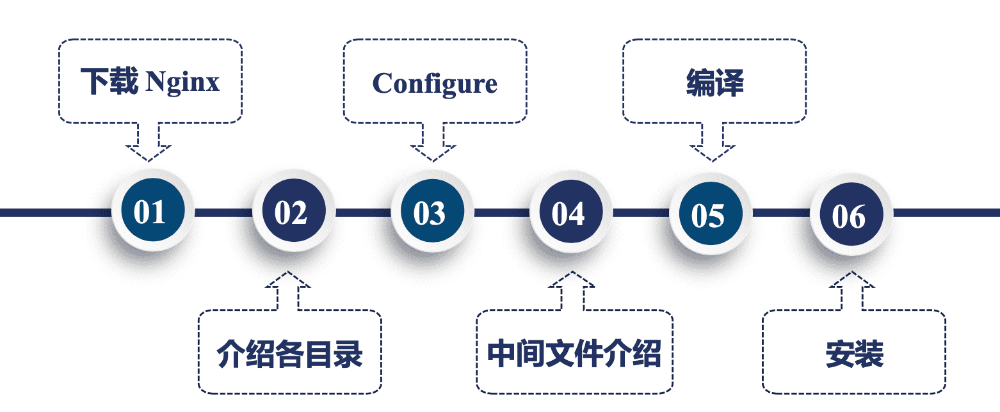
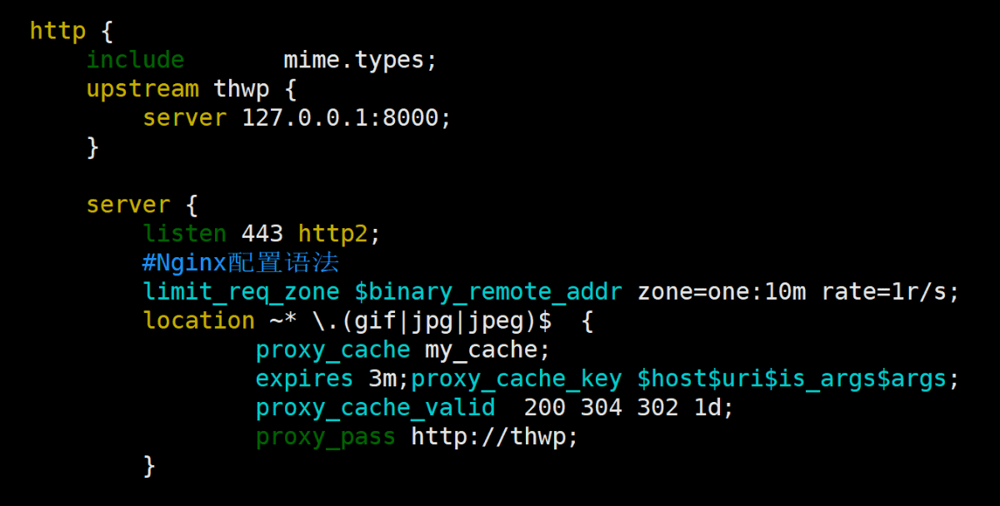
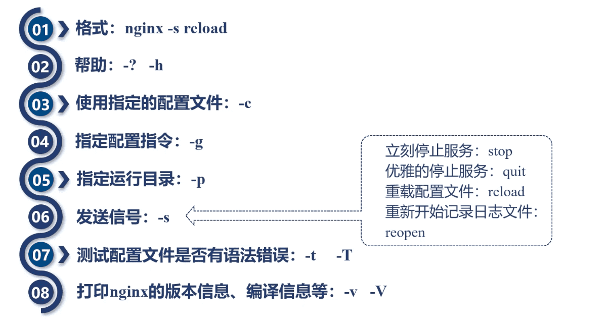

https://www.bilibili.com/video/BV1qC4y1H7Ko?p=10

Nginx核心知识100讲
-----

[课程地址](https://time.geekbang.org/course/intro/100020301)

[课件](https://gitee.com/geektime-geekbang/geektime-nginx)


## 一、初始Nginx

### Nginx使用场景



API服务类似Apache服务器，作为应用服务器，一般会结合JavaScript、Lua语言。

### Nginx出现的历史背景



进程间切换代价大

### Nginx的五个主要优点



### Nginx的四个主要组成部分


### Nginx的版本发布历史



feature  发布的功能

bugfix 修复的bug

change 做了那些小的重构

http://nginx.org/en/download.html

mainline 版本  单数 不大稳定 比如1.19.6

stable版本 双数 比如1.18.0

### 选择哪一个Nginx发行版本

开源版Nginx：nginx.org 

商业版Nginx Plus：nginx.com

阿里巴巴的Tengine

开源版OpenResty 

商业版OpenResty

### 编译出适合自己的Nginx



http://nginx.org/en/download.html

```shell
wget http://nginx.org/download/nginx-1.18.0.tar.gz
tar -zxf nginx-1.18.0.tar.gz
```

源码目录结构：

```shell
drwxr-xr-x. 6 andy andy   4096 1月  23 23:04 auto
-rw-r--r--. 1 andy andy 302863 4月  21 2020 CHANGES
-rw-r--r--. 1 andy andy 462213 4月  21 2020 CHANGES.ru
drwxr-xr-x. 2 andy andy    168 1月  23 23:04 conf
-rwxr-xr-x. 1 andy andy   2502 4月  21 2020 configure
drwxr-xr-x. 4 andy andy     72 1月  23 23:04 contrib
drwxr-xr-x. 2 andy andy     40 1月  23 23:04 html
-rw-r--r--. 1 andy andy   1397 4月  21 2020 LICENSE
drwxr-xr-x. 2 andy andy     21 1月  23 23:04 man
-rw-r--r--. 1 andy andy     49 4月  21 2020 README
drwxr-xr-x. 9 andy andy     91 1月  23 23:04 src
```

让配置文件中语法在vim中高亮：

```shell
cp -r contrib/vim/* ~/.vim/
vim conf/nginx.conf
```

帮助文件查看：

```shell
man man/nginx.8
```


查看支持的编译参数：

```shell
./configure --help | more
```

编译参数分几类，第一类就是确定Nginx执行中寻找哪些目录下的文件作为辅助的一些文件，如：

```shell
--prefix=PATH                      set installation prefix
  --sbin-path=PATH                   set nginx binary pathname
  --modules-path=PATH                set modules path
  --conf-path=PATH                   set nginx.conf pathname
  --error-log-path=PATH              set error log pathname
  --pid-path=PATH                    set nginx.pid pathname
  --lock-path=PATH                   set nginx.lock pathname
```

如果其他参数不指定，就会在`--prefix`指定的目录下建立想要的目录。

第二类参数是使用或者不使用某些模块，前缀一般是`--with-`或者`--without-`的，一般前者默认是不会编译到Nginx中，后者默认是会编译到Nginx中。

第三类参数是一些特殊参数，如：

```shell
--with-cc=PATH                     set C compiler pathname
  --with-cpp=PATH                    set C preprocessor pathname
  --with-cc-opt=OPTIONS              set additional C compiler options
  --with-ld-opt=OPTIONS              set additional linker options
  --with-cpu-opt=CPU                 build for the specified CPU, valid values:
                                     pentium, pentiumpro, pentium3, pentium4,
                                     athlon, opteron, sparc32, sparc64, ppc64
```


```shell
./configure --prefix=/home/andy/nginx
```

可能需要安装pcre库：

```shell
wget    https://netix.dl.sourceforge.net/project/pcre/pcre/8.44/pcre-8.44.tar.gz 

./configure
make
make install
```

可能需要安装c++编译器：

```shell
yum install -y gcc gcc-c++
```

可能需要安装zlib库：

```shell
wget http://www.zlib.net/zlib-1.2.11.tar.gz
```


configure完成后，生成一个中间文件`objs/`目录：

```shell
$ ll objs/
autoconf.err
Makefile
ngx_auto_config.h
ngx_auto_headers.h
ngx_modules.c   # 决定哪些模块会被编译进Nginx中
src/
```

```shell
make
make install
```

如果要进行Nginx升级时，不能直接`make install`，需要从`objs/`中拷贝目标文件nginx到安装目录中。

C语言编译生成的中间文件都在`objs/src`目录中。

动态模块编译生成的`.so`动态文件也会放在`objs/`目录下。

首次安装时，使用`make install`。安装成功到`--prefix`指定目录中查看：

```shell
drwxrwxr-x. 2 andy andy 4096 1月  24 00:09 conf
drwxr-xr-x. 2 andy andy   40 1月  24 00:09 html
drwxrwxr-x. 2 andy andy    6 1月  24 00:09 logs
drwxrwxr-x. 2 andy andy   19 1月  24 00:09 sbin
```

nginx的二进制文件在`sbin/`里。除了上面目录，还有几个临时目录：`client_body_temp`、`fastcgi_temp`、`proxy_temp`、`scgi_temp`、`uwsgi_temp`。


### Nginx配置文件的通用语法



配置语法：

1. 配置文件由指令与指令块构成
2. 每条指令以`;`分号结尾，指令与参数间以空格符号分隔
3. 指令块以`{}`大括号将多条指令组织在一起
4. `include`语句允许组合多个配置文件以提升可维护性
5. 使用`#`符号添加注释，提高可读性
6. 使用`$`符号使用变量
7. 部分指令的参数支持正则表达式

`http{ }` 是一个指令块

`include mime.types;`是一个指令，`mime.types`是另一个配置文件。

`upstream` 是指上游服务。

#### 配置参数：时间单位

```
ms	milliseconds
s		seconds
m		minutes
h		hours
d		days
w		weeks
M		months,30days
h		hours
y		years,365days;
```

#### 配置参数：空间单位

```
bytes
k/K kilobytes
m/M megabytes
g/G gigabytes
```


### Nginx命令行

mac 

 ```
/usr/local/etc/nginx/nginx.conf
 ```



`./nginx` 启动

#### 重载配置文件

`nginx -s reload`，配置文件修改后，这个命令可以在不停止Nginx服务下，重载配置文件。

#### 热部署

```shell
ps -ef | grep nginx
root       1463      1  0 16:33 ?        00:00:00 nginx: master process ./sbin/nginx
root       1464   1463  0 16:33 ?        00:00:00 nginx: worker process
root       1466   1438  0 16:33 pts/0    00:00:00 grep --color=auto nginx
```

热部署是在正在运行的nginx，用新版本的二进制的文件替换当前进程正在使用的二进制文件。

🔖 


#### 切割日志文件


### 搭建静态资源Web服务器


### 搭建一个具备缓存功能的反向代理服务


### 用GoAccess实现可视化并实时监控access日志


### 从网络原理来看SSL安全协议


### 对称加密与非对称加密各自的应用场景


### SSL证书的公信力是如何保证的？


### SSL协议握手时Nginx的性能瓶颈在哪里？


### 用免费SSL协议实现一个HTTPS站点


### 基于OpenResty用Lua语言实现简单服务


## 二、Nginx架构基础


## 三、详解HTTP模块


## 四、方向代理与负载均衡


## 五、Nginx的系统层性能优化


## 六、从源码视角深入使用Nginx与OpenResty

