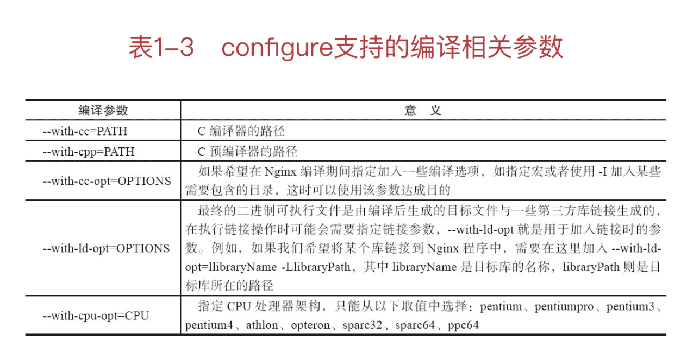

《深入理解Nginx：模块开发与 架构解析》笔记
-------


https://book.douban.com/subject/26745255/


## 一、Nginx能帮我们做什么

### 1 研究Nginx前的准备工作

#### 1.1 Nginx是什么

Web服务器主要有：

- Nginx

- Apache，优点：稳定、开源、跨平台等；缺点：出现久远被设计成重量级的、不支持高并，高并发会导致服务器上消耗大量内存，操作系统内核对<u>成百上千的Apache进程做进程间切换也会消耗大量CPU资源</u>，并导致HTTP请求的平均响应速度降低。

- Lighttpd：与Nginx都是轻量级、高性能的Web服务器，欧美用的多。

- Tomcat、Jetty：都是面向Java语言，先天就是重量级的Web服务器，性能与Nginx没有可比性。

- IIS：只能在Windows操作系统上运行。


Web服务器使用情况，可查看权威网站[Netcraft](https://news.netcraft.com/archives/2020/12/22/december-2020-web-server-survey.html)的数据（2020-12）：


Nginx跨平台，可运行在Linux、FreeBSD、Solaris、AIX、Mac OS、Windows等操作系统上，并且它还可以使用当前操作系统特有的一些高效API来提高自己的性能。

例如，对于高效处理大规模并发连接，它支持Linux上的**epoll**（epoll是Linux上处理大并发网络连接的利器）、Solaris上的event ports和FreeBSD上的kqueue等。

又如，对于Linux，Nginx支持其独有的**sendfile**系统调用，这个系统调用可以高效地把硬盘中的数据发送到网络上（不需要先把硬盘数据复制到用户态内存上再发送），这极大地减少了内核态与用户态数据间的复制动作。

#### 1.2　为什么选择Nginx

Nginx的特点：

##### 更快

表现在两个方面：

1. 在正常情况下，单次请求会得到更快的响应；

2. 在高峰期（如有数以万计的并发请求），Nginx可以比其他Web服务器更快地响应请求。

##### 高扩展性

Nginx的设计极具扩展性，它完全是由多个不同功能、不同层次、不同类型且耦合度极低的模块组成。

Nginx的模块都是嵌入到二进制文件中执行的，无论官方发布的模块还是第三方模块都是如此。

##### 高可靠性

Nginx的高可靠性来自于其核心框架代码的优秀设计、模块设计的简单性；另外，官方提供的常用模块都非常稳定，**每个worker进程相对独立，master进程在1个worker进程出错时可以快速“拉起”新的worker子进程提供服务**。

##### 低内存消耗

一般情况下，10000个非活跃的HTTP Keep-Alive连接在Nginx中仅消耗2.5MB的内存。

##### 单机支持10万以上的并发连接

##### 热部署

master管理进程与worker工作进程的分离设计，使得Nginx能够提供热部署功能。

##### 最自由的BSD许可协议


当然，选择Nginx的核心理由还是它能在支持**高并发请求的同时保持高效**的服务。

Nginx先天的事件驱动型设计、全异步的网络I/O处理机制、极少的进程间切换以及许多优化设计，都使得Nginx天生善于处理高并发压力下的互联网请求，同时Nginx降低了资源消耗，可以把服务器硬件资源“压榨”到极致。

#### 1.3 准备工作

##### Linux操作系统

Linux 2.6 以上才支持epoll。

```shell
uname -a
```

##### 用Nginx的必备软件

1. GCC

```shell
yum install -y gcc
```

2. PCRE库

PCRE（Perl Compatible Regular Expressions，Perl兼容正则表达式），如果在配置文件nginx.conf里使用了正则表达式，那么在编译Nginx时就必须把PCRE库编译进Nginx。

```shell
yum install -y pcre pcre-devel
```

pcre-devel是使用PCRE做二次开发所需要的库。

3. zlib

zlib库用于对HTTP包的内容做gzip格式的压缩，如果在nginx.conf里配置了gzip开启，并指定对于某些类型（content-type）的HTTP响应使用gzip来进行压缩以减少网络传输量，那么，在编译时就必须把zlib编译进Nginx。

```shell
yum install -y zlib zlib-devel
```

zlib是直接使用的库，zlib-devel是二次开发所需要的库。

4. OpenSSL

如果服务器不只是要支持HTTP，还需要在更安全的SSL协议上传输HTTP和MD5、SHA1等散列函数，那么就需要拥有OpenSSL了。

```shell
yum install -y openssl openssl-devel
```

这4个库只是完成Web服务器最基本功能所必需的。

Nginx是高度自由化的Web服务器，它的功能是由许多模块来支持的。使用时可以按需定制使用模块。

##### 磁盘目录

1. Nginx源代码存放目录


2. Nginx编译阶段产生的中间文件存放目录


3. 部署目录


4. 日志文件存放目录


##### Linux内核参数的优化

通常会根据业务特点来进行调整优化内核参数，当Nginx作为静态Web内容服务器、反向代理服务器或是提供图片缩略图功能（实时压缩图片）的服务器时，其内核参数的调整都是不同的。

这里说明比较通用的参数说明，Linux中通过修改`/etc/sysctl.conf`来更改内核参数。常用配置：

```shell
fs.file-max = 999999
net.ipv4.tcp_tw_reuse = 1
net.ipv4.tcp_keepalive_time = 600
net.ipv4.tcp_fin_timeout = 30
net.ipv4.tcp_max_tw_buckets = 5000
net.ipv4.ip_local_port_range = 1024    61000
net.ipv4.tcp_rmem = 4096 32768 262142
net.ipv4.tcp_wmem = 4096 32768 262142
net.core.netdev_max_backlog = 8096
net.core.rmem_default = 262144
net.core.wmem_default = 262144
net.core.rmem_max = 2097152
net.core.wmem_max = 2097152
net.ipv4.tcp_syncookies = 1
net.ipv4.tcp_max_syn.backlog=1024
```

`sysctl -p`命令使其生效。


##### 获取Nginx源码

http://nginx.org/en/download.html

#### 1.4 编译安装Nginx

```shell
./configure
make
make install
```

configure命令做了大量的“幕后”工作，包括检测操作系统内核和已经安装的软件，参数的解析，中间目录的生成以及根据各种参数生成一些C源码文件、Makefile文件等。

make命令根据configure命令生成的Makefile文件编译Nginx工程，并生成目标文件、最终的二进制文件。

make install命令根据configure执行时的参数将Nginx部署到指定的安装目录，包括相关目录的建立和二进制文件、配置文件的复制。

#### 1.5 configure详解

##### 1.5.1 configure的命令参数

```shell
./configure --help
```

四大类参数：

###### 1.路径相关的参数


###### 2.编译相关的参数



###### 3.依赖软件的相关参数


###### 4.模块相关的参数

在configure的参数中，把模块相关的参数分为五大类。

- 事件模块


- 默认即编译进入Nginx的HTTP模块


- 默认不会编译进入Nginx的HTTP模块


- 邮件代理服务器相关的mail模块


- 其他模块


##### 1.5.2　configure执行流程

configure是Shell脚本，中间会调用`<nginx-source>/auto/`目录下的脚本。内容如下：

```shell
#!/bin/sh
# Copyright (C) Igor Sysoev
# Copyright (C) Nginx, Inc.

#auto/options脚本处理configure命令的参数。例如，如果参数是--help，那么显示支持的所有参数格式。options脚本会定义后续工作将要用到的变量，然后根据本次参数以及默认值设置这些变量
. auto/options

#auto/init脚本初始化后续将产生的文件路径。例如，Makefile、ngx_modules.c等文件默认情况下将会在<nginx-source>/objs/
. auto/init

#auto/sources脚本将分析Nginx的源码结构，这样才能构造后续的Makefile文件
. auto/sources

#编译过程中所有目标文件生成的路径由—builddir=DIR参数指定，默认情况下为<nginx-source>/objs，此时这个目录将会被创建
test -d $NGX_OBJS || mkdir $NGX_OBJS

#开始准备建立ngx_auto_headers.h、autoconf.err等必要的编译文件
echo > $NGX_AUTO_HEADERS_H
echo > $NGX_AUTOCONF_ERR

#向objs/ngx_auto_config.h写入命令行带的参数
echo "#define NGX_CONFIGURE \"$NGX_CONFIGURE\"" > $NGX_AUTO_CONFIG_H

#判断DEBUG标志，如果有，那么在objs/ngx_auto_config.h文件中写入DEBUG宏
if [ $NGX_DEBUG = YES ]; then
    have=NGX_DEBUG . auto/have
fi

#现在开始检查操作系统参数是否支持后续编译
if test -z "$NGX_PLATFORM"; then
    echo "checking for OS"

    NGX_SYSTEM=`uname -s 2>/dev/null`
    NGX_RELEASE=`uname -r 2>/dev/null`
    NGX_MACHINE=`uname -m 2>/dev/null`

#屏幕上输出OS名称、内核版本、32位/64位内核
    echo " + $NGX_SYSTEM $NGX_RELEASE $NGX_MACHINE"

    NGX_PLATFORM="$NGX_SYSTEM:$NGX_RELEASE:$NGX_MACHINE";

    case "$NGX_SYSTEM" in
        MINGW32_*)
            NGX_PLATFORM=win32
        ;;
    esac

else
    echo "building for $NGX_PLATFORM"
    NGX_SYSTEM=$NGX_PLATFORM
fi
#检查并设置编译器，如GCC是否安装、GCC版本是否支持后续编译nginx
. auto/cc/conf

# 对非Windows操作系统定义一些必要的头文件，并检查其是否存在，以此决定configure后续步骤是否可以成功（注：在configure脚本里检查某个特性是否存在时，会生成一个最简单的只包含main函数的C程序，该程序会包含相应的头文件。然后，通过检查是否可以编译通过来确认特性是否支持，并将结果记录在objs/autoconf.err文件中。后续检查头文件、检查特性的脚本都用了类似的方法。）

if [ "$NGX_PLATFORM" != win32 ]; then
    . auto/headers
fi

#对于当前操作系统，定义一些特定的操作系统相关的方法并检查当前环境是否支持。例如，对于Linux，在这里使用sched_setaffinity设置进程优先级，使用Linux特有的sendfile系统调用来加速向网络中发送文件块
. auto/os/conf

#定义类UNIX 操作系统中通用的头文件和系统调用等，并检查当前环境是否支持
if [ "$NGX_PLATFORM" != win32 ]; then
    . auto/unix
fi

#最核心的构造运行期modules的脚本。它将会生成ngx_modules.c文件，这个文件会被编译进Nginx中，其中它所做的唯一的事情就是定义了ngx_modules数组。ngx_modules指明Nginx运行期间有哪些模块会参与到请求的处理中，包括HTTP请求可能会使用哪些模块处理，因此，它对数组元素的顺序非常敏感，也就是说，绝大部分模块在ngx_modules数组中的顺序其实是固定的。例如，一个请求必须先执行ngx_http_gzip_filter_module模块重新修改HTTP响应中的头部后，才能使用ngx_http_header_filter模块按照headers_in结构体里的成员构造出以TCP流形式发送给客户端的HTTP响应头部。注意，我们在--add-module=参数里加入的第三方模块也在此步骤写入到ngx_modules.c文件中了
. auto/modules

#conf脚本用来检查Nginx在链接期间需要链接的第三方静态库、动态库或者目标文件是否存在
. auto/lib/conf
#处理Nginx安装后的路径
case ".$NGX_PREFIX" in
    .)
        NGX_PREFIX=${NGX_PREFIX:-/usr/local/nginx}
        have=NGX_PREFIX value="\"$NGX_PREFIX/\"" . auto/define
    ;;

    .!)
        NGX_PREFIX=
    ;;

    *)
        have=NGX_PREFIX value="\"$NGX_PREFIX/\"" . auto/define
    ;;
esac

#处理Nginx安装后conf文件的路径
if [ ".$NGX_CONF_PREFIX" != "." ]; then
    have=NGX_CONF_PREFIX value="\"$NGX_CONF_PREFIX/\"" . auto/define
fi

#处理Nginx安装后，二进制文件、pid、lock等其他文件的路径可参见configure参数中路径类选项的说明
have=NGX_SBIN_PATH value="\"$NGX_SBIN_PATH\"" . auto/define
have=NGX_CONF_PATH value="\"$NGX_CONF_PATH\"" . auto/define
have=NGX_PID_PATH value="\"$NGX_PID_PATH\"" . auto/define
have=NGX_LOCK_PATH value="\"$NGX_LOCK_PATH\"" . auto/define
have=NGX_ERROR_LOG_PATH value="\"$NGX_ERROR_LOG_PATH\"" . auto/define
have=NGX_HTTP_LOG_PATH value="\"$NGX_HTTP_LOG_PATH\"" . auto/define

have=NGX_HTTP_CLIENT_TEMP_PATH value="\"$NGX_HTTP_CLIENT_TEMP_PATH\"" . auto/define
have=NGX_HTTP_PROXY_TEMP_PATH value="\"$NGX_HTTP_PROXY_TEMP_PATH\"" . auto/define
have=NGX_HTTP_FASTCGI_TEMP_PATH value="\"$NGX_HTTP_FASTCGI_TEMP_PATH\"" . auto/define
have=NGX_HTTP_UWSGI_TEMP_PATH value="\"$NGX_HTTP_UWSGI_TEMP_PATH\"" . auto/define
have=NGX_HTTP_SCGI_TEMP_PATH value="\"$NGX_HTTP_SCGI_TEMP_PATH\"" . auto/define

#创建编译时使用的objs/Makefile文件
. auto/make

#为objs/Makefile加入需要连接的第三方静态库、动态库或者目标文件
. auto/lib/make

#为objs/Makefile加入install功能，当执行make install时将编译生成的必要文件复制到安装路径，建立必要的目录
. auto/install

# 在ngx_auto_config.h文件中加入NGX_SUPPRESS_WARN宏、NGX_SMP宏
. auto/stubs

#在ngx_auto_config.h文件中指定NGX_USER和NGX_GROUP宏，如果执行configure时没有参数指定，默认两者皆为nobody（也就是默认以nobody用户运行进程）
have=NGX_USER value="\"$NGX_USER\"" . auto/define
have=NGX_GROUP value="\"$NGX_GROUP\"" . auto/define

#显示configure执行的结果，如果失败，则给出原因
. auto/summary
```

##### 1.5.3　configure生成的文件

configure执行成功时会生成objs目录，如下：

```
|---ngx_auto_headers.h
|---autoconf.err
|---ngx_auto_config.h
|---ngx_modules.c
|---src
|    |---core
|    |---event
|    |    |---modules
|    |---os
|    |    |---unix
|    |    |---win32
|    |---http
|    |    |---modules
|    |    |      |---perl
|    |---mail
|    |---misc
|---Makefile
```

!!

#### 1.6 Nginx的命令行控制

在Linux中，需要使用命令行来控制Nginx服务器的启动与停止、重载配置文件、回滚日志文件、平滑升级等行为。

默认，Nginx被安装在目录`/usr/local/nginx/`中，其二进制文件路径为`/usr/local/nginc/sbin/nginx`，配置文件路径为`/usr/local/nginx/conf/nginx.conf`。

### 2 Nginx的配置

#### 2.1　运行中的Nginx进程间的关系

每一个worker进程都是繁忙的，它们在真正地提供互联网服务，master进程则很“清闲”，只负责监控管理worker进程。


#### 2.2 Nginx配置的通用语法

```shell
user  nobody;

worker_processes  8;
error_log  /var/log/nginx/error.log error;

#pid           logs/nginx.pid;

events {
    use epoll;
    worker_connections  50000;
}

http {
    include       mime.types;
    default_type  application/octet-stream;

    log_format  main  '$remote_addr [$time_local] "$request" '
                      '$status $bytes_sent "$http_referer" '
                      '"$http_user_agent" "$http_x_forwarded_for"';

    access_log  logs/access.log  main buffer=32k;

  …
｝
```

##### 块配置项

块配置项由一个块配置项名和一对大括号组成。


##### 配置项的语法格式


##### 配置项的注释


##### 配置项的单位


##### 在配置中使用变量


#### 2.3　Nginx服务的基本配置

##### 用于调试进程和定位问题的配置项


##### 正常运行的配置项


##### 优化性能的配置项


##### 事件类配置项


#### 2.4　用HTTP核心模块配置一个静态Web服务器

静态Web服务器的主要功能由ngx_http_core_module模块（HTTP框架的主要成员）实现。

##### 虚拟主机与请求的分发


##### 文件路径的定义


##### 内存及磁盘资源的分配


##### 网络连接的设置


##### MIME类型的设置


##### 对客户端请求的限制


##### 文件操作的优化


##### 对客户端请求的特殊处理


##### ngx_http_core_module模块提供的变量


#### 2.5　用HTTP proxy module配置一个反向代理服务器

反向代理（reverse proxy）方式是指用代理服务器来接受Internet上的连接请求，然后将请求转发给内部网络中的上游服务器，并将从上游服务器上得到的结果返回给Internet上请求连接的客户端，此时代理服务器对外的表现就是一个Web服务器。


##### 负载均衡的基本配置


##### 反向代理的基本配置