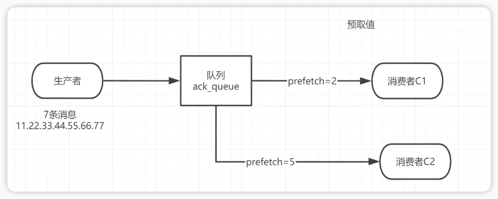

RabbitMQ
----------------

https://www.bilibili.com/video/BV1cb4y1o7zz


Rabbitmq-server-3.8.8


## 1 消息队列

### 1.1 MQ相关概念

MQ（message queue），队列，FIFO，存放message；是一种跨进程的通讯机制，用于上下游传递消息。

在互联网架构中，MQ是一种非常常见的上下游“**逻辑解耦+物理解耦**”的消息通信服务。使用了MQ之后，消息发送上游只需要依赖MQ，不用依赖其他服务。

#### 为什么要使用MQ

三大功能：

1. 流量消峰

举个例子，如果订单系统最多能处理一万次订单，这个处理能力应付正常时段的下单时绰绰有余，正常时段我们下单一秒后就能返回结果。但是在高峰期，如果有两万次下单操作系统是处理不了的，只能限制订单超过一万后不允许用户下单。使用消息队列做缓冲，我们可以取消这个限制，把一秒内下的订单分散成一段时间来处理，这时有些用户可能在下单十几秒后才能收到下单成功的操作，但是比不能下单的体验要好。


2. 应用解耦

以电商应用为例，应用中有订单系统、库存系统、物流系统、支付系统。用户创建订单后，如果耦合调用库存系统、物流系统、支付系统，任何一个子系统出了故障，都会造成下单操作异常。当转变成基于消息队列的方式后，系统间调用的问题会减少很多，比如物流系统因为发生故障，需要几分钟来修复。在这几分钟的时间里，物流系统要处理的内存被缓存在消息队列中，用户的下单操作可以正常完成。当物流系统恢复后，继续处理订单信息即可，下单用户感受不到物流系统的故障，**提升系统的可用性**。


3. 异步处理

   有些服务间调用是异步的，例如A调用B，B需要花费很长时间执行，但是A需要知道B什么时候可以执行完，以前一般有两种方式，A过一段时间去调用B的查询api查询。或者A提供一个callback api，B执行完之后调用api通知A服务。这两种方式都不是很优雅，使用消息总线，可以很方便解决这个问题，A调用B服务后，只需要监听B处理完成的消息，当B处理完成后，会发送一条消息给MQ，MQ会将此消息转发给A服务。这样A服务既不用循环调用B的查询api，也不用提供callback api。同样B服务也不用做这些操作。A服务还能及时的得到异步处理成功的消息。

   


#### MQ的分类

1. ActiveMQ

古老，单机吞吐量万级，时效性ms级，基于主从架构实现高可用性，消息丢失概率很低；

缺点：**维护少，高吞吐场均较少使用**


2. Kafka

为大数据而生，百万级TPS，分布式

在数据采集、传输、存储的过程中发挥 着举足轻重的作用。目前已经被 LinkedIn，Uber, Twitter, Netflix 等大公司所采纳。

优点: 性能卓越，单机写入 TPS 约在百万条/秒，最大的优点，就是吞**吐量高**。时效性 ms 级可用性非 常高，kafka 是分布式的，一个数据多个副本，少数机器宕机，不会丢失数据，不会导致不可用,消费者采 用 Pull 方式获取消息, 消息有序, 通过控制能够保证所有消息被消费且仅被消费一次;有优秀的第三方Kafka Web 管理界面 Kafka-Manager;在日志领域比较成熟，被多家公司和多个开源项目使用;功能支持: 功能 较为简单，主要支持简单的 MQ 功能，在大数据领域的实时计算以及**日志采集**被大规模使用

缺点: Kafka 单机超过 64 个队列/分区，Load 会发生明显的飙高现象，队列越多，load 越高，发送消 息响应时间变长，使用短轮询方式，实时性取决于轮询间隔时间，消费失败不支持重试;支持消息顺序， 但是一台代理宕机后，就会产生消息乱序，**社区更新较慢**;

https://kafka.apache.org/

https://github.com/apache/kafka

3. RocketMQ

阿里巴巴，Java，十万级，消息可以做到0丢失，支持10亿级别的消息堆积。

优点:**单机吞吐量十万级**,可用性非常高，分布式架构,**消息可以做到** **0** **丢失****,**MQ 功能较为完善，还是分 布式的，扩展性好,**支持**10亿级别的消息堆积**，不会因为堆积导致性能下降,源码是 java 我们可以自己阅 读源码，定制自己公司的 MQ

缺点:**支持的客户端语言不多**，目前是 java 及 c++，其中 c++不成熟;社区活跃度一般,没有在MQ 核心中去实现 JMS 等接口,有些系统要迁移需要修改大量代码

https://github.com/apache/rocketmq

4. RabbitMQ

2007年发布，是一个在AMQP（高级消息队列协议）基础上完成的，可复用的企业消息系统，是当前最主流的消息中间件之一。
优点：由于erlang语言的**高并发**特性，性能较好；吞吐量到万级，MQ功能比较完备，健壮、稳定、易用、跨平台、支持多种语言如：Python、Ruby、.NET、Java、JMS、C、PHP、ActionScript、XMPP、STOMP等，支持AJAX文档齐全；开源提供的管理界面非常棒，用起来很好用，社区活跃度高；更新频率相当高

https://www.rabbitmq.com/news.html

缺点：商业版需要收费，学习成本较高


#### MQ的选择

大型公司选择Kafka

金融领域选择RocketMQ

中小型选择RabbitMQ


Kafka 主要特点是基于Pull 的模式来处理消息消费，追求高吞吐量，一开始的目的就是用于日志收集 和传输，适合产生**大量数据**的互联网服务的数据收集业务。**大型公司**建议可以选用，如果有**日志采集**功能， 肯定是首选 kafka 了。

RocketMQ 天生为**金融互联网**领域而生，对于可靠性要求很高的场景，尤其是电商里面的订单扣款，以及业务削 峰，在大量交易涌入时，后端可能无法及时处理的情况。RoketMQ 在稳定性上可能更值得信赖，这些业务 场景在阿里双 11 已经经历了多次考验，如果你的业务有上述并发场景，建议可以选择 RocketMQ。


### 1.2 RabbitMQ

==接受、存储和转发==消息数据。


#### 四大核心概念


1. 生产者
2. 交换机
3. 队列
4. 消费者


#### RabbitMQ核心部分

6种工作模式：

1. 简单模式
2. 工作队列模式
3. 发布订阅模式
4. 路由模式
5. 主题模式
6. 发布确认模式


#### 名词介绍


- **Broker**：RabbitMQ的实体，接受和分发消息的应用，也叫RabbitMQ Server或Message Broker。

- Producer：生产者

- Consumer：消费者

- Connection：publisher/consumer和broker之间的TCP链接

- Channel：信道。channel是connection内部建立的逻辑连接，如果应用程序支持多线程，通常每个thread创建单独的channel进行通讯，AMQP method包含了channel id帮助客户端和message brokeer识别channel，所以channel之间是完全隔离的。Channel作为轻量级的 **Connection** **极大减少了操作系统建立** **TCP connection** **的开销**

- Exchange指交换机。根据分发规则，匹配查询表中的routing key，分发消息到queue中去。常用类型有：direct (point-to-point)， topic (publish-subscribe)， fanout(multicast)。

- Queue：消息最终被送到这里等待consumer取走。

- Binding：exchange和queue之间的虚拟链接，binding 中可以包含 routing key，Binding 信息被保 存到 exchange 中的查询表中，用于 message 的分发依据。

- Virtual hosts：相当于库，每一个Virtual hosts中的exchange和queue都是不同的。

#### 安装

https://www.rabbitmq.com/download.html

先要安装 Erlang 语言

##### linux

先下载erlang和Rabbit包

```shell
rpm -ivh erlang-xxx.rpm
yum install socat -y   // rabbitmq的依赖
rpm -ivh rabbitmq-server-xxx.rpm
```

常用命令

```
添加开启启动RabbitMQ服务：
chkconfig rabbit-server on

启动服务：
/sbin/service rabbit-server start

查看服务状态：
/sbin/service rabbit-server status

停止服务：
/sbin/service rabbit-server stop
```

##### macOS

```shell
brew install erlang
brew install rabbitmq

// 安装RabiitMQ的可视化监控插件
//
sudo sbin/rabbitmq-plugins enable rabbitmq_management

// 配置环境变量
sudo vi /etc/profile
//加入以下两行
export RABBIT_HOME=/usr/local/Cellar/rabbitmq/3.8.0
export PATH=$PATH:$RABBIT_HOME/sbin
// 立即生效
source /etc/profile


// 后台启动 detatched表示以守护线程方式启动
sudo rabbitmq-server -detached  
// 查看状态
sudo rabbitmqctl status 
sudo rabbitmqctl stop 
```

进入rabbitmq安装目录，通过插件程序安装RabiitMQ的可视化监控插件：

```shell
cd /opt/homebrew/Cellar/rabbitmq/3.11.8
sudo sbin/rabbitmq-plugins enable rabbitmq_management
```

配置环境变量：

```shell
// ~/.zshrc
export RABBIT_HOME=/opt/homebrew/Cellar/rabbitmq/3.11.8
export PATH=$PATH:$RABBIT_HOME/sbin

// source ~/.zshrc
```

启动rabbitmq：

```shell
// 后台启动 detatched表示以守护线程方式启动
sudo rabbitmq-server -detached  

// 查看状态
sudo rabbitmqctl status 
sudo rabbitmqctl stop 
```

Web可视化监控访问：http://localhost:15672  （账号和密码都是：guest）

需要添加新账户访问 andy 123456

admin 123


> brew安装erlang老是失败，改用包安装(https://www.erlang.org/downloads)
>
> ```shell
> tar -zxvf otp_src_24.0.tar.gz
> cd otp_src_24.0
> ./configure   
> make
> sudo make install
> ```
>
> 


##### 安装后台web管理界面

端口号：15672

先关闭rabbitMQ

```
/sbin/service rabbit-server stop
```

```shell
rabbitmap-plugins enable rabbitmq-management
```

访问之前要关掉防火墙：

```
systemctl stop firewalld
```

```
systemctl status firewalld
# enable 表示让防火墙下次电脑启动将不再开启
systemctl enable firewalld
```

##### 添加新用户

```
rabbitmqctl add_user admin 123
```

###### 设置用户角色

```
rabbitmqctl set_user_tags admin administrator
```

###### 设置用户权限

```
set_permissions [-p <vhostpath>] <user> <conf> <write> <read>
```

```shell
rabbitmqctl set_permissions -p "/" admin ".*" ".*" ".*"
```

用户user_admin具有/vhost1这个virtualhost中所有资源的配置、写、读权限

###### 当前用户和角色

```
rabbitmqctl list_users
```


## 2.Hello World


## 3 Work Queues

工作队列(又称任务队列)的主要思想是避免立即执行资源密集型任务，而不得不等待它完成。 相反我们安排任务在之后执行。我们把任务封装为消息并将其发送到队列。在后台运行的工作进 程将弹出任务并最终执行作业。当有多个工作线程(消费者)时，这些工作线程将一起处理这些任务。


### 3.1 轮训分发消息

轮训分发：你一个我一个


IDEA设置一份代码，运行多次，就是连续点击运行，会开启懂个线程运行同一份代码：


通过程序执行发现生产者总共发送 4 个消息，消费者 1 和消费者 2 分别分得两个消息，并且 是按照有序的一个接收一次消息：


### 3.2 消息应答

消费者完成一个任务可能需要一段时间，如果其中一个消费者处理一个长的任务并仅只完成 了部分突然它挂掉了，会发生什么情况。RabbitMQ 一旦向消费者传递了一条消息，便立即将该消 息标记为删除。在这种情况下，突然有个消费者挂掉了，我们将丢失正在处理的消息。以及后续 发送给该消费这的消息，因为它无法接收到。

为了保证消息在发送过程中不丢失，rabbitmq 引入消息应答机制，消息应答就是:**消费者在接收 到消息并且处理该消息之后，告诉 rabbitmq 它已经处理了，rabbitmq 可以把该消息删除了。**

消息应答分为自动应答和手动应答

#### 自动应答

消息发送后立即被认为已经传送成功，这种模式需要在高吞吐量和数据传输安全性方面做权 衡,因为这种模式如果消息在接收到之前，消费者那边出现连接或者 channel 关闭，那么消息就丢失 了,当然另一方面这种模式消费者那边可以传递过载的消息，没有对传递的消息数量进行限制， 当 然这样有可能使得消费者这边由于接收太多还来不及处理的消息，导致这些消息的积压，最终使 得内存耗尽，最终这些消费者线程被操作系统杀死，所以这种模式仅适用在消费者可以高效并以 某种速率能够处理这些消息的情况下使用

#### 手动应答的方法


A.Channel.basicAck(用于肯定确认)
 RabbitMQ 已知道该消息并且成功的处理消息，可以将其丢弃了

B.Channel.basicNack(用于否定确认) 
C.Channel.basicReject(用于否定确认)

与 Channel.basicNack 相比少一个参数 不处理该消息了直接拒绝，可以将其丢弃了


#### 批量应答参数 Multiple的解释

手动应答的好处是可以批量应答并且减少网络拥堵。


true 代表批量应答 channel 上未应答的消息。比如说 channel 上有传送 tag 的消息 5,6,7,8 当前 tag 是 8 那么此时5-8 的这些还未应答的消息都会被确认收到消息应答 

false 同上面相比，只会应答 tag=8 的消息 5,6,7 这三个消息依然不会被确认收到消息应答


建议false，不要批量应答


#### 消息自动重新入队

如果消费者由于某些原因失去连接(其通道已关闭，连接已关闭或 TCP 连接丢失)，导致消息未发送 ACK 确认，RabbitMQ 将了解到消息未完全处理，并将对其重新排队。如果此时其他消费者可以处理，它将很快将其重新分发给另一个消费者。这样，即使某个消费者偶尔死亡，也可以确保不会丢失任何消息。


#### 消息手动应答代码

```java
public class SleepUtils {
  public static void sleep(int second){

    try { Thread.sleep(1000*second);
    } catch (InterruptedException _ignored) {Thread.currentThread().interrupt();
    } 
  }
}
```


#### 手动应答效果演示

正常情况下消息发送方发送两个消息 C1 和 C2 分别接收到消息并进行处理：


在发送者发送消息 dd，发出消息之后的把 C2 消费者停掉，按理说该 C2 来处理该消息，但是 由于它处理时间较长，在还未处理完，也就是说 C2 还没有执行 ack 代码的时候，C2 被停掉了， 此时会看到消息被 C1 接收到了，说明消息 dd 被重新入队，然后分配给能处理消息的 C1 处理了：


### **3.3 RabbitMQ**持久化

确保消息不会丢失需要做两件事:**将队列和消息都标记为持久化**。


#### 队列如何实现持久化

生产者代码修改：

```java
// 让消息队列持久化
boolean durable = true;
channel.queueDeclare(TASK_QUEUE_NAME, durable, false, false, null);
```

需要先删除之前同样的队列，否则出现错误:

```
inequivalent arg 'durable' for queue 'ack_queue' in vhost '/': received 'true' but current is 'false'
```


这个时候即使重启 rabbitmq 队列也依然存在。


#### 消息实现持久化


生产者代码修改(`MessageProperties.PERSISTENT_TEXT_PLAIN`)：

```java
// 设置生产者发送消息为持久化消息
channel.basicPublish("", TASK_QUEUE_NAME, MessageProperties.PERSISTENT_TEXT_PLAIN, message.getBytes("UTF-8"));
```

消息标记为持久化并不能完全保证不会丢失消息。尽管它告诉 RabbitMQ 将消息保存到磁盘，但是 这里依然存在当消息刚准备存储在磁盘的时候 但是还没有存储完，消息还在缓存的一个间隔点。此时并没 有真正写入磁盘。持久性保证并不强，但是对于我们的简单任务队列而言，这已经绰绰有余了。如果需要 更强有力的持久化策略，参考后边课件发布确认章节。


#### 不公平分发

在最开始的时候我们学习到 RabbitMQ 分发消息采用的轮训分发，但是在某种场景下这种策略并不是 很好，比方说有两个消费者在处理任务，其中有个消费者 1 处理任务的速度非常快，而另外一个消费者 2 处理速度却很慢，这个时候我们还是采用轮训分发的化就会到这处理速度快的这个消费者很大一部分时间 处于空闲状态，而处理慢的那个消费者一直在干活，这种分配方式在这种情况下其实就不太好，但是 RabbitMQ 并不知道这种情况它依然很公平的进行分发。


在消费者代码添加：

```java
// 设置不公平分发，默认是0表示公平的轮训分发
int prefetchCount = 1;
channel.basicQos(prefetchCount);
```


意思就是如果这个任务我还没有处理完或者我还没有应答你，你先别分配给我，我目前只能处理一个 任务，然后 rabbitmq 就会把该任务分配给没有那么忙的那个空闲消费者，当然如果所有的消费者都没有完 成手上任务，队列还在不停的添加新任务，队列有可能就会遇到队列被撑满的情况，这个时候就只能添加 新的 worker 或者改变其他存储任务的策略。

#### 预取值

指定分发给某个消费多少条



在信道

