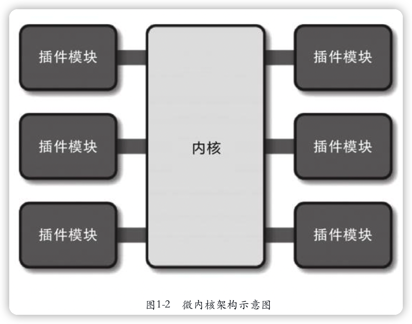
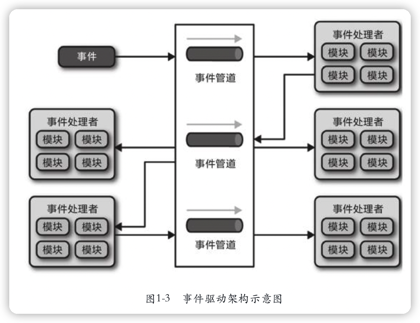
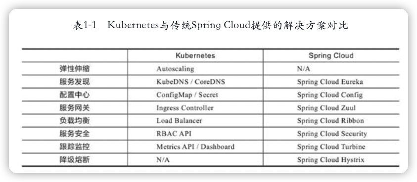
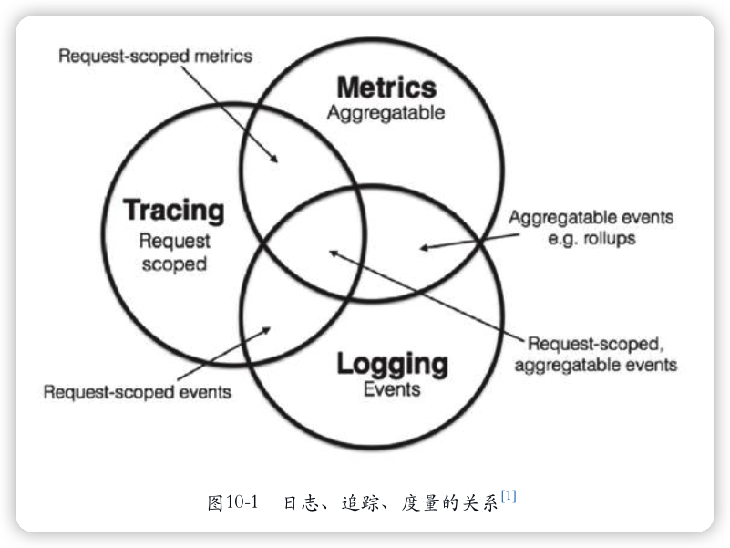
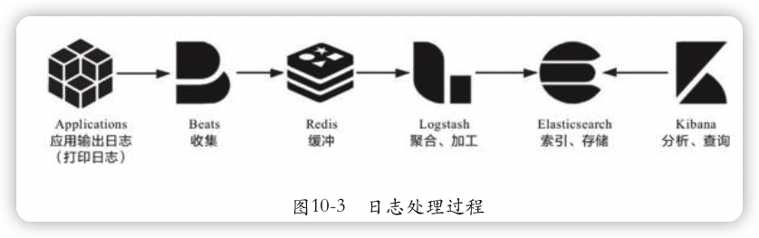

《凤凰架构：构建可靠地大型分布式系统》
---

[《凤凰架构》](https://icyfenix.cn)

一本好的技术书不仅能告诉你某个技术点怎么做、为什么这么做，还会让你明白所有**技术点如何协同配合，最终构建出一个完整的技术体系**。

Spring Boot、Spring Cloud、Kubernetes、Istio、AWS Lambda五种架构风格

“Phoenix”（凤凰）

软件工程小说《凤凰项目》

Martin Fowler在诠释“持续交付”时，曾多次提到“Phoenix Server”（凤凰服务器，取其能够“涅槃重生”之意）与“Snowflake Server”（雪花服务器，取其“世界上没有相同的两片雪花”之意）的优劣比对。

> 为了得到高质量的软件产品，我们是应该把精力更多地集中在提升其中**每一个人员、过程、产出物的能力和质量上**？还是应该把更多精力放在**整体流程和架构**上？
>
> 前者更多与编码能力相关，后者更多与软件架构相关；前者主要由开发者个体的水平决定，后者主要由技术决策者的水平决定。
>
> 具象与抽象
>
> 真正去使用这些不同风格的架构方法来实现某些需求，解决某些问题，然后在实践中观察它们的异同优劣

> 要深入理解一门技术，不仅要去看、去读、去想、去用，更要去说、去写。

# 一、演进中的架构

## 1 服务架构演进史

> 架构并不是被发明出来的，而是持续演进的结果。

### 1.1 原始分布式时代

**网络运算架构（Network Computing Architecture，NCA）**是未来**远程服务调用**的雏形；

**AFS**（Andrew File System，Andrew文件系统）是日后**分布式文件系统**的最早实现；

**Kerberos**协议是**服务认证和访问控制**的基础性协议，也是**分布式服务安全性**的重要支撑。

“分布式运算环境”（Distributed Computing Environment，DCE），分布式技术体系

> “远程”二字带来的网络环境下的新问题：
>
> 远程的服务在哪里（**服务发现**），有多少个（**负载均衡**），网络出现分区、超时或者服务出错了怎么办（**熔断、隔离、降级**），方法的参数与返回结果如何表示（**序列化协议**），信息如何传输（**传输协议**），服务权限如何管理（**认证、授权**），如何保证通信安全（**网络安全层**），如何令调用不同机器的服务返回相同的结果（**分布式数据一致性**）等一系列问题。

> 某个功能能够进行分布式，并不意味着它就应该进行分布式，强行追求透明的分布式操作，只会自寻苦果。

### 1.2 单体系统时代

进程间通信（Inter-Process Communication，IPC）(广义上讲，可以认为RPC是IPC的一种特例)

### 1.3 SOA时代

面向服务架构（Service-Oriented Architecture），一个大的单体系统拆分为若干个更小的、不运行在同一个进程的独立服务。

#### 烟囱式架构（Information Silo Architecture）

又名信息孤岛（Information Island）

#### 微内核架构（Microkernel Architecture）

也被称为插件式架构（Plug-in Architecture）

适合桌面应用程序

局限性：插件模块不能直接交互。

#### 事件驱动架构（Event-Driven Architecture）

### 1.4 微服务时代

> “微服务是一种通过多个小型服务组合来构建单个应用的架构风格，这些服务围绕业务能力而非特定的技术标准来构建。各个服务可以采用不同的编程语言、不同的数据存储技术，运行在不同的进程之中。服务采取轻量级的通信机制和自动化的部署机制实现通信与运维。”
>
> —— Microservices：A Definition of This NewArchitectural Term

微服务的九个核心的业务与技术特征：

1. 围绕业务能力构建（Organized around Business Capability）

2. 分散治理（Decentralized Governance）

3. 通过服务来实现独立自治的组件（Componentization via Service）

4. 产品化思维（Product not Project）。

   团队应该为软件产品的整个生命周期负责，开发者不仅应该知道软件如何开发，还应该知道它如何运作，用户如何反馈，乃至售后支持工作是怎样进行的。（服务的用户不一定是最终用户，也可能是消费这个服务的另外一个服务）

5. 数据去中心化（Decentralized Data Management）

6. 强终端弱管道（Smart Endpoint and Dumb Pipe）

7. 容错性设计（Design for Failure）

8. 演进式设计（Evolutionary Design）

9. 基础设施自动化（Infrastructure Automation）

> 微服务不是SOA的变体或衍生品

对于服务的==注册发现、跟踪治理、负载均衡、故障隔离、认证授权、伸缩扩展、传输通信、事务处理==等问题，微服务中将不再有统一的解决方案。

服务间远程调用问题解决方案有：RMI（Sun/Oracle）、Thrift（Facebook）、Dubbo（阿里巴巴）、gRPC（Google）、Motan2（新浪）、Finagle（Twitter）、brpc（百度）、Arvo（Hadoop）、JSON-RPC、REST，等等；

服务发现问题解决方案：Eureka（Netflix）、Consul（HashiCorp）、Nacos（阿里巴巴）、ZooKeeper（Apache）、etcd（CoreOS）、CoreDNS（CNCF）等等。

### 1.5 后微服务时代

虚拟化技术和容器化技术

微服务时代所取得的成就，本身就离不开以Docker为代表的早期容器化技术的巨大贡献。

早期的容器只被简单地视为一种**可快速启动的服务运行环境**，目的是方便程序的分发部署，在这个阶段，针对单个应用进行封装的容器并未真正解决分布式架构问题。

被业界广泛认可、普遍采用的**通过虚拟化基础设施去解决分布式架构问题**的开端，应该要从2017年**==Kubernetes==**取得容器战争的胜利开始算起。

当虚拟化的基础设施从单个服务的容器扩展至由多个容器构成的服务集群、通信网络和存储设施时，软件与硬件的界限便已模糊。

单纯的Kubernetes反而不如之前的Spring Cloud方案。这是因为**有一些问题处于应用系统与基础设施的边缘，使得很难完全在基础设施层面中精细化地处理**。

服务网格”（Service Mesh）的“边车代理模式”（Sidecar Proxy）

在虚拟化场景中的边车指的是由系统自动在服务容器（通常是指Kubernetes的Pod）中注入一个通信代理服务器，相当于那个挎斗，以类似网络安全里中间人攻击的方式进行流量劫持，在应用毫无感知的情况下，悄然接管应用所有对外通信。

> 笔者相信，未来Kubernetes将会成为服务器端的标准运行环境，如同现在的Linux系统；服务网格也将会成为微服务之间通信交互的主流模式。

### 1.6 无服务时代

相对意义的无限性能

了“无服务”（Serverless，应该翻译为“无服务器”才合适）

如果说**微服务架构是分布式系统这条路当前所能做到的极致**，那无服务架构，也许就是**“不分布式”的云端系统这条路的起点**。

> 笔者相信软件开发的未来不会只存在某一种“最先进的”架构风格，多种具有针对性的架构风格并存，是软件产业更有生命力的形态。

> 尽管目光所及之处，只是不远的前方，即使如此，依然可以看到那里有许多值得去完成的工作在等待我。
>
> —— Alan Turing，Computing Machinery and Intelligence，1950

# 二、架构师的视角

## 2 访问远程服务🔖

### 2.1 远程服务调用

RPC本身解决什么问题、如何解决这些问题、为什么要这样解决？

#### 进程间通信

管道（Pipe）或者具名管道（Named Pipe）

信号（Signal）

消息队列（Message Queue）

共享内存（Shared Memory）

本地套接字接口（IPC Socket）

#### 通信的成本

#### 三个基本问题

##### 1.如何表示数据

##### 2.如何传递数据

##### 3.如何表示方法

#### 统一的RPC

#### 分裂的RPC

如今，任何一款具有生命力的RPC框架，都不再去追求大而全的“完美”，而是<u>以某个具有针对性的特点作为主要的发展方向</u>，如：

- 朝着**面向对象**发展
- 朝着**性能**发展
- 朝着**简化**发展

将一部分功能设计成扩展点，让用户自己选择。框架聚焦于提供核心的、更高层次的能力，譬如提供负载均衡、服务注册、可观察性等方面的支持。如Thrift，Dubbo。

### 2.2 REST设计风格

REST与RPC在思想上差异的核心是**抽象的目标**不一样，即**面向过程**的编程思想与**面向资源**的编程思想两者之间的区别。

#### 理解REST

#### RESTful的系统

六个原则：

##### 1.客户端与服务端分离（Client-Server）

##### 2.无状态（Stateless）

##### 3.可缓存（Cacheability）

##### 4.分层系统（Layered System）

##### 5.统一接口（Uniform Interface）

##### 6.按需代码（Code-On-Demand）

#### RMM

衡量“服务有多么REST”的Richardson成熟度模型（Richardson MaturityModel，RMM）：

- 第0级（The Swamp of Plain Old XML）：完全不REST。
- 第1级（Resources）：开始引入资源的概念。
- 第2级（HTTP Verbs）：引入统一接口，映射到HTTP协议的方法上。
- 第3级（Hypermedia Controls）：超媒体控制，在本文里面的说法是“超文本驱动”，在Fielding论文里的说法是“Hypertext As The Engine Of Application State，HATEOAS”，其实都是指同一件事情。

🔖

#### 不足与争议

1. 面向资源的编程思想只适合做CRUD，面向过程、面向对象编程才能处理真正复杂的业务逻辑。
2. REST与HTTP完全绑定，不适合应用于要求高性能传输的场景中。
3. REST不利于事务支持。
4. REST没有传输可靠性支持。
5. REST缺乏对资源进行“部分”和“批量”处理的能力。

## 3 事务处理

数据状态的一致性（Consistency）

原子性（Atomic）

隔离性（Isolation）

持久性（Durability）

A、I、D是手段，C是目的

事务的概念起源于数据库系统，现在延伸至**所有需要保证数据一致性的应用场景**，包括数据库、事务内存、缓存、消息队列、分布式存储等。

用“**数据源**”来泛指所有这些场景中<u>提供与存储数据的逻辑设备</u>。

### 3.1 本地事务

本地事务（Local Transaction）/“局部事务”

#### 实现原子性和持久性

#### 实现隔离性

### 3.2 全局事务

### 3.3 共享事务

### 3.4 分布式事务

#### CAP与ACID

#### 可靠事件队列

#### TCC事务

#### SAGA事务

## 4 透明多级分流系统

在用户使用**信息系统**的过程中，请求从浏览器出发，在域名服务器的指引下找到系统的入口，经过<u>网关、负载均衡器、缓存、服务集群</u>等一系列设施，最后触及末端存储于数据库服务器中的信息，然后逐级返回到用户的浏览器之中。

### 4.1 客户端缓存

#### 强制缓存

##### 1.Expires

##### 2.Cache-Control

#### 协商缓存

##### 1.Last-Modified和If-Modified-Since

##### 2.ETag和If-None-Match

### 4.2 域名解析

### 4.3 传输链路

#### 连接数优化

#### 传输压缩

#### 快速UDP网络连接

### 4.4 内容分发网络

#### 路由解析

#### 内容分发

#### CDN应用

### 4.5 负载均衡

#### 数据链路层负载均衡

#### 网络层负载均衡

#### 应用层负载均衡

#### 均衡策略与实现

### 4.6 服务端缓存

为缓解CPU压力而引入缓存

为缓解I/O压力而引入缓存

#### 缓存属性

HashMap或者ConcurrentHashMap

##### 1.吞吐量

##### 2.命中率与淘汰策略

##### 3.扩展功能

##### 4.分布式缓存

#### 缓存风险

##### 1.缓存穿透

##### 2.缓存击穿

##### 3.缓存雪崩

##### 4.缓存污染

## 5 架构安全性

- 认证（Authentication）：系统如何正确分辨出操作用户的真实身份？
- 授权（Authorization）：系统如何控制一个用户该看到哪些数据，操作哪些功能？
- 凭证（Credential）：系统如何保证它与用户之间的承诺是双方当时真实意图的体现，是准确、完整且不可抵赖的？
- 保密（Confidentiality）：系统如何保证敏感数据无法被包括系统管理员在内的内外部人员所窃取、滥用？
- 传输（Transport Security）：系统如何保证通过网络传输的信息无法被第三方窃听、篡改和冒充？
- 验证（Verification）：系统如何确保提交到每项服务中的数据是合乎规则的，不会对系统稳定性、数据一致性、正确性产生风险？

### 5.1 认证

#### 认证的标准

#### 认证的实现

### 5.2 授权

#### RBAC

#### OAuth 2

### 5.3 凭证

#### Cookie-Session

#### JWT

### 5.4 保密

#### 保密的强度

#### 客户端加密

#### 密码存储和验证

### 5.5 传输

#### 摘要、加密与签名

#### 数字证书

#### 传输安全层

### 5.6 验证

# 三、分布式的基石

## 6 分布式共识

### 6.1 Paxos

Paxos是由Leslie Lamport（就是大名鼎鼎的LaTeX中的“La”）提出的一种**基于消息传递的协商共识算法**，是当今**分布式系统最重要的理论基础**。

### 6.2 Multi Paxos

### 6.3 Gossip协议

Gossip最早由施乐公司Palo Alto研究中心在论文“Epidemic Algorithms forReplicated Database Maintenance”中提出的一种用于**分布式数据库在多节点间复制同步数据的算法**。

## 7 从类库到服务

**类库（Library）是在编译期静态链接到程序中的，通过调用本地方法来使用其中的功能，而服务（Service）是进程外组件，通过调用远程方法来使用其中的功能。**

采用服务的收益是**软件系统“整体”与“部分”在物理层面的真正隔离**，这对构筑可靠的大型软件系统来说无比珍贵；代价是在**复杂性与执行性能**方面做出了极大的让步。

在一套由多个微服务相互调用才能正常运作的分布式系统中，每个节点都互相扮演着服务的生产者与消费者的多重角色，形成了一套复杂的网状调用关系。三个必须考虑的问题：

- 对消费者来说，外部的服务由谁提供？具体在什么网络位置？
- 对生产者来说，内部哪些服务需要暴露？哪些应当隐藏？应当以何种形式暴露服务？以什么规则在集群中分配请求？
- 对调用过程来说，如何保证每个远程服务都接收到相对平均的流量，获得尽可能高的服务质量与可靠性？

### 7.1 服务发现

### 7.2 网关路由

### 7.3 客户端负载均衡

## 8 流量治理

容错性设计（Design for Failure）

### 8.1 服务容错

#### 容错策略

#### 容错设计模式

### 8.2 流量控制

#### 流量统计指标

每秒事务数（Transaction per Second，TPS）

每秒请求数（Hit per Second，HPS）

每秒查询数（Query per Second，QPS）

#### 限流设计模式

#### 分布式限流

## 9 可靠通信

微服务提倡**分散治理（Decentralized Governance）**，不追求统一的技术平台，提倡让团队有自由选择的权利，不受制于语言和技术框架。

### 9.1 零信任网络

### 9.2 服务安全

## 10 可观测性

### 10.1 事件日志

### 10.2 链路追踪

### 10.3 聚合度量

# 四、不可变基础设施

## 11 虚拟化容器

容器是云计算、微服务等诸多软件行业核心技术的共同基石。

容器的首要目标是让软件分发部署过程从传统的发布安装包、靠人工部署转变为直接发布已经部署好的、包含整套运行环境的虚拟化镜像。

### 11.1 容器的崛起

#### 隔离文件：chroot

#### 隔离访问：名称空间

#### 隔离资源：cgroups

#### 封装系统：LXC

#### 封装应用：Docker

#### 封装集群：Kubernetes

### 11.2 以容器构建系统

#### 隔离与协作

#### 韧性与弹性

### 11.3 以应用为中心的封装

#### Kustomize

#### Helm与Chart

#### Operator与CRD

#### 开放应用模型

## 12 容器间网络

“虚拟化网络”是一项内容十分丰富，研究历史十分悠久的计算机技术，是计算机科学中一门独立的分支，完全不依附于虚拟化容器而存在。

### 12.1 Linux网络虚拟化

#### 网络通信模型

#### 干预网络通信

#### 虚拟化网络设备

#### 容器间通信

### 12.2 容器网络与生态

## 13 持久化存储

### 13.1 Kubernetes存储设计

### 13.2 容器存储与生态

## 14 资源与调度

### 14.1 资源模型

### 14.2 服务质量与优先级

### 14.3 驱逐机制

### 14.4默认调度器

## 15 服务网格

### 15.1 透明通信的涅槃

### 15.2 服务网格与生态

# 五、技术方法论

## 16 向微服务迈进

### 16.1 目的：微服务的驱动力

### 16.2 前提：微服务需要的条件

### 16.3 边界：微服务的粒度

### 16.4 治理：理解系统复杂性
