《大型网站技术架构》笔记
-----------

[《大型网站技术架构》李智慧](https://book.douban.com/subject/25723064/)

本书从网站的架构设计、快速开发、高效部署、业务监控、服务治理、运维管理等多个角度描述了架构设计的相关重点，涉及的核心技术包括前端优化、CDN、反向代理、缓存、消息队列、分布式存储、分布式服务、NoSQL存储、搜索、监控、安全等一系列保证大型网站安全可靠运行的关键技术点。

回顾网站架构的发展历程，我们可以发现任何大型网站架构的发展都非一蹴而就的，同自然界生物物竞天择的自然进化规律一样，大型网站的架构发展和演变也基本遵循着类似的规律。

传统的企业应用系统主要面对的技术挑战是处理复杂凌乱、千变万化的所谓业务逻辑，而大型网站主要面对的技术挑战是处理超大量的用户访问和海量的数据处理；前者的挑战来自功能性需求，后者的挑战来自非功能性需求；功能性需求也许还有“人月神话”聊以自慰，通过增加人手解决问题，而非功能需求大多是实实在在的技术难题，无论有多少工程师，做不到就是做不到。IT系统应用于企业管理已有超过半个世纪的历史，人们在这方面积累了大量的知识和经验（架构模式，领域分析，项目管理），而真正意义上大型网站从出现至今不过短短十多年的时间，很多技术挑战还在摸索阶段。

宏观层面上，将网站架构的演化发展、架构模式、核心要素一一道来；微观层面上，将网站架构常用的分布式缓存、负载均衡、消息队列、分布式服务、甚至网站如何发布运维都逐一进行了阐述。

山寨与创新的最大区别不在于是否抄袭、是否模仿，而在于**对问题和需求是否真正理解与把握**。

**秒杀**给网站带来的难以预计的瞬间高并发冲击的应对策略和架构设计。

**订单系统**，B2C网站生成一个订单需要经历扣减库存、扣减促销资源、更新用户账户等一系列操作，这些操作大多是数据库事务操作，没有办法通过缓存等手段来减轻数据库服务器负载压力。

数据库伸缩性架构

# 一、概述

## 1 大型网站架构演化

### 1.1 大型网站软件系统的特点

**高并发，大流量**

**高可用**

**海量数据**

**用户分布广泛，网络情况复杂**

**安全环境恶劣**

**需求快速变更，发布频繁**

**渐进式发展**：好的互联网产品都是慢慢运营出来的，不是一开始就开发好的，这也正好与网站架构的发展演化过程对应。

### 1.2 大型网站架构演化发展历程

#### 1.2.1 初始阶段的网站架构

**应用程序、数据库、文件**等所有的资源都在一台服务器上。LAMP

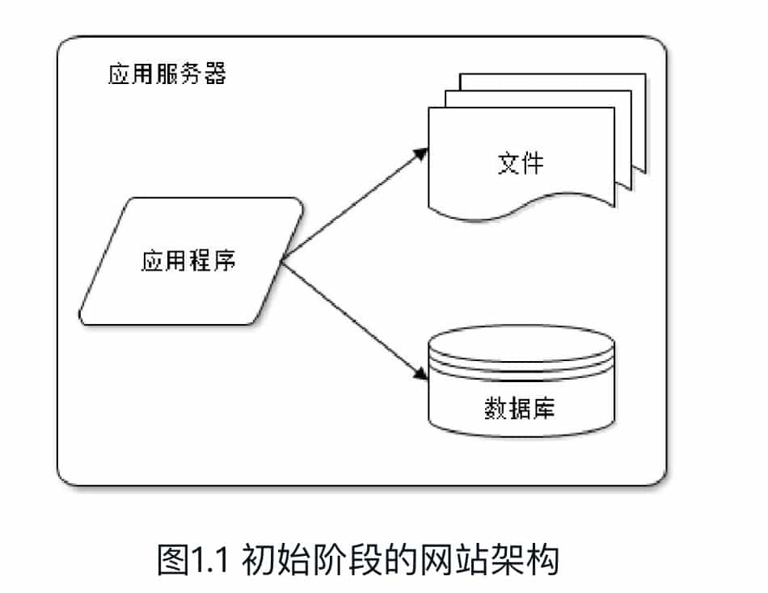

#### 1.2.2 应用服务和数据服务分离

**应用服务器**：处理大量的业务逻辑，需要更快更强大的**CPU**；

**数据库服务器**：快速磁盘检索和数据缓存，需要更快的**硬盘**和更大的**内存**；

**文件服务器**：存储大量用户上传的文件，需要更大的**硬盘**。

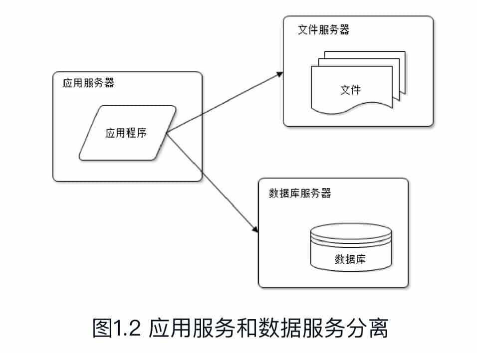

#### 1.2.3 使用缓存改善网站性能

80%的业务访问集中在20%的数据上。小部分数据缓存在内存中。

网站的两种缓存：缓存在应用服务器上的**本地缓存**；缓存在专门的分布式缓存服务器上的**远程缓存**。

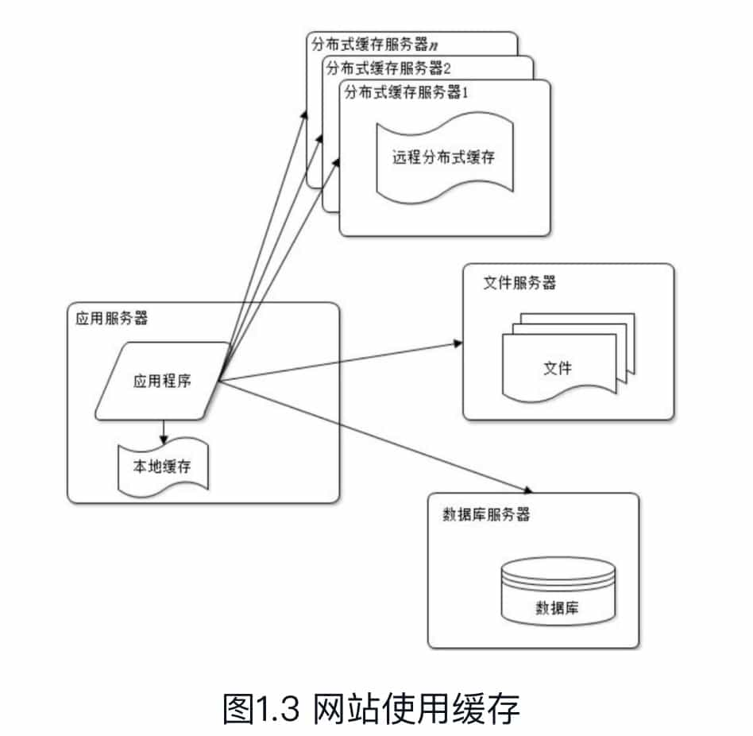

#### 1.2.4 使用应用服务器集群改善网站的并发处理能力

只要能通过增加一台服务器的方式改善负载压力，就可以以同样的方式持续增加服务器不断改善系统性能，从而实现系统的可伸缩性。

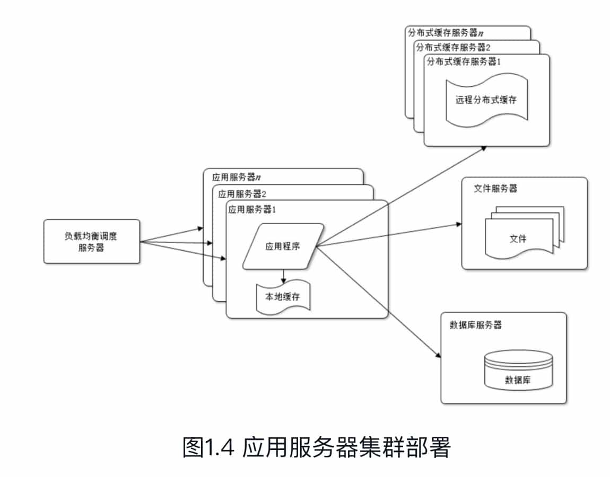

#### 1.2.5 数据库读写分离

使用缓存后，仍有一部分读操作（**缓存访问不命中、缓存过期**）和全部的写操作需要访问数据库。

主从热备功能

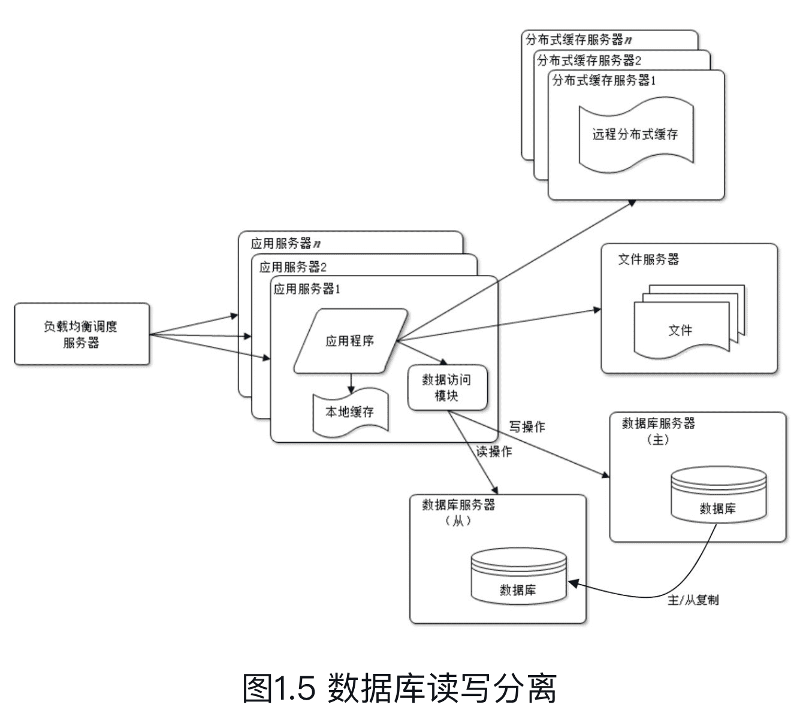

应用服务器在写数据的时候，访问主数据库，主数据库通过主从复制机制将数据更新同步到从数据库。

数据访问模块

#### 1.2.6 使用反向代理和CDN加速网站响应

CDN和反向代理的基本原理都是缓存，区别在于CDN部署在网络提供商的机房；而反向代理则部署在网站的中心机房。

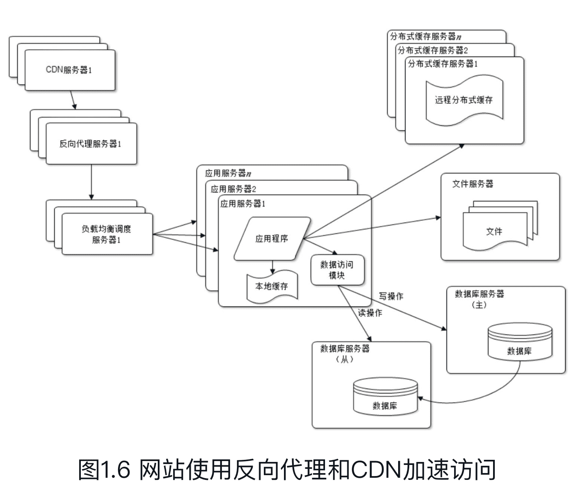

#### 1.2.7 使用分布式文件系统和分布式数据库系统

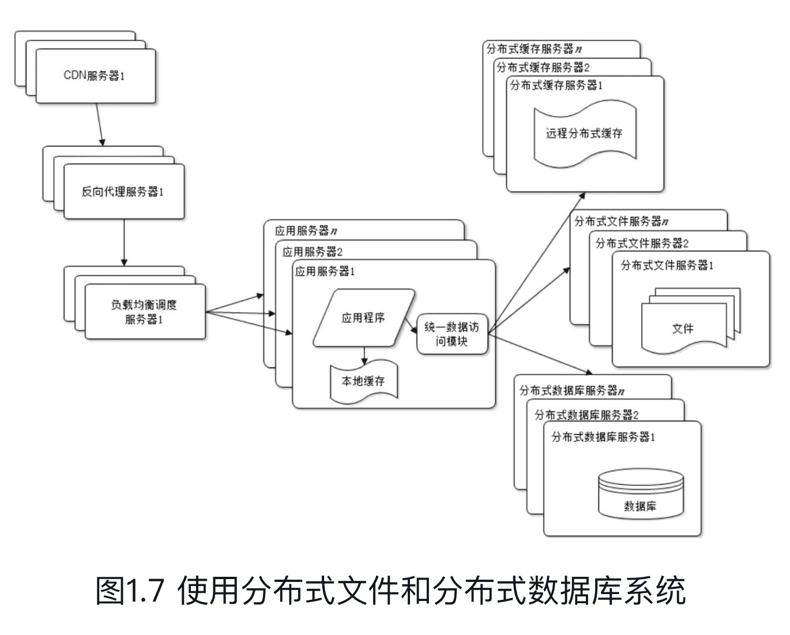

#### 1.2.8 使用NoSQL和搜索引擎

随着网站业务越来越复杂，对数据存储和检索的需求也越来越复杂，网站需要采用一些**非关系数据库技术如NoSQL**和**非数据库查询技术如搜索引擎**。

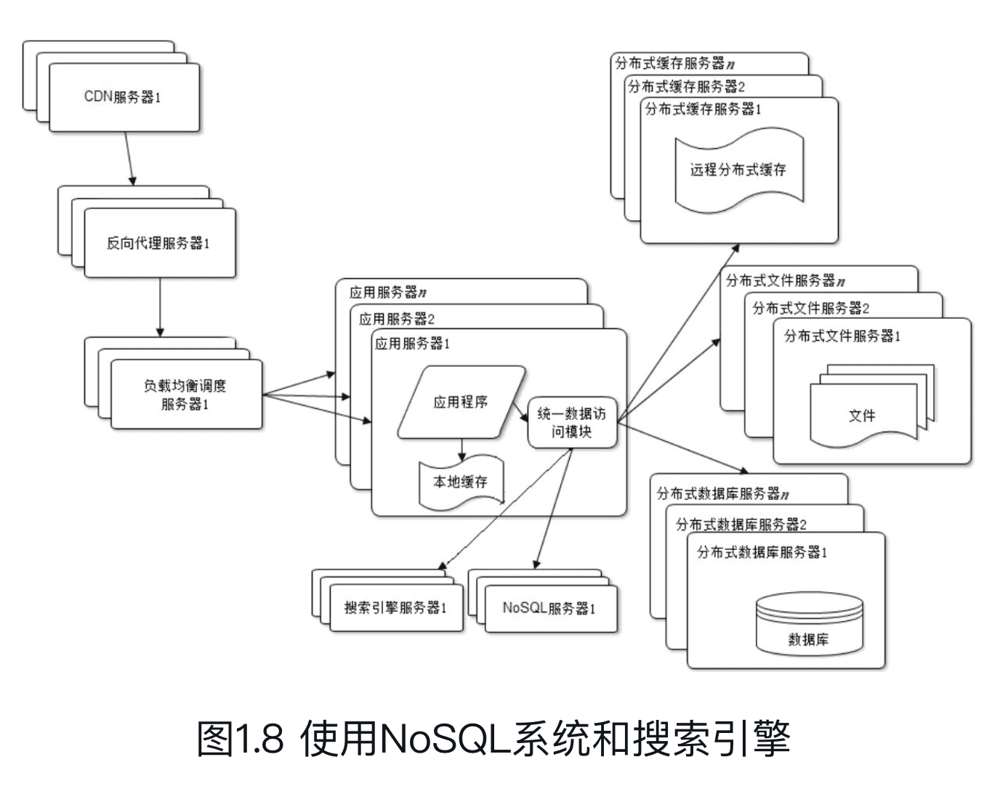

应用服务器则通过一个统一数据访问模块访问各种数据，减轻应用程序管理诸多数据源的麻烦。

#### 1.2.9 业务拆分

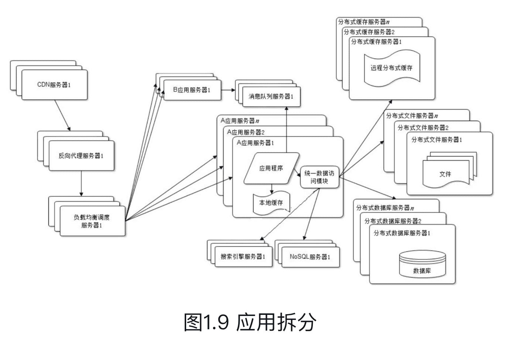

#### 1.2.10 分布式服务

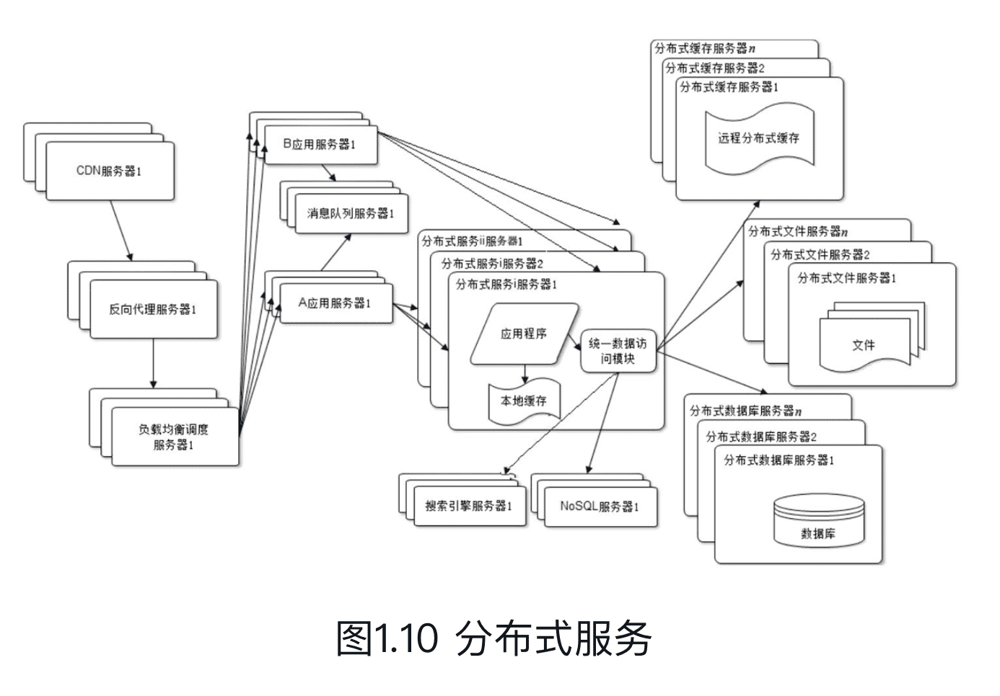

### 1.3 大型网站架构演化的价值观

网站的价值在于它能为用户提供什么价值，在于网站能做什么，而不在于它是怎么做的，所以在网站还很小的时候就去追求网站的架构是舍本逐末，得不偿失的。小型网站最需要做的就是为用户提供好的服务来创造价值，得到用户的认可，活下去，野蛮生长。

#### 1.3.1 大型网站架构技术的核心价值是随网站所需灵活应对

#### 1.3.2 驱动大型网站技术发展的主要力量是网站的业务发展

是业务成就了技术，是事业成就了人，而不是相反。

### 1.4 网站架构设计误区

#### 一味追随大公司的解决方案

#### 为了技术而技术

#### 企图用技术解决所有问题

技术是用来解决业务问题的，而业务的问题，也可以通过业务的手段去解决。

## 2 大型网站架构模式

> 建筑学中的模式：
>
> “每一个模式描述了一个在我们周围不断重复发生的问题及该问题解决方案的核心。这样，你就能一次又一次地使用该方案而不必做重复工作”。

模式的关键在于模式的**可重复性**，**问题与场景**的可重复性带来**解决方案**的可重复使用。

> 我们的现实生活中充斥着几乎千篇一律的人生架构模式：读重点学校，选热门专业，进稳定高收入的政府部门和企业，找门当户对的配偶，生一个听话的孩子继续这个模式……但是人生不同于软件，精彩的人生绝不会来自于复制。

### 2.1 网站架构模式

为了解决大型网站面临的**高并发访问、海量数据处理、高可靠运行**等一系列问题与挑战，大型互联网公司在实践中提出了许多解决方案，以实现网站高性能、高可用、易伸缩、可扩展、安全等各种技术架构目标。这些解决方案又被更多网站重复使用，从而逐渐形成大型网站架构模式。

#### 2.1.1 分层

分层，将系统在横向维度上切分成几个部分，每个部分负责一部分相对比较单一的职责，然后通过上层对下层的依赖和调用组成一个完整的系统。

分层结构在计算机世界中无处不在：

网络的7层通信协议

计算机硬件、操作系统、应用软件

网站软件系统分为应用层、服务层、数据层

#### 2.1.2 分割

软件的分层是横向，分割是纵向。

#### 2.1.3 分布式

对于大型网站，分层和分割的一个主要目的是**为了切分后的模块便于分布式部署**，即将不同模块部署在不同的服务器上，通过**远程调用**协同工作。

常用分布式方案：

- 分布式应用和服务

- 分布式静态资源

- 分布式数据和存储

- 分布式计算

此外，还有可以支持网站线上服务器配置实时更新的**分布式配置**；分布式环境下实现并发和协同的**分布式锁**；支持云存储的**分布式文件系统**等。

#### 2.1.4 集群

多台服务器部署相同应用构成一个集群，通过负载均衡设备共同对外提供服务。

#### 2.1.5 缓存

**缓存就是将数据存放在距离计算最近的位置以加快处理速度**。缓存是改善软件性能的第一手段，现代CPU越来越快的一个重要因素就是使用了更多的缓存，在复杂的软件设计中，缓存几乎无处不在。

缓存大致可分为：

- CDN

- 反向代理

- 本地缓存：在应用服务器本地缓存着热点数据，应用程序可以在本机内存中直接访问数据，而无需访问数据库。

- 分布式缓存

使用缓存有两个前提条件：

一是数据访问热点**不均衡**，某些数据会被更频繁的访问，这些数据应该放在缓存中；

二是数据在某个时间段内有效，**不会很快过期**，否则缓存的数据就会因已经失效而产生脏读，影响结果的正确性。

#### 2.1.6 异步

计算机软件发展的一个重要目标和驱动力是**降低软件耦合性**。事物之间**直接关系**越少，就越少被彼此影响，越可以独立发展。

降低耦合性的手段有分层、分割、分布等，以及异步，业务之间的消息传递不是同步调用，而是将一个业务操作分成多个阶段，每个阶段之间通过共享数据的方式异步执行进行协作。

在单一服务器内部可通过多线程共享**内存队列**的方式实现异步，处在业务操作前面的线程将输出写入到队列，后面的线程从队列中读取数据进行处理；在分布式系统中，多个服务器集群通过**分布式消息队列**实现异步，分布式消息队列可以看作内存队列的分布式部署。

异步架构是典型的**生产者消费者模式**，两者不存在直接调用，只要**保持数据结构不变**，彼此功能实现可以随意变化而不互相影响，这对网站扩展新功能非常便利。除此之外，使用异步消息队列还有如下特性：

- 提高系统可用性。

- 加快网站响应速度。

- 消除并发访问高峰。

**注意：**使用异步方式处理业务可能会对用户体验、业务流程造成影响，需要网站产品设计方面的支持。

#### 2.1.7 冗余

大规模服务器，难免出现某台服务器宕机，要想保证在服务器宕机的情况下网站依然可以继续服务，不丢失数据，就需要一定程度的**服务器冗余运行**，**数据冗余备份**，这样当某台服务器宕机时，可以将其上的服务和数据访问转移到其他机器上。

访问和负载很小的服务也必须部署至少两台服务器构成一个集群，其目的就是通过冗余实现服务高可用。数据库除了定期备份，存档保存，实现**冷备份**外，为了保证在线业务高可用，还需要对数据库进行主从分离，实时同步实现**热备份**。

为了抵御地震、海啸等不可抗力导致的网站完全瘫痪，某些大型网站会对整个数据中心进行备份，全球范围内部署**灾备数据中心**。网站程序和数据实时同步到多个灾备数据中心。

#### 2.1.8 自动化

自动化发布运维

自动化代码管理

自动化测试

自动化安全检测

自动化部署

自动化监控

自动化报警

自动化失效转移

自动化失效恢复

自动化降级

自动化分配资源

#### 2.1.9 安全

通过**密码**和**手机校验码**进行身份认证；

登录、交易等操作需要对网络通信进行**加密**，网站服务器上存储的敏感数据如用户信息等也进行加密处理；

为了防止机器人程序滥用网络资源攻击网站，网站使用**验证码**进行识别；

对于常见的用于攻击网站的XSS攻击、SQL注入、进行编码转换等相应处理；

对于垃圾信息、敏感信息进行**过滤**；

对交易转账等重要操作根据交易模式和交易信息进行**风险控制**。

### 2.2 架构模式在新浪微博的应用

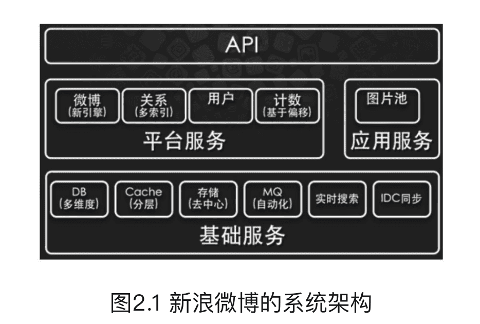

## 3 大型网站核心架构要素

架构，通俗的说法是**“最高层次的规划，难以改变的决定”**。

> 从这个意义上说，人生规划也是一种架构。选什么学校、学什么专业、进什么公司、找什么对象，过什么样的生活，都是自己人生的架构。

软件架构：**“有关软件整体结构与组件的抽象描述，用于指导大型软件系统各个方面的设计”**。

### 3.1 性能

很多时候网站性能问题是网站架构升级优化的触发器。

从用户浏览器到数据库，影响用户请求的所有环节都可以进行性能优化。

- 在浏览器端，可以通过**浏览器缓存、使用页面压缩、合理布局页面、减少Cookie传输**等手段改善性能。
- 还可以使用**CDN**，将网站静态内容分发至离用户最近的网络服务商机房，使用户通过最短访问路径获取数据。
- 可以在网站机房部署**反向代理**服务器，缓存热点文件，加快请求响应速度，减轻应用服务器负载压力。
- 在应用服务器端，可以使用**服务器本地缓存和分布式缓存**，通过缓存在内存中的**热点数据**处理用户请求，加快请求处理过程，减轻数据库负载压力。
- 也可以通过异步操作将用户请求发送至**消息队列**等待后续任务处理，而当前请求直接返回响应给用户。
- 在网站有很多用户高并发请求的情况下，可以将多台应用服务器组成一个**集群**共同对外服务，提高整体处理能力，改善性能。
- 在代码层面，也可以通过使用多线程、改善内存管理等手段优化性能。
- 在数据库服务器端，**索引、缓存、SQL优化**等性能优化手段都已经比较成熟。而方兴未艾的NoSQL数据库通过优化**数据模型、存储结构、伸缩特性**等手段在性能方面的优势也日趋明显。

衡量网站性能重要的指标有响应时间、TPS、系统性能计数器等。

### 3.2 可用性

### 3.3 伸缩性

伸缩性：通过不断向集群中加入服务器的手段来缓解不断上升的用户并发访问压力和不断增长的数据存储需求。

衡量架构伸缩性的**主要标准**就是是否可以用多台服务器构建集群，是否容易向集群中添加新的服务器。加入新的服务器后是否可以提供和原来的服务器无差别的服务。集群中可容纳的总的服务器数量是否有限制。

对于应用服务器集群，只要**服务器上不保存数据**，所有服务器都是对等的，通过使用合适的**负载均衡**设备就可以向集群中不断加入服务器。

缓存路由

缓存路由算法

关系数据库虽然支持数据复制，**主从热备**等机制，但是很难做到大规模集群的可伸缩性，因此<u>关系数据库的集群伸缩性方案必须在数据库之外实现</u>，通过路由分区等手段将部署有多个数据库的服务器组成一个集群。

### 3.4 扩展性

衡量网站架构扩展性好坏的主要标准就是在网站增加新的业务产品时，是否可以实现对现有产品透明无影响，不需要任何改动或者很少改动既有业务功能就可以上线新产品。

伸缩架构的主要手段是：

1. 事件驱动架构
2. 分布式服务

性能、可用性、伸缩性、扩展性和安全性是网站架构最核心的几个要素，这几个问题解决了，大型网站架构设计的大部分挑战也就克服了。

### 3.5 安全性

# 二、架构

## 4 瞬时响应：网站的高性能架构

网站性能是客观的指标，可以具体体现到响应时间、吞吐量等技术指标，同时也是主观的感受，而感受则是一种与具体参与者相关的微妙的东西，用户的感受和工程师的感受不同，不同的用户感受也不同。

### 4.1 网站性能测试

#### 不同视角下的网站性能

##### 1.用户视角

##### 2.开发人员视角

##### 3. 运维人员视角的网站性能

#### 性能测试指标

##### 1.响应时间

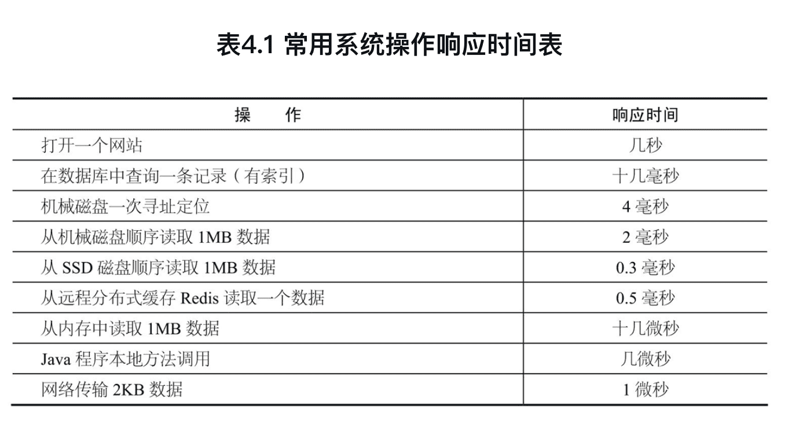

##### 2.并发数

> 网站系统用户数>>网站在线用户数>>网站并发用户数

##### 3.吞吐量

指单位时间内系统处理的请求数量，体现系统的整体处理能力。

TPS（每秒事务数）

HPS（每秒HTTP请求数）

QPS（每秒查询数）

##### 4.性能计数器

描述服务器或操作系统性能的一些数据指标。包括**SystemLoad、对象与线程数、内存使用、CPU使用、磁盘与网络I/O**等指标。

##### 性能测试方法

性能测试、负载测试、压力测试、稳定性测试

#### 性能测试报告

#### 性能优化策略

##### 1.性能分析

检查请求处理的各个环节的日志，分析哪个环节响应时间不合理、超过预期；然后检查监控数据，分析影响性能的主要因素是内存、磁盘、网络、还是CPU，是代码问题还是架构设计不合理，或者系统资源确实不足。

##### 2.性能优化

Web前端性能优化、应用服务器性能优化、存储服务器性能优化

### 4.2 Web前端性能优化

一般说来Web前端指网站业务逻辑之前的部分，包括浏览器加载、网站视图模型、图片服务、CDN服务等，主要优化手段有优化浏览器访问、使用反向代理、CDN等。

#### 浏览器访问优化

##### 1.减少http请求

主要手段是合并CSS、合并JavaScript、合并图片。将浏览器一次访问需要的JavaScript、CSS合并成一个文件，这样浏览器就只需要一次请求。图片也可以合并，多张图片合并成一张，如果每张图片都有不同的超链接，可通过CSS偏移响应鼠标点击操作，构造不同的URL。

##### 2.使用浏览器缓存

通过设置HTTP头中Cache-Control和Expires的属性，可设定浏览器缓存，缓存时间可以是数天，甚至是几个月。

##### 3.启用压缩

在服务器端对文件进行压缩，在浏览器端对文件解压缩，可有效减少通信传输的数据量。

##### 4.CSS放在页面最上面、JavaScript放在页面最下面

浏览器会在下载完全部CSS之后才对整个页面进行渲染，在加载JavaScript后立即执行。

##### 5.减少Cookie传输

#### CDN加速

CDN能够缓存的一般是静态资源，如图片、文件、CSS、Script脚本、静态网页等，但是这些文件访问频度很高，将其缓存在CDN可极大改善网页的打开速度。

#### 反向代理

传统代理服务器位于浏览器一侧，代理浏览器将HTTP请求发送到互联网上，而反向代理服务器位于网站机房一侧，代理网站Web服务器接收HTTP请求。

和传统代理服务器可以保护**浏览器安全**一样，反向代理服务器也具有保护**网站安全**的作用，来自互联网的访问请求必须经过代理服务器，相当于在Web服务器和可能的网络攻击之间建立了一个屏障。

反向代理服务器也可以通过配置缓存功能加速Web请求。

反向代理也可以实现负载均衡的功能，而通过负载均衡构建的应用集群可以提高系统总体处理能力，进而改善网站高并发情况下的性能。

### 4.3 应用服务器性能优化

应用服务器就是处理网站业务的服务器，网站的业务代码都部署在这里，是网站开发最复杂，变化最多的地方，优化手段主要有缓存、集群、异步等。

#### 分布式缓存

> 网站性能优化第一定律：优先考虑使用缓存优化性能。

在整个网站应用中，缓存几乎无所不在，既存在于浏览器，也存在于应用服务器和数据库服务器；既可以对数据缓存，也可以对文件缓存，还可以对页面片段缓存。合理使用缓存，对网站性能优化意义重大。

##### 1.缓存的基本原理

缓存指将数据存储在相对较高访问速度的存储介质中，以供系统处理。

缓存的本质是一个内存Hash表，网站应用中，数据缓存以一对Key、Value的形式存储在内存Hash表中。

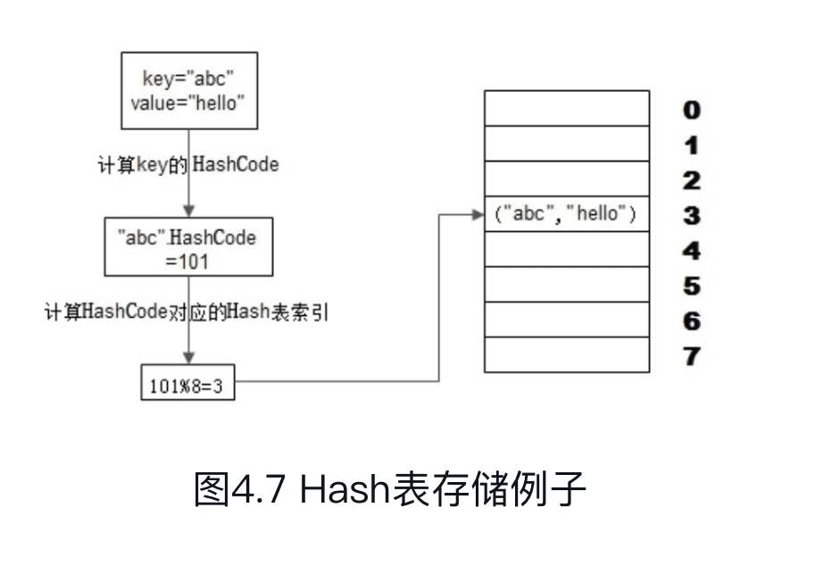

缓存主要用来存放那些**读写比很高、很少变化**的数据，如**商品的类目信息，热门词的搜索列表信息，热门商品信息**等。

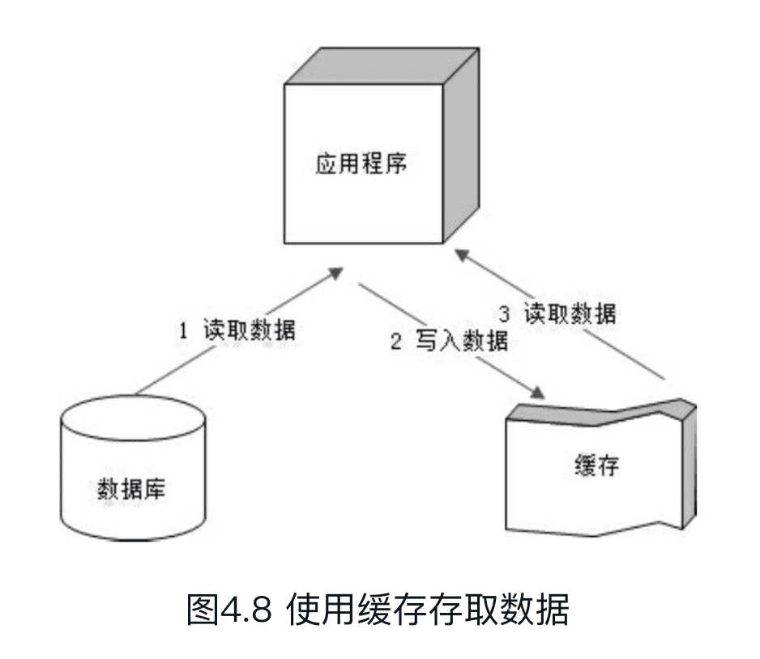

网站数据访问通常遵循二八定律，即网站数据访问通常遵循二八定律，即**80%的访问落在20%的数据上**，缓存主要针对这20%数据。

##### 2.合理使用缓存

###### 频繁修改的数据

读写比在2:1以上，即写入一次缓存，在数据更新前至少读取两次，缓存才有意义。

##### 没有热点的访问

###### 数据不一致与脏读

###### 缓存可用性

###### 缓存预热

###### 缓存穿透

##### 3.分布式缓存架构

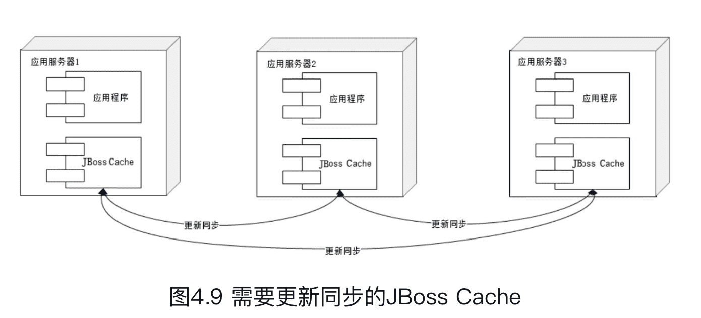

##### 4.Memcached

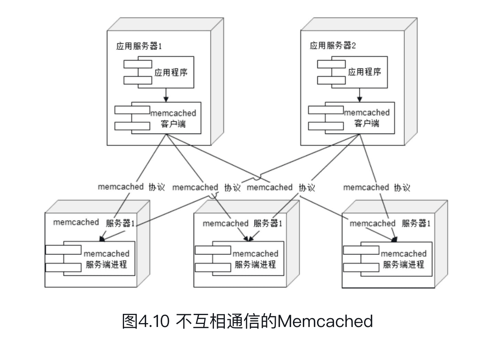

#### 异步操作

使用消息队列将调用异步化，可改善网站的扩展性[7章]()。

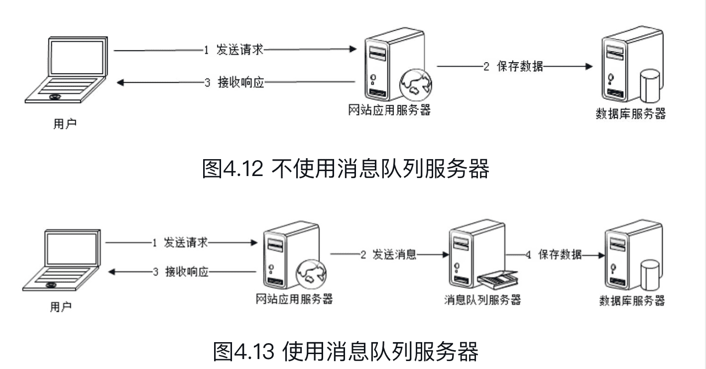

在使用消息队列后，用户请求的数据发送给消息队列后立即返回，再由消息队列的消费者进程（通常情况下，该进程通常独立部署在专门的服务器集群上）从消息队列中获取数据，异步写入数据库。

> 任何可以晚点做的事情都应该晚点再做。

#### 使用集群

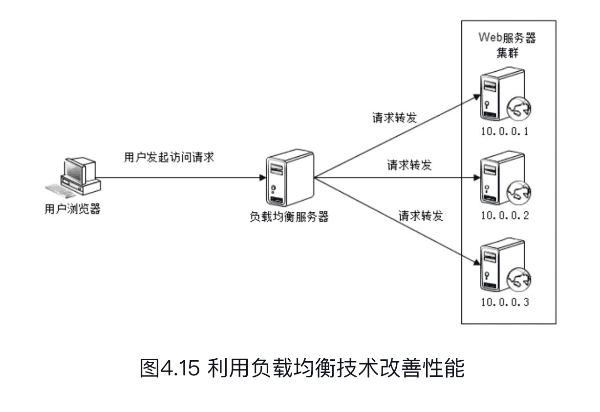

#### 代码优化

##### 1.多线程

> 启动线程数=[任务执行时间/（任务执行时间-IO等待时间）]×CPU内核数

#### 2.资源复用

系统运行时，要**尽量减少那些开销很大的系统资源的创建和销毁**，比如<u>数据库连接、网络通信连接、线程、复杂对象</u>等。从编程角度，资源复用主要有两种模式：**单例（Singleton）**和**对象池（ObjectPool）**。

#### 3.数据结构

#### 4.垃圾回收

### 4.4 存储性能优化

#### 机械硬盘vs. 固态硬盘

#### B+树vs.LSM树

!!

#### RAID vs.HDFS

> 技术是为业务服务的，技术选型和架构决策依赖业务规划乃至企业战略规划，离开业务发展的支撑和驱动，技术走不远，甚至还会迷路。

## 5 万无一失：网站的高可用架构

### 5.1 网站可用性的度量与考核

#### 度量

**网站不可用**也被称作**网站故障**，业界通常用多少个9来衡量网站的可用性，如QQ的可用性是4个9，即QQ服务99.99%可用，这意味着QQ服务要保证其在所有运行时间中，只有0.01%的时间不可用，也就是一年中大约最多53分钟不可用。

> 网站不可用时间（故障时间）=故障修复时间点-故障发现（报告）时间点

> 网站年度可用性指标=（1-网站不可用时间/年度总时间）×100%

对于大多数网站而言，2个9是基本可用，网站年度不可用时间小于88小时；3个9是较高可用，网站年度不可用时间小于9小时；4个9是具有自动恢复能力的高可用，网站年度不可用时间小于53分钟；5个9是极高可用性，网站年度不可用时间小于5分钟。

#### 考核

> 故障分=故障时间（分钟）× 故障权重在

### 5.2 高可用的网站架构

既然硬件故障是常态，网站的高可用架构设计的主要目的就是保证服务器硬件故障时服务依然可用、数据依然保存并能够被访问。

### 5.3 高可用的应用 !!

所谓无状态的应用是指应用服务器不保存业务的上下文信息，而仅根据每次请求提交的数据进行相应的业务逻辑处理，多个服务实例（服务器）之间完全对等，请求提交到任意服务器，处理结果都是完全一样的。

#### 通过负载均衡进行无状态服务的失效转移

心跳检测机制

#### 应用服务器集群的Session管理

集群环境下，Session管理主要以下几种手段：

##### 1.Session复制

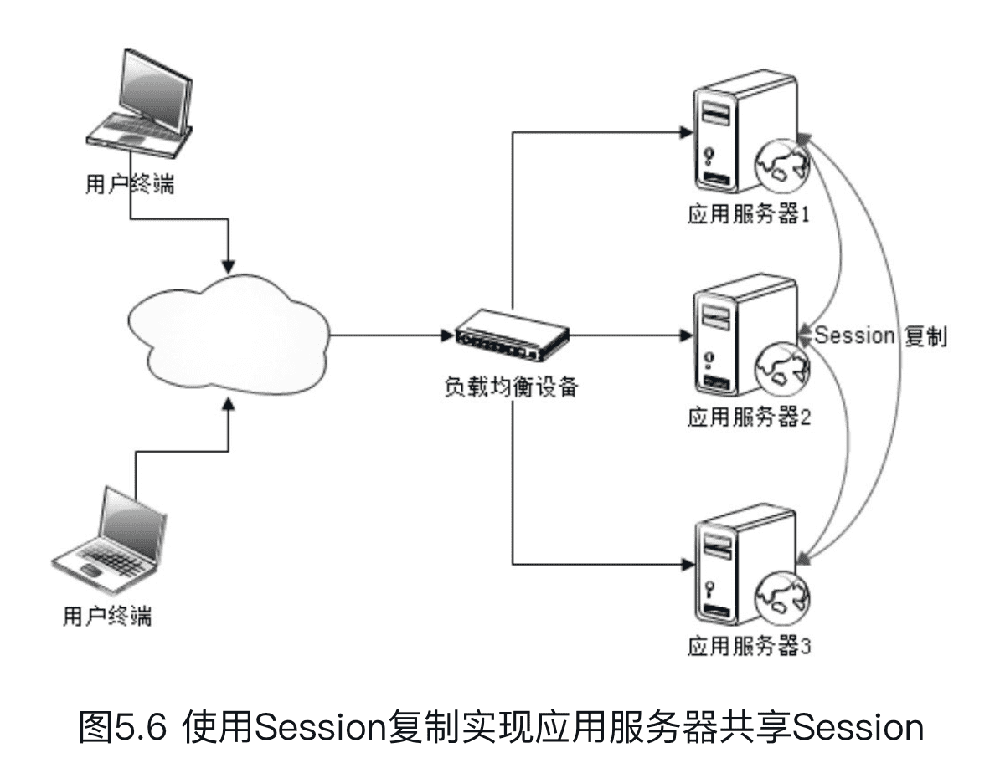

##### 2.Session绑定

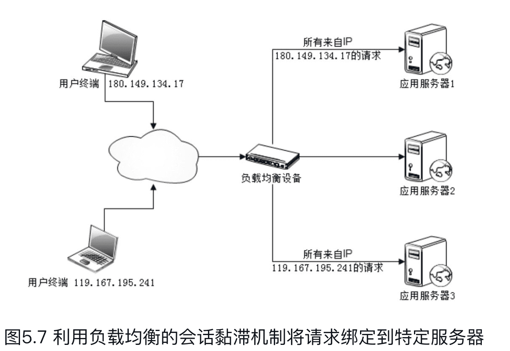

##### 3.利用Cookie记录Session

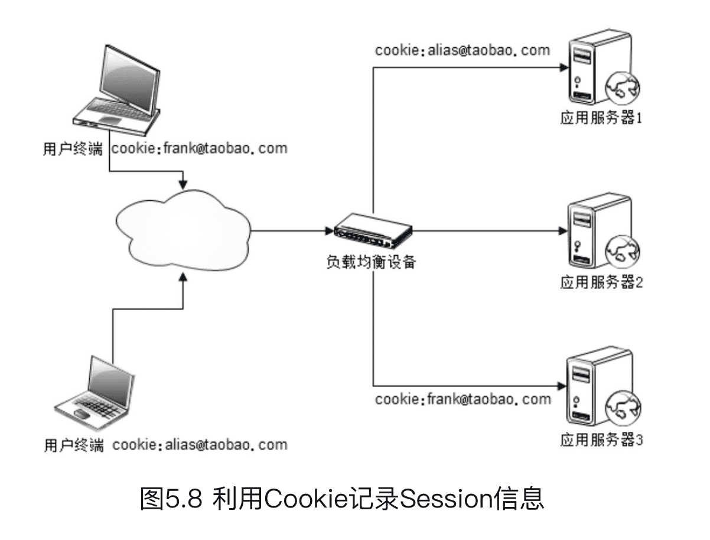

##### 4.Session服务器

利用独立部署的Session服务器（集群）统一管理Session，应用服务器每次读写Session时，都访问Session服务器。

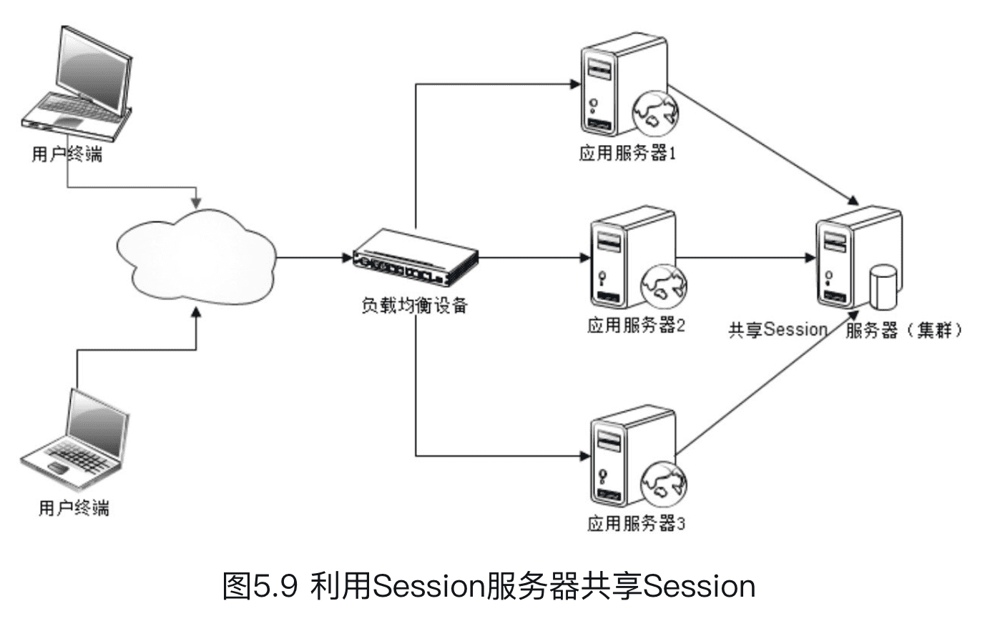

这种解决方案事实上是将应用服务器的状态分离，分为无状态的应用服务器和有状态的Session服务器，然后针对这两种服务器的不同特性分别设计其架构。

如果业务场景对Session管理有比较高的要求，比如利用Session服务集成单点登录（SSO）、用户服务等功能，则需要开发专门的Session服务管理平台。

### 5.4 高可用的服务

可复用的服务模块为业务产品提供基础公共服务，大型网站中这些服务通常都独立分布式部署，被具体应用远程调用。

可复用的服务和应用一样，也是无状态的服务，因此可以使用类似负载均衡的**失效转移策略**实现高可用的服务。

#### 1.分级管理

#### 2.超时设置

#### 3.异步调用

#### 4.服务降级

#### 5.幂等性设计

### 5.5 高可用的数据

> 保护网站的数据就是保护企业的命脉>

保证数据存储高可用的手段主要是**数据备份**和**失效转移机制**。

失效转移机制保证当一个数据副本不可访问时，可以快速切换访问数据的其他副本，保证系统可用。

#### CAP原理

CAP原理认为，一个提供数据服务的存储系统无法同时满足数据一致性（Consistency）、数据可用性（Availibility）、分区耐受性（Patition Tolerance，系统具有跨网络分区的伸缩性）这三个条件。

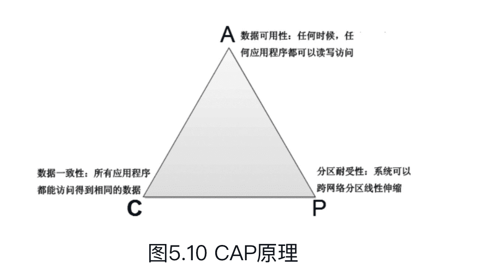

#### 数据备份

数据热备可分为两种：异步热备方式和同步热备方式。

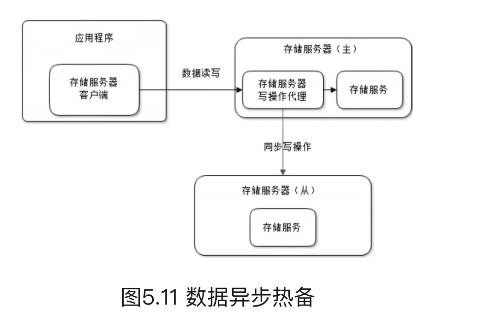

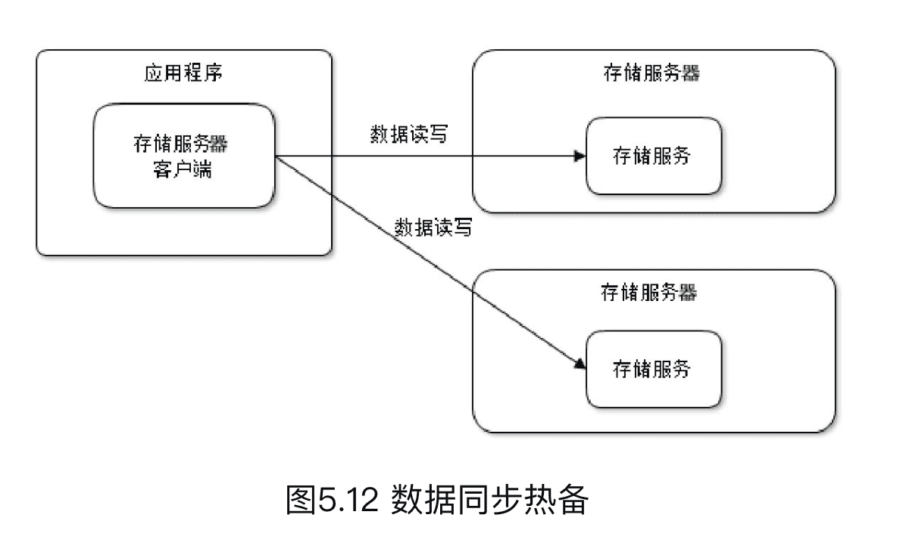

#### 失效转移

##### 1.失效确认

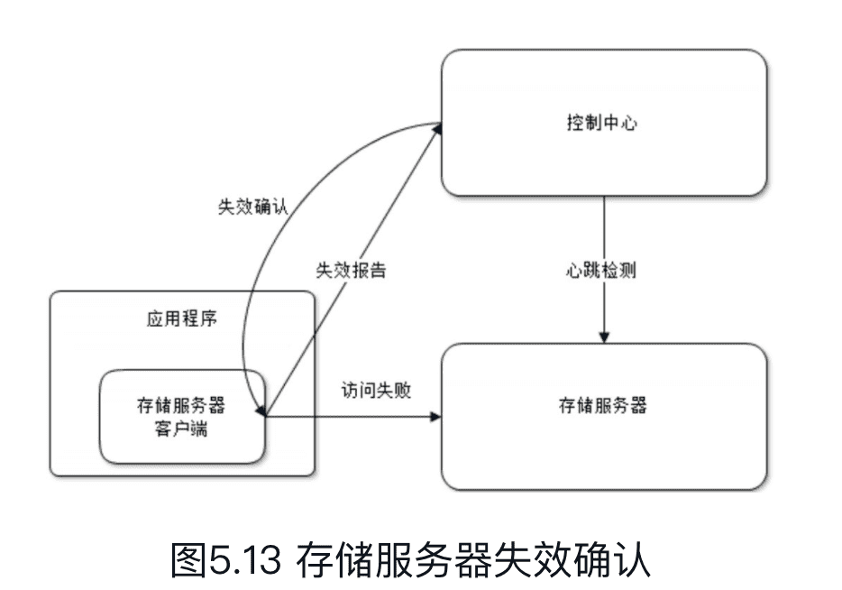

##### 2.访问转移

##### 3.数据恢复

### 5.6 高可用网站的软件质量保证

#### 网站发布

网站的发布过程事实上和服务器宕机效果相当，其对系统可用性的影响也和服务器宕机相似。

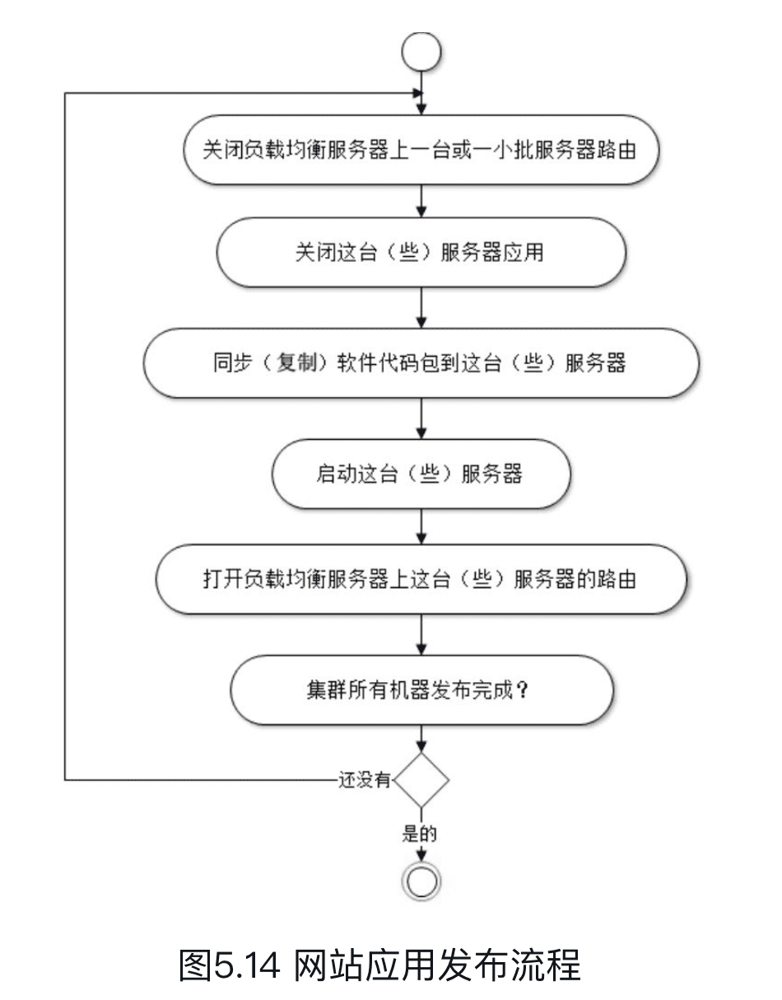

#### 自动化测试

Selenium

#### 预发布验证

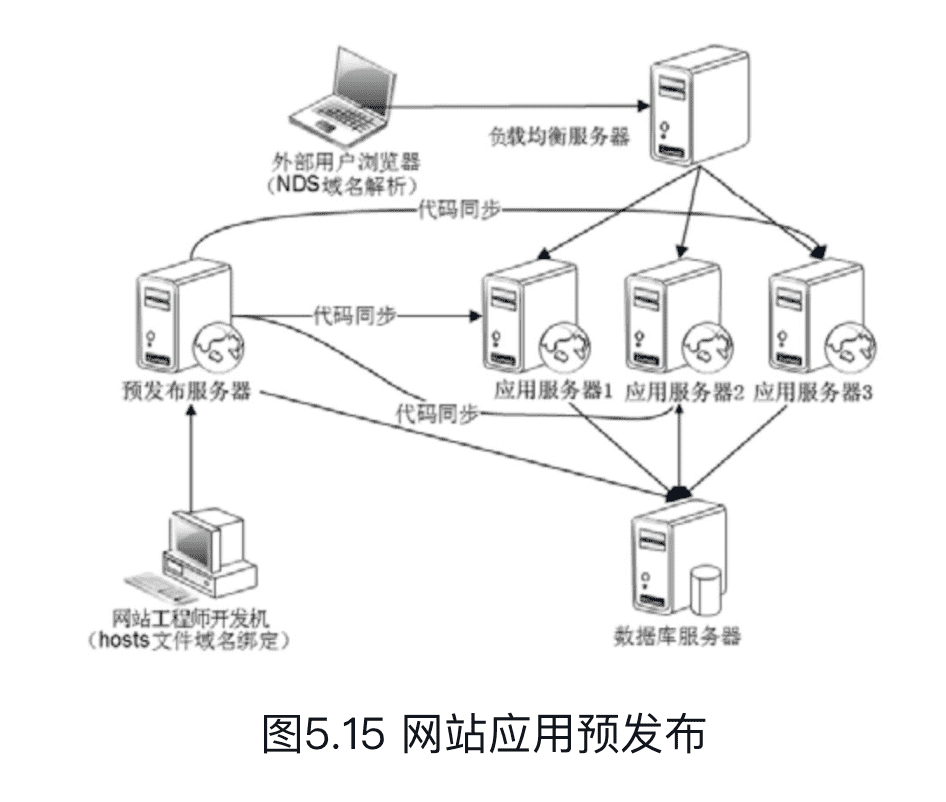

#### 代码控制!!

自动化发布

#### 灰度发布

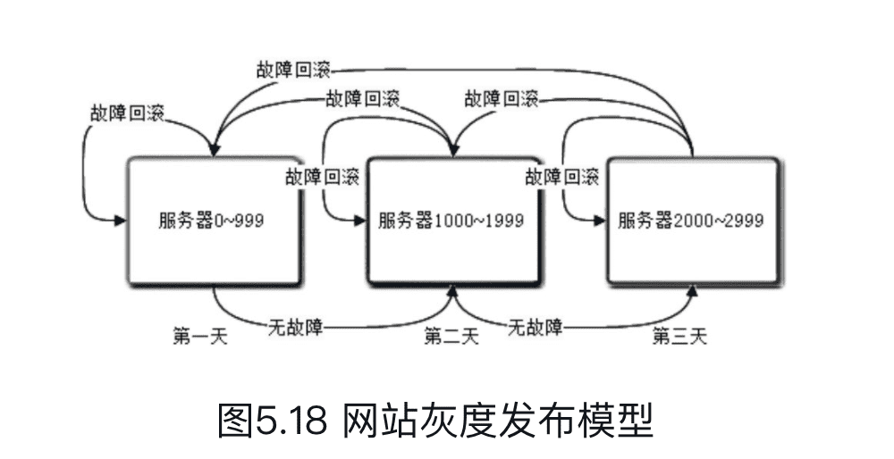

AB测试

### 5.7 网站运行监控

> “不允许没有监控的系统上线”。

#### 监控数据采集

##### 1.用户行为日志收集

用户行为日志指用户在浏览器上所做的所有操作及其所在的操作环境，包括用户操作系统与浏览器版本信息，IP地址、页面访问路径、页面停留时间等，这些数据对统计网站PV/UV指标、分析用户行为、优化网站设计、个性化营销与推荐等非常重要。

服务器端日志收集。

客户端浏览器日志收集。

目前许多网站逐步开发基于实时计算框架Storm的日志统计与分析工具。

##### 2.服务器性能监控

##### 3.运行数据报告

#### 监控管理

##### 系统报警

##### 失效转移

##### 自动优雅降级

## 6 永无止境：网站的伸缩性架构

网站的伸缩性：指不需要改变网站的软硬件设计，仅仅通过改变部署的服务器数量就可以扩大或者缩小网站的服务处理能力。

### 6.1 网站架构的伸缩性设计

### 6.2 应用服务器集群的伸缩性设计

#### HTTP重定向负载均衡

#### DNS域名解析负载均衡

#### 反向代理负载均衡

#### IP负载均衡

#### 数据链路层负载均衡

#### 负载均衡算法

### 6.3 分布式缓存集群的伸缩性设计

#### Memcached分布式缓存集群的访问模型

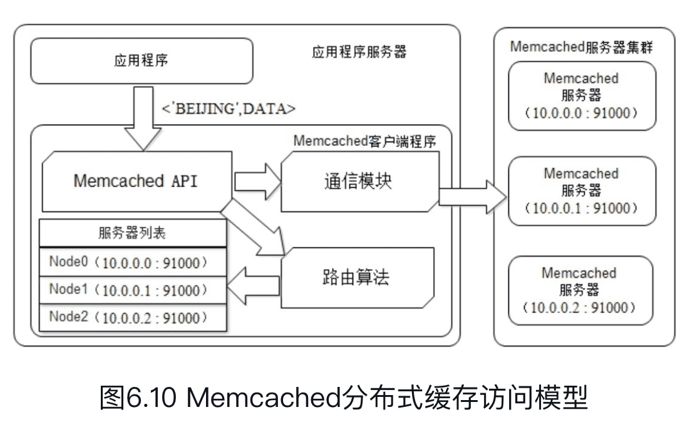

#### Memcached分布式缓存集群的伸缩性挑战

#### 分布式缓存的一致性Hash算法

### 6.4 数据存储服务器集群的伸缩性设计

#### 关系数据库集群的伸缩性设计

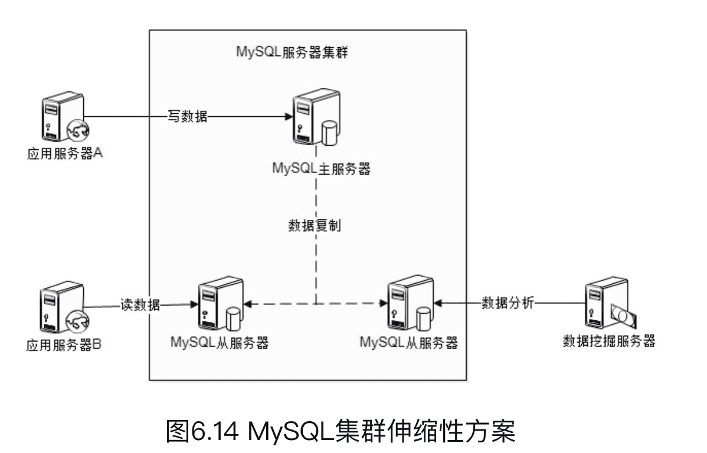

Amoeba

Cobar

#### NoSQL数据库的伸缩性设计

Apache HBase

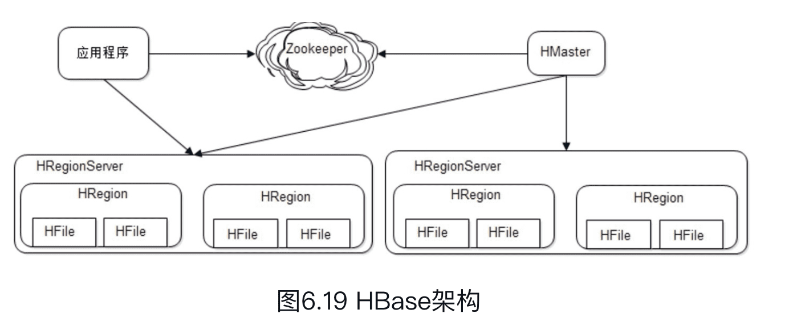

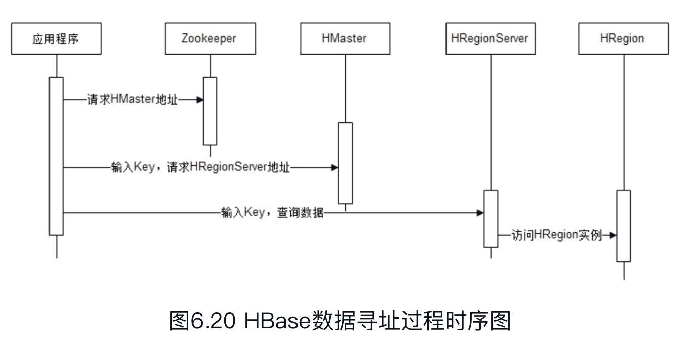

## 7 随需应变：网站的可扩展架构

## 8 固若金汤：网站的安全架构

### 8.1 道高一尺魔高一丈的网站应用攻击与防御

#### XSS攻击

#### 注入攻击

#### CSRF攻击

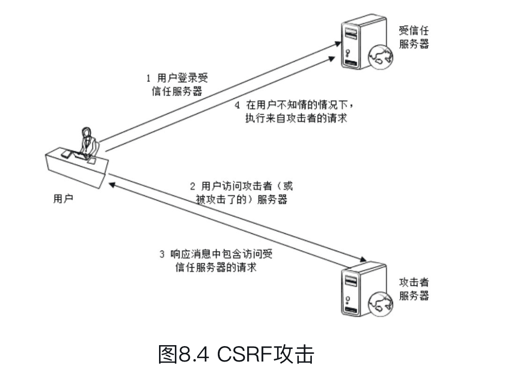

#### 其他攻击和漏洞

#### Web应用防火墙

#### 网站安全漏洞扫描

### 8.2 信息加密技术及密钥安全管理

#### 单向散列加密

#### 对称加密

#### 非对称加密

#### 密钥安全管理

### 8.3 信息过滤与反垃圾

#### 文本匹配

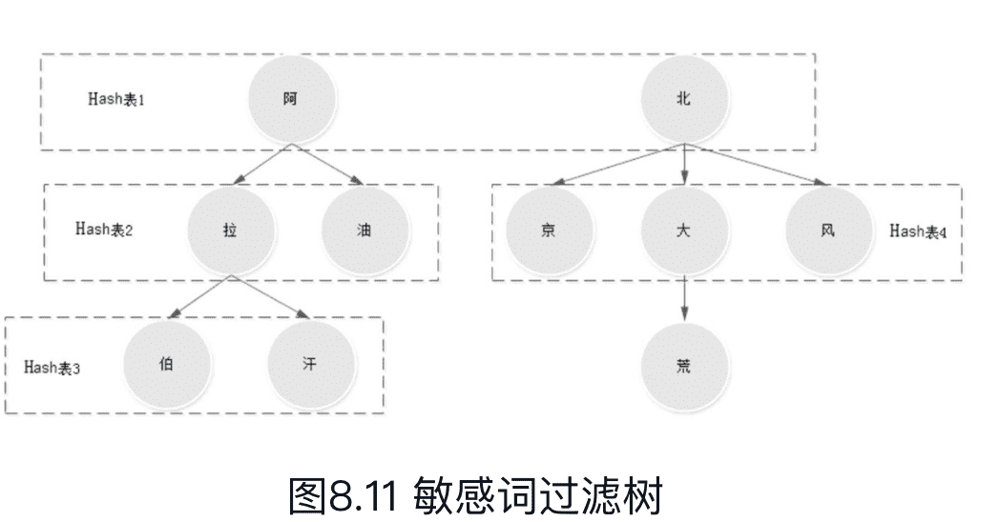

#### 分类算法

#### 黑名单

### 8.4 电子商务风险控制

# 三、案例

## 9 淘宝网的架构演化案例分析

## 10 维基百科的高性能架构设计分析

## 11 海量分布式存储系统Doris的高可用架构设计分析

## 12 网购秒杀系统架构设计案例分析

## 13 大型网站典型故障案例分析

# 四、架构师

### 