消息队列高手课
---

https://time.geekbang.org/column/intro/100032301

消息队列中间件的使用并不复杂，但如果你对消息队列不熟悉，很难构建出健壮、稳定并且高性能的企业级系统，你会面临很多实际问题：

- 如何选择最适合系统的消息队列产品？
- 如何保证消息不重复、不丢失？
- 如何做到水平扩展？

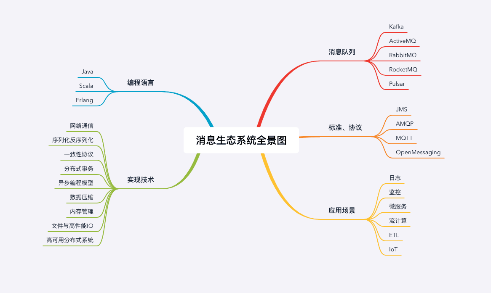

## 基础篇

### 1-为什么需要消息队列？

消息队列是最古老的中间件之一，从系统之间有通信需求开始，就自然产生了消息队列。

小袁是一家巧克力作坊的老板，生产出美味的巧克力需要三道工序：首先将可可豆磨成可可粉，然后将可可粉加热并加入糖变成巧克力浆，最后将巧克力浆灌入模具，撒上坚果碎，冷却后就是成品巧克力了。

最开始的时候，每次研磨出一桶可可粉后，工人就会把这桶可可粉送到加工巧克力浆的工人手上，然后再回来加工下一桶可可粉。小袁很快就发现，其实工人可以不用自己运送半成品，于是他在每道工序之间都增加了一组传送带，研磨工人只要把研磨好的可可粉放到传送带上，就可以去加工下一桶可可粉了。 传送带解决了上下游工序之间的“通信”问题。

传送带上线后确实提高了生产效率，但也带来了新的问题：每道工序的生产速度并不相同。在巧克力浆车间，一桶可可粉传送过来时，工人可能正在加工上一批可可粉，没有时间接收。不同工序的工人们必须协调好什么时间往传送带上放置半成品，如果出现上下游工序加工**速度不一致**的情况，上下游工人之间必须互相等待，确保不会出现传送带上的半成品无人接收的情况。

为了解决这个问题，小袁在每组传送的下游带配备了一个**暂存半成品的仓库**，这样上游工人就不用等待下游工人有空，任何时间都可以把加工完成的半成品丢到传送带上，无法接收的货物被暂存在仓库中，下游工人可以随时来取。传送带配备的仓库实际上起到了“通信”过程中“缓存”的作用。

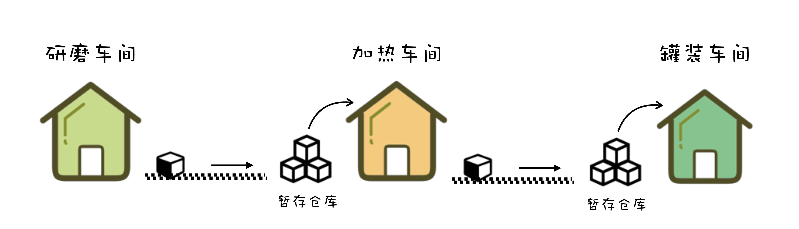

传送带解决了半成品运输问题，仓库可以暂存一些半成品，解决了上下游生产速度不一致的问题，小袁在不知不觉中实现了一个巧克力工厂版的消息队列。

#### 哪些问题适合使用消息队列来解决？

##### 1️⃣异步处理

> 经典却没有标准答案的问题：如何设计一个秒杀系统？
>
> 有很多合理答案，但大多数答案中都离不开消息队列。
>
> 秒杀系统需要解决的核心问题是，==如何利用有限的服务器资源，尽可能多地处理短时间内的海量请求==。

处理一个秒杀请求包含了很多步骤，例如：

- 风险控制；
- 库存锁定；
- 生成订单；
- 短信通知；
- 更新统计数据。

如果没有任何优化，正常的处理流程是：**App 将请求发送给网关，依次调用上述 5 个流程，然后将结果返回给 APP**。

对于这 5 个步骤来说，能否决定秒杀成功，实际上只有**风险控制和库存锁定**这 2 个步骤。只要用户的秒杀请求通过风险控制，并在服务端完成库存锁定，就可以给用户返回秒杀结果了，对于后续的生成订单、短信通知和更新统计数据等步骤，并不一定要在秒杀请求中处理完成。

所以当服务端完成前面 2 个步骤，确定本次请求的秒杀结果后，就可以马上给用户返回响应，然后把请求的数据放入消息队列中，由消息队列异步地进行后续的操作。

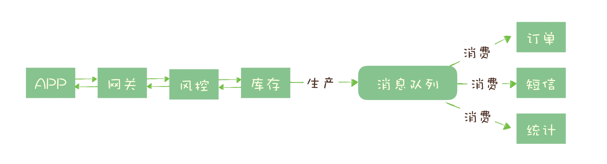

处理一个秒杀请求，从 5 个步骤减少为 2 个步骤，这样不仅响应速度更快，并且在秒杀期间，我们可以把大量的服务器资源用来处理秒杀请求。秒杀结束后再把资源用于处理后面的步骤，充分利用有限的服务器资源处理更多的秒杀请求。

可以看到，在这个场景中，消息队列被用于实现服务的异步处理。这样做的好处是：

- 可以更快地返回结果；
- 减少等待，自然实现了步骤之间的并发，提升系统总体的性能。

#### 2️⃣流量控制

> 如何避免过多的请求压垮我们的秒杀系统？

一个设计健壮的程序有自我保护的能力，也就是说，**它应该可以在海量的请求下，还能在自身能力范围内尽可能多地处理请求，拒绝处理不了的请求并且保证自身运行正常**。不幸的是，现实中很多程序并没有那么“健壮”，而直接拒绝请求返回错误对于用户来说也是不怎么好的体验。

设计思路是，**使用消息队列隔离网关和后端服务，以达到流量控制和保护后端服务的目的**。

加入消息队列后，整个秒杀流程变为：

1. 网关在收到请求后，将请求放入请求消息队列；
2. 后端服务从请求消息队列中获取 APP 请求，完成后续秒杀处理过程，然后返回结果。

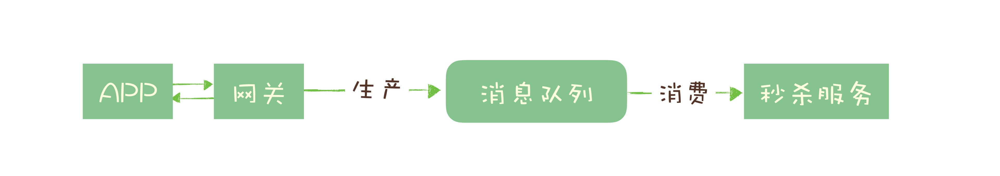

秒杀开始后，当短时间内大量的秒杀请求到达网关时，不会直接冲击到后端的秒杀服务，而是先堆积在消息队列中，后端服务按照自己的最大处理能力，从消息队列中消费请求进行处理。

对于超时的请求可以直接丢弃，APP 将超时无响应的请求处理为秒杀失败即可。运维人员还可以随时增加秒杀服务的实例数量进行水平扩容，而不用对系统的其他部分做任何更改。

这种设计的优点是：**能根据下游的处理能力自动调节流量，达到“削峰填谷”的作用**。缺点：

- 增加了系统调用链环节，导致总体的响应时延变长。
- 上下游系统都要将同步调用改为异步消息，增加了系统的复杂度。

更简单的做法是用消息队列实现一个**==令牌桶==**。令牌桶控制流量的原理是：**单位时间内只发放固定数量的令牌到令牌桶中，规定服务在处理请求之前必须先从令牌桶中拿出一个令牌，如果令牌桶中没有令牌，则拒绝请求。这样就保证单位时间内，能处理的请求不超过发放令牌的数量，起到了流量控制的作用。**

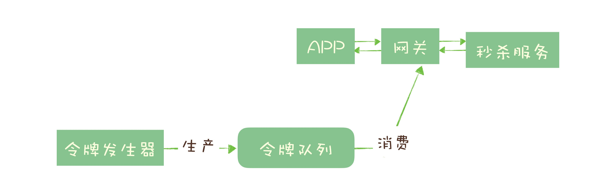

#### 3️⃣服务解耦

举一个电商的例子来说明解耦的作用和必要性。

订单是电商系统中比较核心的数据，当一个新订单创建时：

1. 支付系统需要发起支付流程；
2. 风控系统需要审核订单的合法性；
3. 客服系统需要给用户发短信告知用户；
4. 经营分析系统需要更新统计数据；
5. ……

这些订单下游的系统都需要实时获得订单数据。随着业务不断发展，这些订单下游系统不断的增加，不断变化，并且每个系统可能只需要订单数据的一个子集，负责订单服务的开发团队不得不花费很大的精力，应对不断增加变化的下游系统，不停地修改调试订单系统与这些下游系统的接口。任何一个下游系统接口变更，都需要订单模块重新进行一次上线，对于一个电商的核心服务来说，这几乎是不可接受的。

所有的电商都选择用消息队列来解决类似的系统耦合过于紧密的问题。引入消息队列后，订单服务在订单变化时发送一条消息到消息队列的一个主题 Order 中，所有下游系统都订阅主题 Order，这样每个下游系统都可以获得一份实时完整的订单数据。

无论增加、减少下游系统或是下游系统需求如何变化，订单服务都无需做任何更改，实现了订单服务与下游服务的解耦。

#### 小结

主要使用场景：异步处理、流量控制和服务解耦。其它：

- 作为发布 / 订阅系统实现一个微服务级系统间的观察者模式；
- 连接流计算任务和数据；
- 用于将消息广播给大量接收者。

> 简单的说，==在单体应用里面需要用队列解决的问题，在分布式系统中大多都可以用消息队列来解决==。

消息队列的一些问题和局限性:

- 引入消息队列带来的延迟问题；
- 增加了系统的复杂度；
- 可能产生数据不一致的问题。

## 基础篇

### 02-该如何选择消息队列？

RabbitMQ

RocketMQ

Kafka

### 03-消息模型：主题和队列有什么区别？

最初的一种消息模型：队列模型。

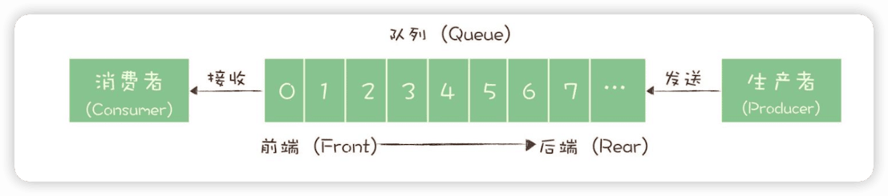

演化出了另外一种消息模型：“发布-订阅模型（Publish-Subscribe Pattern）”。

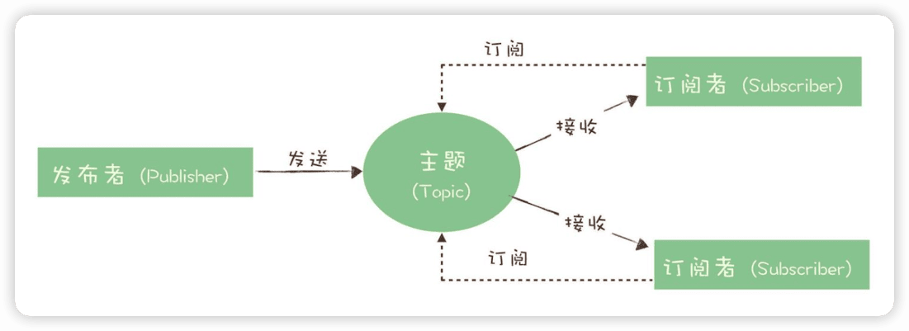

RocketMQ的消息模型

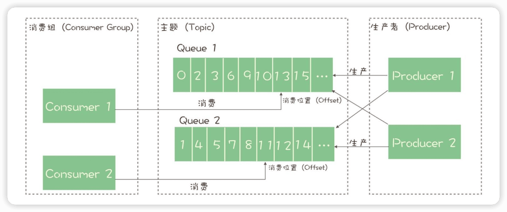

Kafka的消息模型和RocketMQ是完全一样的，刚刚讲的所有RocketMQ中对应的概念，和生产消费过程中的确认机制，都完全适用于Kafka。唯一的区别是，在Kafka中，队列这个概念的名称不一样，Kafka中对应的名称是“分区（Partition）”，含义和功能是没有任何区别的。

### 04-如何利用事务消息实现分布式事务？

一般来说，用户在电商APP上购物时，先把商品加到购物车里，然后几件商品一起下单，最后支付，完成购物流程，就可以愉快地等待收货了。

这个过程中有一个需要用到消息队列的步骤，订单系统创建订单后，发消息给购物车系统，将已下单的商品从购物车中删除。因为从购物车删除已下单商品这个步骤，并不是用户下单支付这个主要流程中必需的步骤，使用消息队列来异步清理购物车是更加合理的设计。

对于订单系统来说，它创建订单的过程中实际上执行了2个步骤的操作：
1.  在订单库中插入一条订单数据，创建订单；
2.  发消息给消息队列，消息的内容就是刚刚创建的订单。

购物车系统订阅相应的主题，接收订单创建的消息，然后清理购物车，在购物车中删除订单中的商品。

#### 什么是分布式事务？

#### 消息队列是如何实现分布式事务的？

事务消息需要消息队列提供相应的功能才能实现，Kafka和RocketMQ都提供了事务相关功能。

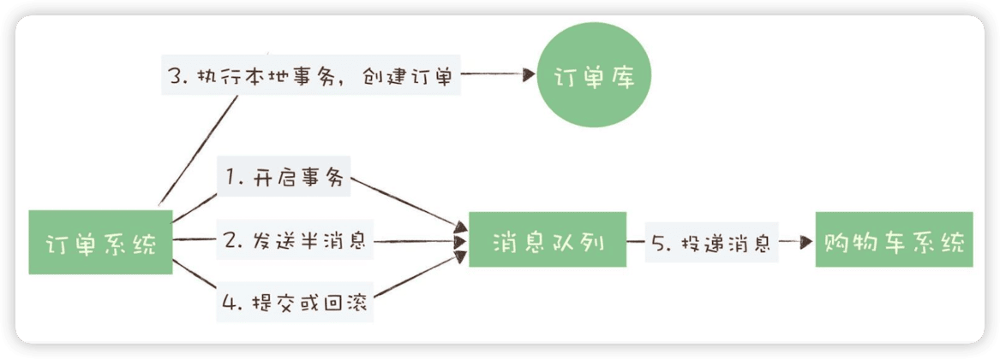

#### RocketMQ中的分布式事务实现

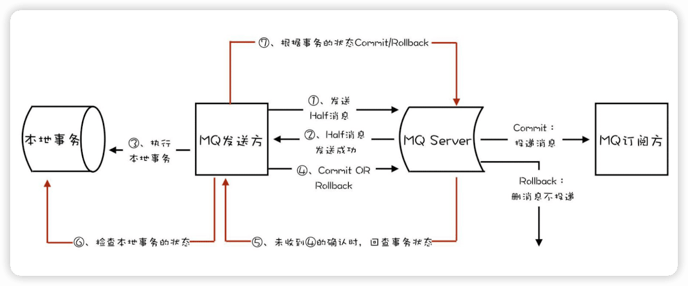

### 05-如何确保消息不会丢失?

### 06-如何处理消费过程中的重复消息？

#### 消息重复的情况必然存在

#### 用幂等性解决重复消息问题

### 07-消息积压了该如何处理？

优化性能来避免消息积压

### 08-答疑解惑（一） : 网关如何接收服务端的秒杀结果？

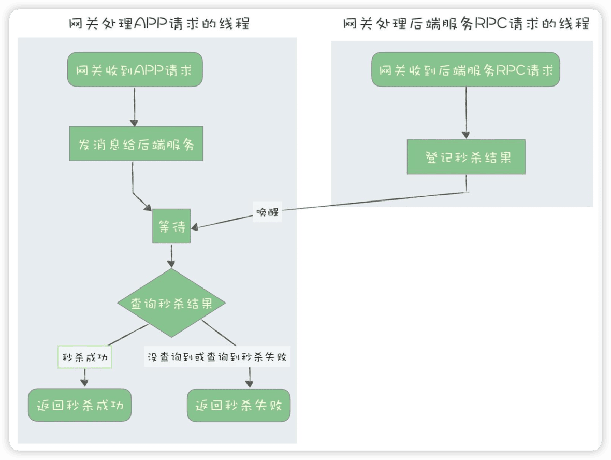

## 进阶篇

### 09-学习开源代码该如何入手？

### 10-如何使用异步设计提升系统性能？

### 11-如何实现高性能的异步网络传输？

### 12-序列化与反序列化：如何通过网络传输结构化的数据？

### 13-传输协议：应用程序之间对话的语言

### 14-内存管理：如何避免内存溢出和频繁的垃圾回收？

### 加餐-JMQ的Broker是如何异步处理消息的？

### 15-Kafka如何实现高性能IO？

### 16-缓存策略：如何使用缓存来减少磁盘IO？

### 17-如何正确使用锁保护共享数据，协调异步线程？

### 18-如何用硬件同步原语（CAS）替代锁？

### 19-数据压缩：时间换空间的游戏

### 20-RocketMQ Producer源码分析：消息生产的实现过程

### 21-Kafka Consumer源码分析：消息消费的实现过程

### 22-Kafka和RocketMQ的消息复制实现的差异点在哪？

### 23-RocketMQ客户端如何在集群中找到正确的节点？

### 24-Kafka的协调服务ZooKeeper：实现分布式系统的“瑞士军刀”

### 25-RocketMQ与Kafka中如何实现事务？

### 26-MQTT协议：如何支持海量的在线IoT设备?

MQTT就是专门为物联网设备设计的一套标准的消息队列通信协议。使用MQTT协议的IoT设备，可以连接到任何支持MQTT协议的消息队列上，进行通信。

MQTT（Message Queuing Telemetry Transport, **消息队列遥测传输**）

### 27-Pulsar的存储计算分离设计：全新的消息队列设计思路

### 28-答疑解惑（二）：我的100元哪儿去了？

## 案例篇

29-流计算与消息（一）：通过Flink理解流计算的原理

30-流计算与消息（二）：在流计算中使用Kafka链接计算任务

31-动手实现一个简单的RPC框架（一）：原理和程序的结构

32-动手实现一个简单的RPC框架（二）：通信与序列化

33-动手实现一个简单的RPC框架（三）：客户端

34-动手实现一个简单的RPC框架（四）：服务端

35-答疑解惑（三）：主流消息队列都是如何存储消息的？

## 测试篇

期中测试丨10个消息队列热点问题自测

期末测试-消息队列100分试卷等你来挑战！
