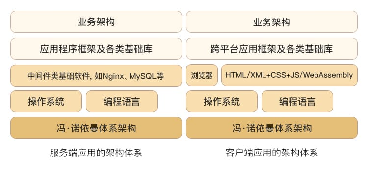
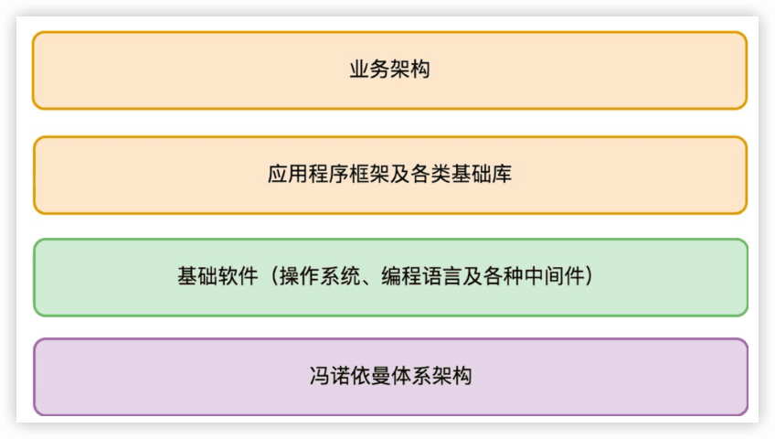
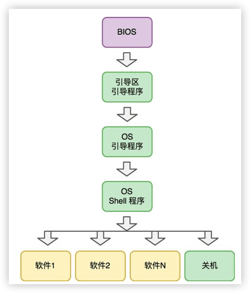
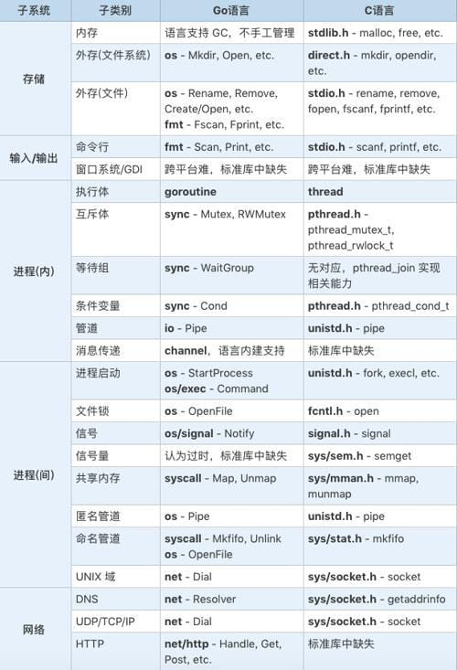
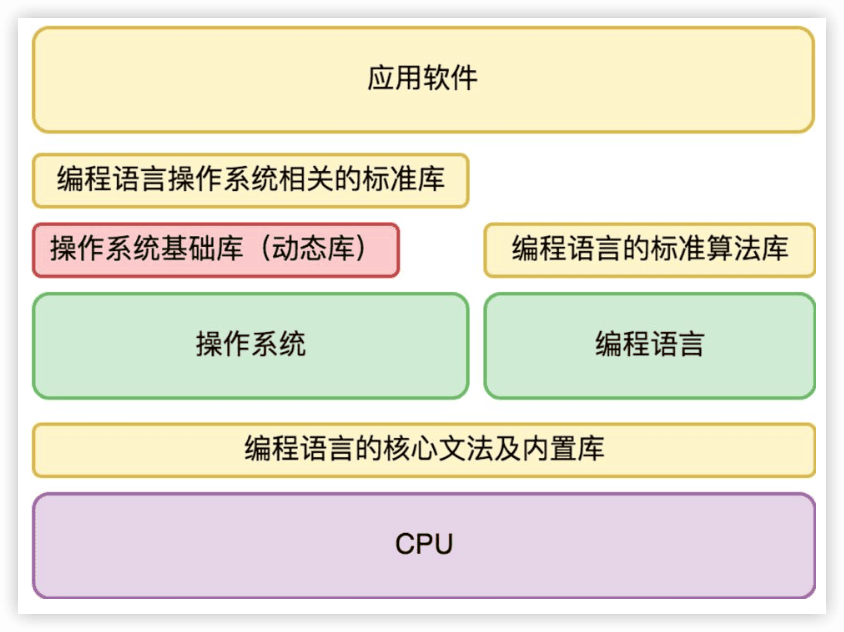
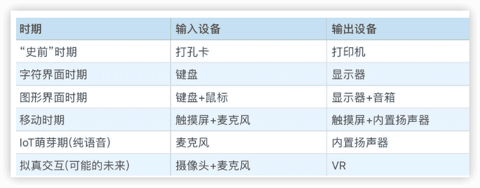
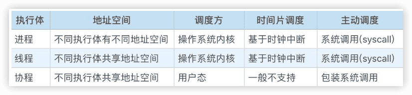
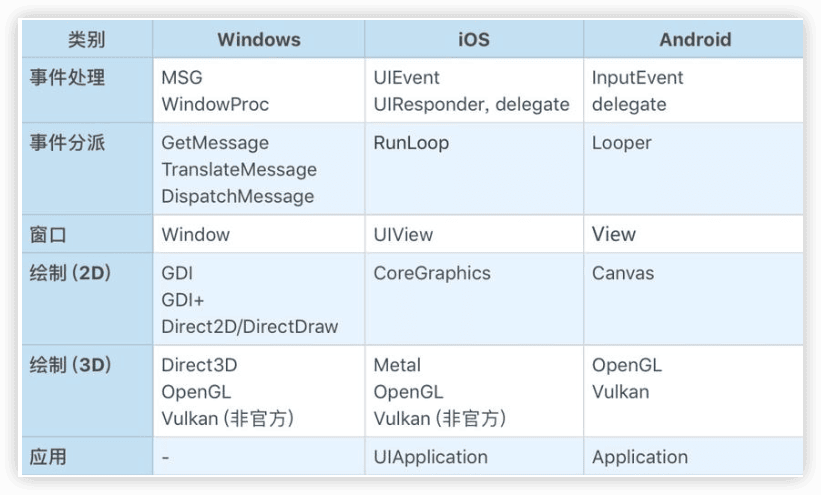
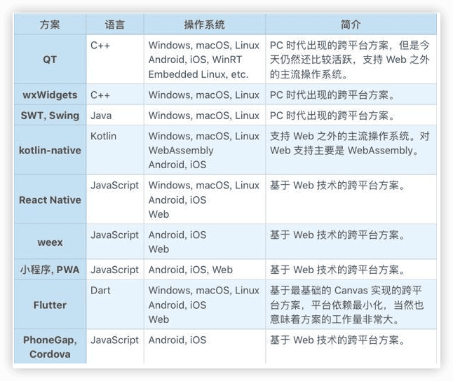

许式伟的架构课
---

https://time.geekbang.org/column/intro/100025201

## 介绍

架构师不仅要知道当前用户的需求是什么，还要对需求未来可能出现的变化做出==合理预判==。

预判什么会发生，而==什么一定不会发生==。其中，后者更为重要，只有做到这一点，才能真正防止架构的过度设计，把简单的事情复杂化。

掌控全局

架构的本质是==构建和创造==。

架构师不只需要想清楚**业务应该怎么做分解**，实际上，整个应用从底层的操作系统、编程语言到顶层的业务架构，每一层都需要进行各种决策。

基础平台、桌面端平台、服务端开发、服务治理、架构思维、软件工程

### 0 怎样成长为优秀的软件架构师？

搬砖师、工程师、架构师

代码跑起来 -> 维护代码：增加新的需求，对已有的功能进行调整，修改之前代码遗留下来的问题，优化性能等等

代码质量的评判一些基本维度：==可阅读性（方便代码流转）、可扩展性/可维护性（方便修改功能，添加新功能）、可测试性（质量管理）、可复用性（简化后续功能开发的难度）==。

致力于不断提升软件代码的==工程质量==的程序员   -->  软件工程师

软件从诞生之初到其生命周期结束，自始至终都在迭代变化，从未停止。

所以，光靠把控软件工程师的水平，依赖他们自觉保障的工程质量，是远远不够的。软件工程是一项非常复杂的系统工程，它需要依赖一个能够掌控整个工程全局的团队，来规划和引导整个系统的演变过程。这个团队就是==架构师团队==。

软件架构师要对软件系统进行==边界划分==和==模块规格的定义==，还要==对软件工程的执行结果负责==，这包括：**按时按质进行软件的迭代和发布、敏捷地响应需求变更、防范软件质量风险（避免发生软件质量事故）、降低迭代维护成本**。

> 那怎么才能成长为优秀的软件架构师？软件架构师和软件工程师最根本的差别又在哪里？我认为关键在于四个字：==掌控全局==，就是对系统的全貌了然于胸。

掌控全局，**并不是无所不能，不是成为全栈**。怎么做到掌控全局？核心在于==对知识脉络的体系化梳理==。

市面上架构相关的图书可以分类：

- 架构思维类
- 设计模式类
- 分布式系统架构设计类
- 重构类

都没有揭开架构设计的全貌。

本专栏围绕着两个脉络主线来展开内容：

- 如何从零开始一步步构建出整个信息世界；
- 在整个信息世界的构建过程中，都用了哪些重要的架构思维范式，以及这些范式如何去运用于你平常的工程实践中。

## 一、基础平台

### 1 架构设计的宏观视角

### 2 大厦基石：无生有，有生万物

#### 解剖架构的关键点是什么？

我们应该如何去分析架构设计中涉及的每一个零部件。换一句话说，当我们设计或分析一个零部件时，我们会关心哪些问题。

- 第一个问题，是==需求==。

  这个零部件的作用是什么？它能被用来做哪些事情？（某种意义上来说更重要的是）它==不会被用来做哪些事情==？

  为何这个零件被设计成用来干这些事情的，而不是多干一点事情，或者为什么不是少干某些事情？

- 第二个问题，是==规格==。

  这个零部件接口是什么样的？它如何与其他零件连接在一起的？

规格是零部件的==连接需求的抽象==。

规格的约束条件会非常多样化，可能是外观（比如形状和颜色），可能是交互方式（比如用键盘、鼠标，或者语音和触摸屏），也可能是质量（比如硬度、耐热性等等）。

> 冯·诺依曼体系结构的需求和规格又是什么样的呢？

#### 为“解决一切的问题”而生

冯·诺依曼体系结构不但是应用程序这座大厦的地基，同时也是==整个信息科技的地基==。

冯·诺依曼体系结构的迷人之处在于，从需求来说，它想解决一切问题。==解决一切可以用“计算”来解决的问题==。

#### 冯·诺依曼体系的规格

为了实现“解决一切可以用‘计算’来解决的问题”这个目标，冯·诺依曼引入了三类基础零部件：

- 中央处理器；
- 存储；
- 输入输出设备。

#### 需求是怎么被满足的？

#### 架构思维上我们学习到什么？

抓住需求的==稳定点和变化点==。需求的稳定点，往往是系统的核心价值点；而需求的变化点，则往往需要相应去做开放性设计。

### 3 汇编：编程语言的诞生

#### 编程的史前时代

汇编语言非常接近计算机的CPU 指令，一条汇编指令基本上和CPU指令一一对应。

#### 与机器对话

汇编语言的出现，让写程序（编程）成为一个纯软件行为（出现“程序员”这个分工的标志）

在表达能力上，汇编语言主要做了如下效率优化：

- 用文本符号（symbol）表达机器指令
- 用文本符号（symbol）表达要操作的内存地址，并支持内存地址的自动分配。
- 用文本符号（symbol）表达要调用的函数（function，也叫“过程-procedure”）地址。
- 用文本符号（symbol）表达要跳转的目标地址。

汇编从指令能力上来说，和机器指令并无二致，它只不过把人们从物理硬件地址中解脱出来，以便专注于程序逻辑的表达。

#### 可自我迭代的计算机

### 4 编程语言的进化

编程语言在信息科技发展中的位置，如同人类文明中语言所在的位置。

#### 软件是活的书籍

#### 编程范式的进化

- 过程式。过程式就是以一条条命令的方式，让计算机按我们的意愿来执行。代表是Fortran、C/C++、JavaScript、Go 等等。

过程式编程中最核心的两个概念是==结构体（自定义的类型）和过程（也叫函数）==。通过结构体对数据进行组合，可以构建出任意复杂的自定义数据结构。通过过程可以抽象出任意复杂的自定义指令，复用以前的成果，简化意图的表达。

- 函数式。函数式本质上是==过程式编程的一种约束==，它最核心的主张就是==变量不可变，函数尽可能没有副作用==（对于通用语言来说，所有函数都没副作用是不可能的，内部有 IO 行为的函数就有副作用）。

既然变量不可变，函数没有副作用，自然人们犯错的机会也就更少，**代码质量就会更高（学习门槛也高，低效）**。函数式语言的代表是 Haskell、Erlang 等等。大部分语言会比较难以彻底实施函数式的编程思想，但在思想上会有所借鉴。

- 面向对象。面向对象在过程式的基础上，引入了对象（类）和对象方法（类成员函数），它主张尽可能把方法（其实就是过程）归纳到合适的对象（类）上，不主张全局函数（过程）。面向对象语言的代表是 Java、C#、C++、Go 等等。

#### 从“面向对象”到“面向连接”

面向对象的核心思想是引入==契约==，基于对象这样一个概念对代码的使用界面进行抽象和封装。

引入==接口==来抽象不同对象相同的行为（比如鸟和猪是不同的对象，但是它们有相同的方法，比如移动和吃东西）。

继承

组合

Go语言：放弃继承，全面强化组合能力

==不同编程范式并不是互斥的==。虽然有些编程语言会有明确的编程范式主张，比如Java 是纯正的面向对象语言，它反对全局过程。但是，也有一些语言明确主张说自己是多范式的，典型代表是 C++。

所谓面向连接就是==朴素的组合思想==。

Go 语言直接从语言设计上就消灭掉那些最容易发生口水的地方，让大家专注于意图的表达。

消息传递约束了进程（这里的进程是抽象意义上的，在 Go 语言中叫`goroutine`）的行为，是进程与进程的连接契约。消息传递是多核背景下流行起来的一种编程思想，其核心主张是：**尽可能用消息传递来取代共享内存，从而尽可能避免显式的锁，降低编程负担。**

#### 其他方面的进化

编程语言的进化还体现在==工程化能力==的完善上：

- 包（package），即代码的发布单元。
- 版本（version），即包的依赖管理。
- 文档生成（doc）。
- 单元测试（test）。

从语言的执行器的行为看，出现了这样三种分类的语言：

- 编译的目标文件为可执行程序。典型代表是 Fortran、C/C++、Go 等。
- 生成跨平台的虚拟机字节码，有独立的执行器（虚拟机）执行字节码 。典型代表为 Java、Erlang 等。
- 直接解释执行。典型代表是 JavaScript。当然现在纯解释执行的语言已经不多。大多数语言也只是看起来直接执行，内部还是会有基于字节码的虚拟机以提升性能。

#### 语言对架构的影响是什么？

无论服务端，还是客户端，可以统一将其架构图简化为：

- 淡紫色是硬件层次的依赖，是我们程序工作的**物理基础**。
- 淡绿色的是软件层次的依赖，是我们程序工作的**生态环境**。
- 桔色的是库或源代码层次的依赖，是我们**程序本身**的组成部分。细分的话它又可以分两部分：一部分是业务无关的框架和基础库，还有一部分是业务架构。

### 5 思考题解读：如何实现可自我迭代的计算机？

### 6 操作系统进场

- 多个软件如何同时运行（多任务的需求）？
- 多个软件如何共同使用计算机上的存储空间（内存管理、文件系统的需求）？
- 多个软件如何共同使用同一个外部设备（设备管理的需求）？
- 多个软件如何相互通讯，如何进行数据交换（进程间通讯、共享内存的需求）？
- 病毒、恶意软件如何治理（安全管理的需求）？

#### 操作系统的启动过程

#### 操作系统的需求演进

从客户需求来说，操作系统的核心价值在于：

- 实现软件治理，让多个软件和谐共处；
- 提供基础的编程接口，降低软件开发难度。

### 7 软件运行机制及内存管理

CPU可以直接访问的存储资源只有：**寄存器、内存（RAM）、主板上的ROM**。

#### 计算机运行全过程

#### 实模式下的内存管理

#### 保护模式下的内存管理

内存管理的两个核心问题：

- 如何分配内存（给运行中的软件，避免它们发生资源争抢）；
- 如何运行外置存储（比如硬盘）上的软件？

### 8 操作系统内核与编程接口

#### 系统调用

#### 编程接口

#### 动态库

#### 操作系统与编程语言

### 9 外存管理与文件系统

### 10 输入和输出设备：交互的演进

#### 交互的演进

### 11 多任务：进程、线程与协程

#### 多任务与执行体

#### 进程与线程

#### 协程与goroutine

### 12 进程内协同：同步、互斥与通讯

#### 原子操作

#### 执行体的互斥

#### 执行体的同步

#### 执行体的通讯

### 13 进程间的同步互斥、资源共享与通讯

### 14 IP 网络：连接世界的桥梁

### 15 可编程的互联网世界

### 16 安全管理：数字世界的守护

### 17 架构：需求分析 (上)

### 18 架构：需求分析 (下) · 实战案例

### 19 基础平台篇：回顾与总结

## 二、桌面端平台

### 20 桌面开发的宏观视角

#### 命令行交互

#### 字符界面

#### 图形界面

#### 智能交互

### 21 图形界面程序的框架

- PC：Windows、MacOS、Linux 等；
- PC 浏览器：Chrome、Safri、Firefox 等；
- 手机/平板/手表：Android（不同手机厂商也会有细节差异）、iOS 等；
- 小程序：微信、支付宝、快应用等。

### 22 桌面程序的架构建议

### 23 Web开发：浏览器、小程序与PWA

### 24 跨平台与 Web 开发的建议

### 25 桌面开发的未来

### 26 实战（一）：怎么设计一个“画图”程序？

### 27 实战（二）：怎么设计一个“画图”程序？

### 28 实战（三）：怎么设计一个“画图”程序？

### 29 实战（四）：怎么设计一个“画图”程序？

### 30 实战（五）：怎么设计一个“画图”程序？

### 31 辅助界面元素的架构设计

### 32 架构：系统的概要设计

### 33 桌面开发篇：回顾与总结

## 三、服务端开发

### 34 服务端开发的宏观视角

#### 服务端的发展史

#### 服务端程序的需求

- 规模

桌面程序是为单个用户服务的，所以它关注点是用户交互体验的不断升级。

服务端程序是被所有用户所共享，为所有用户服务的。一台物理的机器资源总归是有限的，能够服务的用户数必然存在上限，所以一个服务端程序在用户规模到达一定程度后，需要分布式化，跑在多台机器上以服务用户。

- 连续服务时长

- 质量要求

#### 服务端开发的体系架构

### 35 流量调度与负载均衡

相比桌面程序而言，服务端程序依赖的基础软件不只是操作系统和编程语言，还多了两类：

- 负载均衡（Load Balance）；
- 数据库或其他形式的存储（DB/Storage）

#### DNS 流量调度

#### 网络层负载均衡

#### 应用层负载均衡

#### 优雅升级

### 36 业务状态与存储中间件

#### 业务状态

#### 存储中间件与容灾级别

#### 存储即数据结构

### 37 键值存储与数据库

#### 数据库的种类

#### 事务

#### 主从结构

#### 分布式

### 38 文件系统与对象存储

#### 异常处理才是存储的业务逻辑

### 39 存储与缓存

### 40 服务端的业务架构建议

### 41 实战（一）：“画图”程序后端实战

### 42 实战（二）：“画图”程序后端实战

### 43 实战（三）：“画图”程序后端实战

### 44 实战（四）：“画图”程序后端实战

### 45 架构：怎么做详细设计？

### 46 服务端开发篇：回顾与总结

### 如何做HTTP服务的测试？

## 四、服务治理

### 47 服务治理的宏观视角

### 48 事务与工程：什么是工程师思维？

### 49 发布、升级与版本管理

### 50 日志、监控与报警

### 加餐：怎么保障发布的效率与质量？

### 51 故障域与故障预案

### 52 故障排查与根因分析

### 53 过载保护与容量规划

### 54 业务的可支持性与持续运营

### 55 云计算、容器革命与服务端的未来

### 56 服务治理篇：回顾与总结

## 五、架构思维

### 47 服务治理的宏观视角

### 48 事务与工程：什么是工程师思维？

### 49 发布、升级与版本管理

### 50 日志、监控与报警

### 加餐：怎么保障发布的效率与质量？

### 51 故障域与故障预案

### 52 故障排查与根因分析

### 53 过载保护与容量规划

### 54 业务的可支持性与持续运营

### 55 云计算、容器革命与服务端的未来

### 56 服务治理篇：回顾与总结

## 六、软件工程

### 68 软件工程的宏观视角

### 69 团队的共识管理

### 70 怎么写设计文档？

### 71 如何阅读别人的代码？

### 72 发布单元与版本管理

### 73 软件质量管理：单元测试、持续构建与发布

### 74 开源、云服务与外包管理

### 75 软件版本迭代的规划

### 76 软件工程的未来

### 77 软件工程篇：回顾与总结

