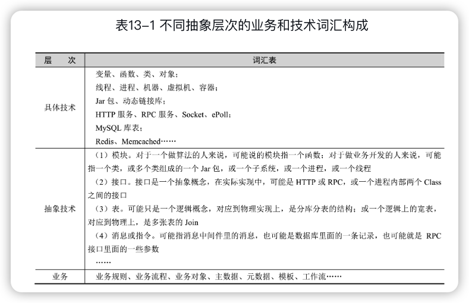

 《软件架构设计：大型网站技术架构与业务架构融合之道》 
---


# 前言

语言、数据结构、算法、操作系统原理，框架或中间件的使用方式、原理等，**“硬”性**，容易表述，容易衡量；

软件建模、架构设计等，**“软”性**。


**“显性问题”**，高并发、高可用和由此带来的数据一致性问题。解决的思路通常有两个：

第一，利用分布式系统的特性不断地分拆，把大系统拆小，各个击破，降低风险；

第二，小步快跑，快速迭代。

**“隐性问题”**，指系统的可重用性、可扩展性、可维护性等。往往无法显性地衡量。

其实“隐性问题”比“显性问题”的影响更大，因为它会让技术拖累业务，当有新需求的时候，系统无法跟随业务快速变化。

架构是一种综合能力，而不是某一方面的技能。本书提供的是一个全面的<u>解决方案、方法论、成体系的设计思维</u>。

# 一、什么是架构

抽象概念，架构是针对所有重要问题做出的重要决策。

## 1 五花八门的架构师职业

### 1.1 架构师职业分类

### 1.2 架构的分类


#### 第一层：基础架构

基础架构指云平台、操作系统、网络、存储、数据库和编译器等。

#### 第二层：中间件与大数据平台

1. 中间件架构。例如分布式服务中间件、消息中间件、数据库中间件、缓存中间件、监控系统、工作流引擎和规则引擎等。
2. 大数据架构。例如开源的Hadoop生态体系，Hive、Spark、Storm、Flink等。

#### 第三层：业务系统架构

1. 通用软件系统。例如最常用的办公软件、浏览器、播放器等。
2. 离线业务系统。例如各种基于大数据的BI分析、数据挖掘、报表与可视化等。
3. 大型在线业务系统。例如搜索、推荐、即时通信、电商、游戏、广告、企业ERP 或CRM等。

通用性软件和业务软件的界限也并不是泾渭分明的。一个业务系统随着技术的进步，很多功能将被通用化、标准化，最终变成了一个通用系统。

通用化的过程是一个技术不断进步的过程，也是一个使用门槛不断被降低的过程。

本书聚焦在**大型在线业务系统的架构**。


## 2 架构的道与术

### 2.1 何为道，何为术

> 如何拆分服务？
>
> 如何组织服务与服务之间的层次关系？ 
>
> 如何设计接口？
>
> 缓存数据结构与更新策略是什么样的？
>
> 缓存宕机后系统是否可用？
>
> 数据库如何分库分表？
>
> 消息队列在什么地方使用？
>
> 需要部署多少台Tomcat？
>
> 需要部署多少台RPC服务？
>
> ……

方法论，即是架构的道。具体来说，对于技术问题，主要指高并发、高可用和一致性方面；对于业务问题，主要指业务的需求分析和业务建模。

把抽象玄幻的业务建模方法论、晦涩难懂的分布式一致性理论，用通俗的语言表达出来，让读者可以从一个“最朴素的视角”去看待这些理论。

### 2.2 道与术的辩证关系

知，是理论，是套路，是解决问题的方法论；行，是实践，是操作，用于解决一个个实际问题。先有实践，然后总结出理论，用理论指导新的实践，在新的实践中再总结出新的理论。如此循环往复，**即是归纳和演绎循环往复的过程，也是螺旋式上升的过程**。

具体到软件架构，就是道和术都不能偏废，一方面需要不断实践，在实践中深究原理；一方面要把实践的东西抽象、总结出来，形成方法论。

术：外部招式，行（实践），答案

道：内功心法，知（理论），问题


# 二、计算机功底

往往越是专家，越注重功底；越是底层架构，对计算机的功底要求越深。

工作久了你会发现，那些工作中最厉害的屠龙之术其实在大学的教科书上早就已经讲过了。比如<u>TCP如何在一个“不可靠”的通信网络上实现一个“可靠”的通道，比如数据库如何利用Write-ahead Log解决I/O问题，利用Checksum保证日志完整性，利用 MVCC（CopyOnWrite）解决高并发问题</u>。这些思维方式是通用的，底层系统需要，做上层系统同样需要，因为这是“大道”。

## 3 语言

### 3.1 层出不穷的编程语言

在追求性能的编程领域，Go、Rust也在一点点地蚕食C和C++的份额；

### 3.2 精通一门语言

首先，几乎所有的现代高级编程语言都有一些典型的共同特征，例如：

- 都有一个基本数据类型的集合（比如Java是8种基本数据类型）；
- 都有类型转换、类型推断、类型安全方面的机制；
- 都是顺序、选择、循环三种语句类型；
- 都有类、对象、封装、继承、多态（如果是面向对象的）；
- 都有一个常用数据结构的库（数组、栈、队列、链表、Hash）；
- 都有一个常用的I/O库；
- 都有一个常用的线程库（协程库）；
- ……

此外，语言背后都对应着相应的实现原理。这些原理上的差异也对应了<u>为什么有些语言适合某些特定的业务场景</u>。要精通一门语言，需要去不断地探究背后的实现原理。

- 学习Java，除了会用Java的各种库，对JVM的原理、类加载机制、锁的实现、线程的原理、I/O原理都需要很好地理解；
- 学习C++，需要懂得对象的内存布局、编译器和链接器内部是如何工作的；
- 学习PHP，需要懂得PHP的解释器是如何工作的，里面的线程是如何实现的；
- ……

## 4 操作系统

### 4.1 缓冲I/O和直接I/O

**缓冲I/O**是C语言提供的库函数，均以f打头；**直接I/O**是Linux的系统API。

虽然系统API也是C语言写的，但两者原理差异很大。


==应用程序内存==：是通常写代码用malloc/free、new/delete等分配出来的内存。

==用户缓冲区==：C语言的FILE结构体里面的buffer。

```c
typedef struct {
  short level;
  short token;
  short bsize;
  char fd;
  unsigned flags;
  unsigned char hold;
  unsigned char *buffer;
  unsigned char *curp;
  unsigned istemp;
} FILE;
```

==内核缓冲区==：Linux操作系统的Page Cache。为了加快磁盘的I/O，Linux系统会把磁盘上的数据以Page为单位缓存在操作系统的内存里，这里的Page是Linux系统定义的一个逻辑概念，一个Page一般为4K。

对于缓冲I/O，一个读操作会有3次数据拷贝，一个写操作，有反向的3次数据拷贝：

- 读：磁盘→内核缓冲区→用户缓冲区→应用程序内存；

- 写：应用程序内存→用户缓冲区→内核缓冲区→磁盘。

对于直接I/O，一个读操作，会有2次数据拷贝，一个写操作，有反向的2次数据拷贝：

- 读：磁盘→内核缓冲区→应用程序内存；
- 写：应用程序内存→内核缓冲区→磁盘。

所谓的“直接I/O”，其中直接的意思是指**没有用户级的缓冲**，但操作系统本身的缓冲还是有的。


说明：

- fflush和fsync的区别：fflush是缓冲I/O中的一个API，它只是把数据从用户缓冲区刷到内核缓冲区而已，fsync则是把数据从内核缓冲区刷到磁盘里。
- 对于直接I/O，也有read/write和pread/pwrite两组不同的API。pread/pwrite在多线程读写同一个文件的时候很有用。

### 4.2 内存映射文件与零拷贝

#### 内存映射文件

相比于直接I/O，内存映射文件往前更进了一步。当用户空间不再有物理内存，<u>直接拿应用程序的逻辑内存地址映射到 Linux 操作系统的内核缓冲区，应用程序虽然读写的是自己的内存，但这个内存只是一个“逻辑地址”，实际读写的是内核缓冲区！</u>


数据拷贝次数从缓冲I/O的3次，到直接I/O的2次，再到内存映射文件，变成了1次。

读：磁盘→内核缓冲区；

写：内核缓冲区→磁盘。

在linux中，内存映射文件对应的API是：

```c
void* mmap(void* start, size_t length, int prot, int flags, int fd, off_t offset);
```

在Java中，用MappedByteBuffer类可以实现同样的目的。

#### 零拷贝🔖

**零拷贝（Zero Copy）**是<u>提升I/O效率</u>的又一利器。Kafka，消费消息。

### 4.3 网络I/O模型

#### 实现层面的网络I/O模型

同步阻塞I/O

同步非阻塞I/O

I/O多路复用（IO Multiplexing）

异步I/O


#### Reactor模式与Preactor模式

网络框架的两种设计模式。

#### select、epoll的LT与ET

epoll是Linux服务器开发的主流网络I/O模型，Java NIO在Linux平台中也是基于epoll实现的。

##### 1.select

```c
int select(int maxfdp1, fd_set *readfds, fd_set *writefds, fd_set *exceptfds, struct timeval *timeout);
```

##### 2.poll

##### 3.epoll

##### 4.epoll的LT和ET模式

epoll里面有两种模式：LT（水平触发）和ET（边缘触发）。水平触发又称条件触发，边缘触发又称状态触发。

#### 服务器编程的1+N+M模型

整个服务器有1+N+M个线程，一个监听线程，N个I/O线程，M个Worker线程。N的个数通常等于CPU核数，M的个数根据上层决定，通常有几百个。


### 4.4 进程、线程和协程

#### 1.为什么要多线程

#### 2.多进程

> “不要通过共享内存来实现通信，而应通过通信实现共享内存。”
>
> 也就是
>
> “尽可能通过消息通信，而不是共享内存来实现进程或者线程之间的同步。”

#### 3.多协程

### 4.5 无锁（内存屏障与CAS）

#### 内存屏障

#### CAS

## 5 网络

HTTP主要有1.0、1.1、2三个版本，在HTTP之上有HTTPS。

- 1996年，HTTP 1.0协议规范RFC 1945发布；
- 1999年，HTTP 1.1协议规范RFC 2616发布。
- 2015年，HTTP/2 协议规范RFC 7540/7541发布。还没普及。

### 5.1 HTTP 1.0

#### HTTP 1.0的问题

HTTP协议的基本特点是“**一来一回**”。就是客户端发起一个TCP连接，在连接上面发一个HTTP Request到服务器，服务器返回一个HTTP Response，然后连接关闭。每来一个请求，就要开一个连接，请求完了，连接关闭。

1. 性能问题
2. 服务器推送问题。不支持“一来多回”，服务器无法在客户端没有请求的情况下主动向客户端推送消息。

#### Keep-Alive机制与Content-Length属性

Keep-Alive机制来实现TCP<u>连接的复用</u>，来解决性能问题。Keep-Alive timeout参数

> 客户端怎么知道连接处理结束了呢？
>
> Content-Length属性。告诉客户端HTTP Response的Body共有多少个字节，客户端接收到这么多个字节之后，就知道响应成功接收完毕。

### 5.2 HTTP 1.1

#### 连接复用与Chunk机制

HTTP 1.1之后，连接复用变成了默认属性。

如果服务器返回的数据是动态语言生成的内容，则要计算Content-Length，这点对服务器来说比较困难。为此，HTTP 1.1中引用了**Chunk机制（Http Streaming）**。

>  具体来说，就是在响应的头部加上**Transfer-Encoding：chunked**属性，其目的是告诉客户端，响应的Body是分成了一块块的，块与块之间有间隔符，所有块的结尾也有个特殊标记。这样，即使没有 Content-Length 字段，也能方便客户端判断出响应的末尾。

#### Pipeline与Head-of-line Blocking问题

有了“连接复用”之后，减少了建立连接、关闭连接的开销。但还存在一个问题，在同一个连接上，请求是**串行的**，客户端发送一个请求，收到响应，然后发送下一个请求，再收到响应。这种串行的方式，导致并发度不够。

为此，HTTP 1.1引入了Pipeline机制。<u>在同一个TCP连接上面，可以在一个请求发出去之后、响应没有回来之前，就可以发送下一个、再下一个请求，这样就提高了在同一个TCP连接上面的处理请求的效率</u>。


但Pipeline 有个致命问题，就是Head-of-Line Blocking翻译成中文叫作“**队头阻塞**”。

#### HTTP/2出现之前的性能提升方法

一般同一个域名，浏览器限制只能开6～8个连接

##### 1.Spriting技术

小图组合成一张大图

##### 2.内联（Inlining）

将图片的原始数据嵌入在CSS文件里

##### 3.JS拼接

##### 4.请求的分片技术

多做几个域名

#### “一来多回”问题

##### 1.客户端定期轮询

##### 2.FlashSocket/WebSocket

##### 3.HTTP长轮询

客户端发送一个HTTP请求，如果服务器有新消息，就立即返回；如果没有，则服务器夯住此连接，客户端一直等该请求返回。然后过一个约定的时间之后，如果服务器还没有新消息，服务器就返回一个空消息（客户端和服务器约定好的一个消息）。客户端收到空消息之后关闭连接，再发起一个新的连接，重复此过程。

这就相当于变相地用HTTP实现了TCP的长连接效果，这也是<u>目前Web最常用的服务器端推送方法</u>。

##### 4.HTTP Streaming

与长轮询的差异在于，这里只有一个HTTP请求，不存在HTTP Header不断重复的问题，但实现时没有长轮询简单直接。


#### 断点续传

客户端一边下载一边记录下载的数据量大小，一旦连接中断了，重新建立连接之后，在请求的头部加上Range：firstoffset-last offset 字段，指定从某个offset下载到某个offset，服务器就可以只返回（first offset，last offset）之间的数据。

> HTTP 1.1的这种特性只适用于断点下载。要实现断点上传，就需要自行实现了。

### 5.3 HTTP/2

SPDY是Google公司开发的一个实验性协议，用于解决HTTP1.1的Pipeline不够完善的问题。

HTTP/2协议以SPDY为基础。

#### 与HTTP 1.1的兼容

#### 进制分帧🔖

二进制分帧是HTTP/2为了解决HTTP 1.1的“队头阻塞”问题所设计的核心特性。

#### 头部压缩

### 5.4 SSL/TLS

#### 背景

SSL（Secure Sockets Layer）的中文名称为安全套接层，TLS（Transport Layer Security）的中文名称为传输层安全协议。

#### 对称加密的问题


#### 双向非对称加密

公私钥有个关键特性：<u>公钥PubA是通过私钥PriA 计算出来的，但反过来不行，不能根据PubA推算出PriA！</u>

#### 单向非对称加密


这个密钥在内存里面，不会落地存储，所以也不存在被盗取的问题。这就是SSL/TLS的原型。

#### 中间人攻击


#### 数字证书与证书认证中心


#### 根证书与CA信任链


#### SSL/TLS协议：四次握手


### 5.5 HTTPS

HTTPS=HTTP+SSL/TLS


HTTP/2主要是解决性能问题，HTTPS主要解决安全问题。

### 5.6 TCP/UDP

#### 可靠与不可靠

##### 1.解决不丢问题：ACK+重发

##### 2.解决不重的问题

##### 3.解决时序错乱问题

#### TCP的“假”连接（状态机）


#### 三次握手

#### 四次挥手

### 5.7 QUIC

QUIC（Quick UDP Internet Connection）是由Google公司提出的基于UDP协议的多路并发传输协议。

只要使用 TCP，就没有办法完全解决队头阻塞问题，因为 TCP 是先发送先接收，而 UDP没有这个限制。QUIC协议基于UDP。


QUIC取代了TCP的部分功能（数据包的不丢）；然后它实现了SSL/TLS的所有功能；最后它还取代了HTTP/2的部分功能（多路复用）。

#### 不丢包（Raid5算法和Raid6算法）

#### 更少的RTT

#### 连接迁移


## 6 数据库🔖

### 6.1 范式与反范式


但在互联网应用中，为了性能或便于开发，违背范式的设计比比皆是，如字段冗余、字段存一个复杂的JSON串、分库分表之后数据多维度冗余存储、[宽表](https://baike.baidu.com/item/%E5%AE%BD%E8%A1%A8/19942837?fr=aladdin)等。

需要仔细权衡，什么时候应该遵守范式，什么时候可以违背范式。

### 6.2 分库分表

#### 为什么要分

第一个考虑是==做“业务拆分”==，一个大的复杂系统拆成多个业务子系统，之间<u>通过RPC或消息中间件通信</u>。这样做既便于团队成员的职责**分工**，也便于对未来某个系统进行**扩展**。

第二个考虑是==应对高并发==。读多写少，可以通过加从库、加缓存解决，不一定要分库分表；读少写多，或者说写入的QPS已经达到了数据库的瓶颈，这时就要考虑分库分表了。

第三个考虑是“==数据隔离”==。核心业务数据和非核心业务数据。

#### 分布式ID生成服务

#### <u>拆分维度</u>的选择

比如电商的订单表，至少有三个查询维度：订单ID、用户ID、商户ID。

对于在分库分表之后其他维度的查询，一般有以下几个方法：

##### 1.建立一个映射表

建立辅助维度和主维度之间的映射关系（商户 ID 和用户 ID 之间的映射关系）。

分布式事务问题

##### 2.业务双写

同一份数据，两套分库分表。一套按用户ID切分，一套按商户ID 切分。同样，存在写入多个库的分布式事务问题。

##### 3.异步双写

还是两套表，只是业务单写。然后通过监听Binlog，同步到另外一套表上。

##### 4.两个维度统一到一个维度

#### Join查询问题

##### 1.把Join拆成多个单表查询，不让数据库做Join，而是在代码层对结果进行拼装

##### 2.做宽表，重写轻读

##### 3.利用搜索引擎

#### 分布式事务

做了分库之后，纯数据库的事务就做不了了。一般的解决办法是优化业务，避免跨库的事务，保证所有事务都落到单库中。


### 6.3 B+树

关系型数据库在查询方面有一些重要特性，是KV型的数据库或者缓存所不具备的，比如：

1. 范围查询。
2. 前缀匹配模糊查询。
3. 排序和分页。

#### B+树逻辑结构

#### B+树物理结构

#### 非主键索引


### 6.4 事务与锁

#### 事务的四个隔离级别


#### 悲观锁和乐观锁


#### 死锁检测


### 6.5 事务实现原理之1：Redo Log

####  Write-Ahead


#### Redo Log的逻辑与物理结构


#### Physiological Logging


#### I/O写入的原子性（Double Write）


#### Redo Log Block结构


#### 事务、LSN与Log Block的关系


#### 事务Rollback与崩溃恢复（ARIES算法）


### 6.6 事务实现原理之2：Undo Log

#### Undo Log是否一定需要


#### Undo Log(MVCC)


#### Undo Log不是Log


#### Undo Log与Redo Log的关联


#### 各种锁


### 6.7 Binlog与主从复制

#### Binlog与Redo Log的主要差异

Redo Log和Undo Log是InnoDB引擎里面的工具，但Binlog是MySQL层面的东西。

不同于Redo Log和Undo Log用来实现事务，Binlog的主要作用是做**主从复制**，如果是单机版的，没有主从复制，也可以不写Binlog。

在互联网应用中，Binlog有了第二个用途：一个应用进程把自己伪装成Slave，监听Master 的Binlog，然后把数据库的变更以消息的形式抛出来，业务系统可以消费消息，执行对应的业务逻辑操作，比如更新缓存。阿里开源的[Canal](https://github.com/alibaba/canal)


#### 内部XA-Binlog与Redo Log一致性问题


#### 三种主从复制方式

同步复制

异步复制

半同步复制


#### 并行复制


## 7 框架、软件与中间件

### 7.1 对生态体系的认知

做C++的程序员往往喜欢自己写系统，从底到上全部自己写；做Java的程序员往往喜欢用各式各样的开源框架，像搭积木一样拼出整个系统。

技术的生态体系，就是从底层基础设施，到运维、中间件、大数据平台，这些技术之间可以很好地衔接，比如监控系统和RPC中间件、消息中间件、数据库的衔接，大数据平台和业务系统之间的衔接。从而让业务开发从技术问题中解脱出来，可以**更好地服务业务**。

在自己造轮子之前，一定要对整个开源体系有一个清晰的认知，学会从开源的生态体系中吸收系统设计和实现的精华，再结合自己业务造特定的轮子，避免“闭门造车”。

### 7.2 框架

关注它的缺点

使用的简洁性

### 7.3 软件与中间件

对于**标准化的功能**，会产生对应的开源软件和中间件。软件和中间件的定义并没有一个绝对的界限，从操作系统层面讲，**都是进程和线程的集合**。

软件更加<u>固化，不需要开发代码</u>，主要是安装、配置、运维，比如 Apache、Nginx、MySQL、Redis等；中间件需要<u>和业务代码进行结合</u>，比如RPC中间件、数据库分库分表中间件，<u>需要在业务代码中嵌入相对应的SDK</u>。


理解其基本原理

基本原理一方面是操作系统、网络通信、数据库等方面内容，还有各种设计模式；另一方面，是后面要讲到的应对分布式问题的各种策略，比如高并发、数据一致性。

# 三、技术架构之道

## 8 高并发问题

### 8.1 问题分类

#### 侧重于“高并发读”的系统

##### 场景1：搜索引擎

##### 场景2：电商的商品搜索

##### 场景3：电商系统的商品描述、图片和价格


#### 侧重于“高并发写”的系统

广告扣费系统


> 互联网的三大变现模式：广告、游戏和电商。


#### 同时侧重于“高并发读”和“高并发写”的系统

##### 场景1：电商的库存系统和秒杀系统

##### 场景2：支付系统和微信红包

##### 场景3：IM、微博和朋友圈


### 8.2 高并发读

#### 策略1：加缓存

##### 案例1：本地缓存或Memcached/Redis集中式缓存

##### 案例2：MySQL的Master/Slave

##### 案例3：CDN静态文件加速（动静分离）

> 对于Redis、MySQL的Slave、CDN，虽然从技术上看完全不一样，但从策略上看都是一种“缓存”的形式。都是通过对数据进行冗余，达到空间换时间的效果。


#### 策略2：并发读

##### 案例1：异步RPC

##### 案例2：Google的“冗余请求”


#### 策略3：重写轻读

##### 案例1：微博Feeds流

##### 案例2：多表的关联查询：宽表与搜索引擎


#### 总结：读写分离（CQRS架构）

无论加缓存、动静分离，还是重写轻读，其实本质上都是读写分离，这也就是微服务架构里经常提到的==**CQRS**==（Command Query Responsibility Separation）。


### 8.3 高并发写

#### 策略1：数据分片

数据分片也就是对要处理的数据或请求分成多份并行处理。

##### 案例1：数据库的分库分表

##### 案例2：JDK的ConcurrentHashMap实现

ConcurrentHashMap在内部分成了若干槽（个数是2的整数次方，默认是16个槽），也就是若干子HashMap。这些槽可以并发地读写，槽与槽之间是独立的，不会发生数据互斥。

##### 案例3：Kafka的partition

##### 案例4：ES的分布式索引


#### 策略2：任务分片

数据分片是对要处理的数据（或者请求）进行分片，任务分片是**对处理程序本身进行分片**。

##### 案例1：CPU的指令流水线

##### 案例2：Map/Reduce

##### 案例3：Tomcat的1+N+M网络模型


#### 策略3：异步化🔖


##### 案例1：短信验证码注册或登录

##### 案例2：电商的订单系统

##### 案例3：广告计费系统

##### 案例4：LSM树（写内存+Write-Ahead日志）

##### 案例5：Kafka的PipeLine


#### 策略4：批量

##### 案例1：Kafka的百万QPS写入

##### 案例2：广告计费系统的合并扣费

##### 案例3：MySQL的小事务合并机制


#### 策略5：串行化+多进程单线程+异步I/O


### 8.4 容量规划

#### 吞吐量、响应时间与并发数

吞吐量：单位时间内处理的请求数。通常所说的 QPS、TPS，其实都是吞吐量的一种衡量方式。

响应时间：处理每个请求所需的时间。

并发数：服务器同时并行处理地请求个数。

> 吞吐量 x 响应时间 = 并发数

#### 压力测试与容量评估

##### 1.容量评估的基本思路

> 机器数 = 预估总流量 / 单机容量

##### 2.压力测试策略

- 线上压力测试对比测试环境压力测试。
- 接口压力测试对比写接口压力测试。
- 单机压力测试对比全链路压力测试。


## 9 高可用与稳定性

### 9.1 多副本

#### 1.本地缓存多副本

#### 2.Redis多副本

#### 3.MySQL多副本

#### 4.消息中间件多副本


### 9.2 隔离、限流、熔断和降级

#### 1.隔离

隔离是指将系统或资源分割开，在系统发生故障时能限定传播范围和影响范围，即发生故障后不会出现滚雪球效应，从而把故障的影响限定在一个范围内。

数据隔离

机器隔离（调用者隔离）

线程池隔离

信号量隔离


#### 2.限流

技术层面的限流

业务层面的限流

限流算法  桶算法和令牌桶算法


#### 3.熔断

根据请求失败率做熔断

根据请求响应时间做熔断


#### 4.降级

降级是一种兜底方案，是在系统出故障之后的一个尽力而为的措施。
降级不是一个纯粹的技术手段，而是要根据业务场景具体分析，看哪些功能可以降级，降级到什么程度，哪些宁愿不可用也不能降级。


### 9.3 灰度发布与回滚

既然无法避免系统变更，我们能做的就是让这个过程尽可能平滑、受控，这就是灰度与回滚策略。

#### 1.新功能上线的灰度

#### 2.旧系统重构的灰度

#### 3.回滚


### 9.4 监控体系与日志报警

#### 1.监控体系

资源监控

系统监控

业务监控

#### 2.日志报警


## 10 事务一致性

### 10.1 随处可见的分布式事务问题

数据库的事务机制不管用了，因为数据库本身只能保证单机事务，对于分布式事务，只能靠业务系统解决。


### 10.2 分布式事务解决方案汇总

#### 2PC


#### 最终一致性（消息中间件）


#### TCC

2PC 通常用来解决两个数据库之间的分布式事务问题，比较局限。

TCC是Try、Confirm、Cancel三个单词的缩写，其实是一个应用层面的2PC协议，Confirm对应2PC中的事务提交操作，Cancel对应2PC中的事务回滚操作


#### 事务状态表+调用方重试+接收方幂等


#### 对账


#### 妥协方案：弱一致性+基于状态的补偿


#### 妥协方案：重试+回滚+报警+人工修复


## 11 多副本一致性

一致性算法本身很复杂，要实现一个工业级的一致性系统则更难。


### 11.1 高可用且强一致性到底有多难

#### Kafka的消息丢失问题

#### Kafka消息错乱问题


### 11.2 Paxos算法解析


### 11.3 Raft算法解析


### 11.4 Zab算法解析

Zab（Zookeeper Atomic Broadcast）是Zookeeper使用的一个强一致性的算法。

### 11.5 三种算法对比


## 12 CAP理论

高并发、高可用和一致性三者并不是孤立的，而是相互影响的。

### 12.1 CAP理论的误解

C：一致性。比如事务一致性、多副本一致性。

A：可达性，也有人翻译为可用性。除了可用性，作者认为也包括了高并发、性能方面的因素，因为一个服务抵抗不住高并发，或者性能不行，导致客户端超时，其实也是不可达。

P：网络分区。系统一旦变成分布式，有多个节点，无论因为数据分片，还是任务分片，节点之间要网络通信，就可能存在网络超时或网络中断。

### 12.2 现实世界不存在“强一致性”（PACELC理论）


### 12.3 典型案例：分布式锁

#### 方案1：基于Zookeeper实现

#### 方案2：基于Redis实现

# 四、业务架构之道

## 13 业务意识

### 13.1 产品经理vs.需求分析师🔖

> 对于一个技术人员，不需要像产品经理或需求分析师一样对需求了如指掌，但具有良好的业务Sense却是做业务架构的基本条件。


### 13.2 什么叫作一个“业务”

一个内容能称为一个“业务”，往往具有一个特点，就是“闭环”。


### 13.3 “业务架构”的双重含义

“康威定律”：一个组织产生的系统设计等同于组织之内、组织之间的沟通结构。


### 13.4 “业务架构”与“技术架构”的区分




## 14 业务架构思维

### 14.1 “伪”分层


### 14.2 边界思维

只要一个系统对外的接口是简洁、优雅的，即使系统内部混乱，也不会影响到外界其他系统。相当于把混乱的逻辑约束在一个小范围内，而不会扩散到所有系统。

#### 1.对象层面（SOLID原则）

#### 2.接口层面

#### 3.产品层面

#### 4.组织架构层面


### 14.3 系统化思维


### 14.4 利益相关者分析


### 14.5 非功能性需求分析（以终为始）


### 14.6 视角（横看成岭侧成峰）

- 功能视图：对于B端的复杂业务系统，往往会画用例图，但对于C端产品，往往直接看交互设计稿或最终的UI原型图。
- 逻辑视图：系统的逻辑模块划分，数据结构、面向对象的设计方法论里面的类图、状态图等。
- 物理视图：整个系统所在的机房、各类机器数目、机器配置和网络带宽等。
- 开发视图：代码所在的工程结构、目录结构、Jar包、动态链接库、静态链接库等。
- 运行视图：系统的多进程、多线程之间的同步。

### 14.7 抽象

### 14.8 建模

1.建模的本质：重要东西“显性化”

2.重要的东西：构造块

3.显性化

4.形成体系

5.建模的层次


### 14.9 正交分解


## 15 技术架构与业务架构的融合

### 15.1 各式各样的方法论


### 15.2 为什么要“领域驱动”


### 15.3 “业务流程”不等于“系统流程”


### 15.4 为何很难设计一个好的领域模型


### 15.5 领域驱动设计与微服务架构的“合”


### 15.6 领域驱动设计与读写分离（CQRS）


### 15.7 业务分层架构模式


### 15.8 管道—过滤器架构模式


### 15.9 状态机架构模式


### 15.10 业务切面/业务闭环架构模式


# 五、从架构到技术管理

“架构师”不是一个职位、一个头衔，而是一种技术能力。

技术管理首先不是一个管理别人的问题，而是自我管理的问题。要做好技术管理，需要在技术能力之外全面提升其他方面的能力。全面能力的提升，会让自己在团队里一点点地扩大自身的影响力，而之后的带团队，自然水到渠成。

## 16 个人素质的提升


## 17 团队能力的提升

### 17.1 不确定性与风险把控


### 17.2 以价值为中心的管理


### 17.3 团队培养