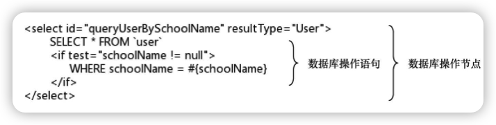
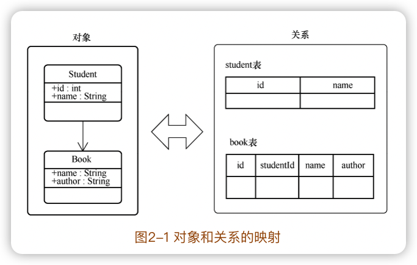
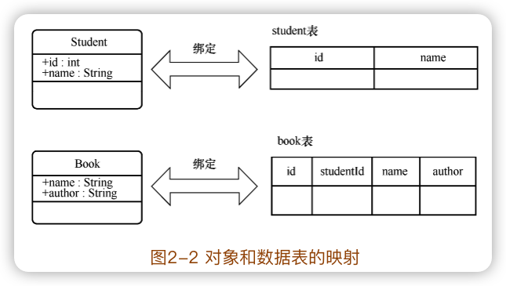
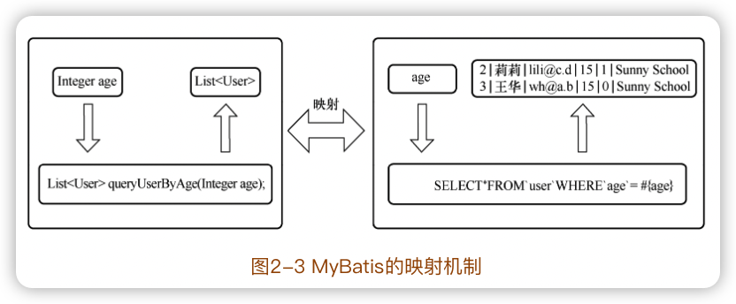
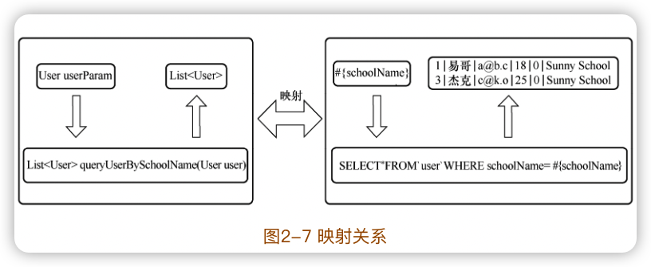
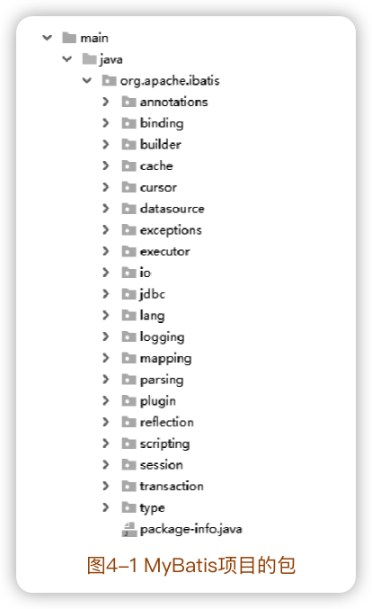
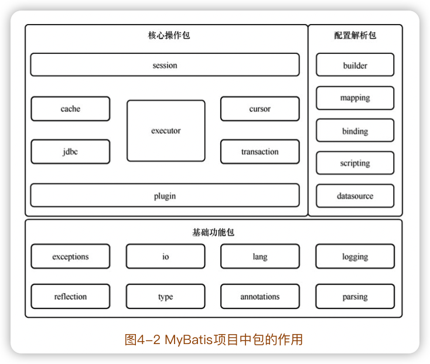
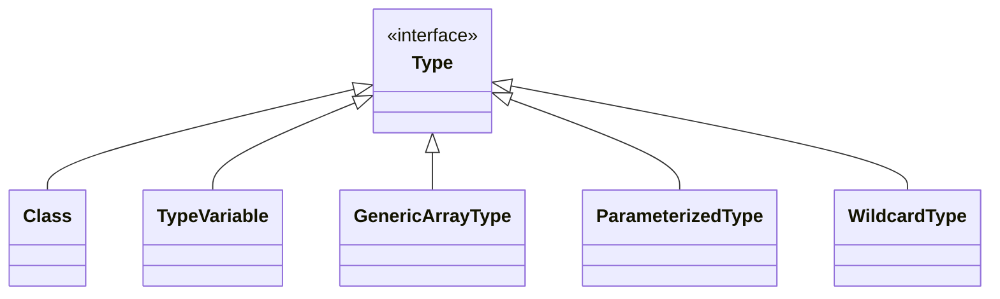

通用源码阅读指导书：MyBatis源码详解
-------

运行初探、模块归类、合理猜测、类比阅读、网格阅读等许多源码阅读方法

[《通用源码阅读指导书——MyBatis源码详解》配套示例](https://github.com/yeecode/MyBatisDemo)

[MyBatis中文详尽注释版](https://github.com/yeecode/MyBatisCN)

[作者网站](https://yeecode.top/)

[mybatis-3](https://github.com/mybatis/mybatis-3)

把握一个软件的设计需求和主要功能对于阅读软件的源码很有帮助。

**基础功能包**相对独立，与MyBatis的核心逻辑耦合小，比较适合作为源码阅读的切入点。

源码阅读对知识广度和深度都有较高要求。

掌握源码阅读的方法和技巧，并将这些方法和技巧应用到其他项目的源码阅读工作、系统设计工作、软件开发工作中，这才是阅读本书的最终目的。


## 一、背景介绍

### 1 源码阅读

#### 源码阅读的意义

**基础和蓝图之间却有着巨大的知识断层**：我们很容易找到用来夯实基础的入门书籍，也很容易找到用来阐述蓝图的分析文章，却鲜有资料告诉我们如何从基础开始构建出蓝图中的雄伟建筑。

源码阅读是理解和分析优秀的开源代码，并从中积累和学习的过程。

- 透彻地理解项目的实现原理；
- 接触到成熟和先进的架构方案；
- 学习到可靠与巧妙的实施技巧；
- 发现自身知识盲点，完善自身知识储备。

#### 源码阅读的方法

每一个优秀的工程项目都凝聚了众多开发者的缜密思维逻辑；每一个优秀的工程项目都经历了从雏形到成熟的曲折演化过程。最终，这些思维逻辑和演化过程都会投射和堆叠到源码上，使得源码变得复杂和难以理解。因此，==源码阅读的过程是一个通过源码去逆推思维逻辑和演化过程的工作==。

舒适能带来的只是原地踏步。梳理这些凌乱文件、理解这些类型组织、追踪这些逻辑跳转、弄清这些方法变量的痛苦过程，才是真正能让我们获得提升的过程。

一些基本技巧：

- 调式追踪
- 归类总结
- 上下文整合

有一套支持**代码高亮显示、错误提示、引用跳转、断点调试**等功能的开发工具十分必要。


#### 一些优秀的Java开源项目

apache/dubbo：一个高性能的远程过程调用框架；

netty/netty：事件驱动的异步网络应用框架；

spring-projects/spring-boot：一套简单易用的 Spring框架；

alibaba/fastjson：一套快速的 JSON解析、生成组件；

apache/kafka：一套实时数据流处理平台；

mybatis/mybatis-3：一套强大的对象关系映射工具。


#### mybatis中的文件指代

使用MyBatis时，会涉及三类文件：

##### 1.配置文件（XML）

通常命名为**mybatis-config.xml**，根节点为configuration，根节点包含以下节点信息：

- properties：属性信息，相当于 MyBatis的全局变量。
- settings：设置信息，通过它对 MyBatis的功能进行调整。
- typeAliases：类型别名，在这里可以为类型设置一些简短的名字。
- typeHandlers：类型处理器，在这里可以为不同的类型设置相应的处理器。
- objectFactory：对象工厂，在这里可以指定 MyBatis创建新对象时使用的工厂。
- objectWrapperFactory：对象包装器工厂，在这里可以指定 MyBatis使用的对象包装器工厂。
- reflectorFactory：反射器工厂，在这里可以设置 MyBatis的反射器工厂。
- plugins：插件，在这里可以为 MyBatis 配置差价，从而修改或扩展 MyBatis 的行为。
- environments：环境，这里可以配置 MyBatis运行的环境信息，如数据源信息等。
- databaseIdProvider：数据库编号，在这里可以为不同的数据库配置不同的编号，这样可以对不同类型的数据库设置不同的数据库操作语句。
- mappers：映射文件，在这里可以配置映射文件或映射接口文件的地址。

==注意👆🏻上面节点必须按照这个顺序出现。==

##### 2.映射文件（XML）

用来完成 **Java方法与 SQL语句的映射、Java对象与SQL参数的映射、SQL查询结果与 Java对象的映射**等。跟节点为mapper，根节点包含节点信息：

- cache：缓存，通过它可以对当前命名空间进行缓存配置。
- cache-ref：缓存引用，通过它可以引用其他命名空间的缓存作为当前命名空间的缓存。
- resultMap：结果映射，通过它来配置如何将 SQL查询结果映射为对象。
- parameterMap：参数映射，通过它来配置如何将参数对象映射为 SQL参数。该节点已废弃，建议直接使用内联参数。
- sql：SQL语句片段，通过它来设置可以被复用的语句片段。
- insert：插入语句。
- update：更新语句。
- delete：删除语句。
- select：查询语句。

后面四个节点是**数据库操作节点**。



##### 3.映射接口文件

Java接口文件，并且该接口不需要实现类。通常情况下，每个映射接口文件都有一个同名的映射文件与之相对应。

映射接口文件中定义了一些抽象方法，它们分为两类：

- 第一类抽象方法与对应的映射文件中的数据库操作节点相对应。
- 第二类抽象方法通过注解声明自身的数据库操作语句。当整个接口文件中均为该类抽象方法时，则该映射接口文件可以没有对应的映射文件。

#### 本书中方法的指代

Java中，常常会针对某一方法重载多个方法，以满足不同的使用需求。本书中使用方法名和参数类型来特指某个方法。

在某些情况下，具有相同方法名的一组方法是为了便于外部调用而重载的，其核心实现逻辑都集中在某一个方法内，其他方法只做了转接适配的工作。

### 2 MyBatis概述

阅读源码之前，先要对项目整体有个全名了解（项目的产生背景、演进过程、使用方法等）

#### 2.1 背景介绍

##### 传统数据库连接


过程：

1. 加载驱动程序
2. 获得数据库连接
3. 创建语句并执行
4. 处理数据库操作结果
5. 关闭连接

##### ORM框架

面向对象是在**软件工程原则**（如聚合、封装）的基础上发展起来的，而关系型数据库则是在**数学理论**（集合代数等）的基础上发展起来的，两者并不是完全匹配的，它们中间需要信息的转化。



这样的转化称为==对象关系映射==（Object Relational Mapping，简称ORM）。ORM 会在数据库数据的读取和写入操作过程中频繁发生，为了降低这种转化过程的开发成本，产生了大量的 ORM框架，MyBatis就是其中非常出色的一款。


##### MyBatis的特点

大多数 ORM框架选择将 Java对象和数据表直接关联起来，用一组对应关系将两者绑定在一起。



MyBatis则采取了另一种方式，它没有将 Java对象和数据表直接关联起来，而是将**Java方法和 SQL语句关联**起来。



这样只要**调用一个方法就可以执行一条复杂的 SQL语句**。在调用方法时可以给方法传递对象作为 SQL语句的参数，而 SQL语句的执行结果也会被映射成对象后返回。因此，关系型数据库被 MyBatis屏蔽了，读写数据库的过程成了一个纯粹的面向对象的过程。

除核心映射功能外，MyBatis 还提供了<u>缓存功能、懒加载功能、主键自增功能、多数据集处理功能</u>等。


#### MyBatis的核心功能分析

```java
List<User> userList = userMapper.queryUserBySchoolName(userParam)
```

不包含 SQL语句，接收的参数是 Java对象，输出的结果是 Java对象列表。

- 映射文件中的SQL语句与映射接口的抽象方法建立了映射。
- SQL语句的输入参数与方法输入参数建立了映射。
- SQL语句的输出结果与方法结果建立了映射。



阅读源码的策略：找出软件项目的核心功能，重点关注与核心功能相关的代码。

### 3 MyBatis运行初探

在追踪的过程中要抓大放小，重点关注与项目核心功能相关的部分，忽略一些细枝末节的代码。


### 4 MyBatis源码结构

#### 包结构



#### 分组



按照包的功能大致划分（各个包的类、方式实际是互相关联、交织的）：

- 基础功能包：这些包用来为其他包提供一些外围基础功能，如文件读取功能、反射操作功能等。这些包的特点是功能相对独立，与业务逻辑耦合小。
- 配置解析包：这些包用来完成配置解析、存储等工作。这些包中的方法主要在系统初始化阶段运行。
- 核心操作包：这些包用来完成数据库操作。在工作过程中，这些包可能会依赖基础功能包提供的基础功能和配置解析包提供的配置信息。这些包中的方法主要在数据库操作阶段运行。

源码阅读过程中有一个非常重要的技巧，那就是从整个项目的<u>外围源码入手</u>。外围源码很少依赖核心源码，相对独立。先阅读外围源码，受到其他未阅读部分的干扰较小；核心源码大量依赖外围源码。


## 二、基础功能包源码阅读




```mermaid
```

